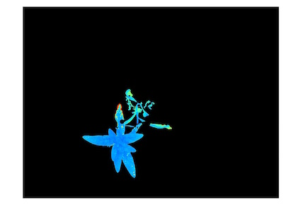

## Analyze FLU Signal

Extract Fv/Fm data of objects and produce pseudocolored images.

**fluor_fvfm**(*fdark, fmin, fmax, mask, device, filename, bins=1000, debug=None*)

**returns** device, FLU channel histogram headers, FLU channel histogram data

- **Parameters:**
    - fdark - image object, grayscale
    - fmin - image object  grayscale
    - fmax - image object, grayscale
    - mask - binary mask of selected contours
    - device - Counter for image processing steps
    - filename - False or image name. If defined print image
    - bins - number of grayscale bins (0-256 for 8-bit images and 0 to 65,536), if you would like to bin data, you would alter this number
    - debug - None, "print", or "plot". Print = save to file, Plot = print to screen. Default = None
- **Context:**
    - Used to extract fv/fm per identified plant pixel.
    - Generates histogram of fv/fm data.
    - Generaes pseudocolored output image with fv/fm values per plant pixel.
- **Example use:**
    - [Use In PSII Tutorial](psII_tutorial.md)
    
**Output Data Units:** 
    - Bin-number - number of bins set by user  
    - FV/FM Bins - bin values based on number of bins set by user  
    - FV/FM Histogram - histogram of FV/FM ratio values for object  
    - FV/FM Histogram Peak - bin value of histogram peak (greatest number of pixels)  
    - FV/FM Median - bin value of histogram median  
    - F-Dark Passed QC - Check (True or False) to determine if Fdark image does not have pixel intensity values above 2000. 

**Fdark image**


**Fmin image**


**Fmax image**


```python
from plantcv import plantcv as pcv

# Analyze Fv/Fm    
 device, fvfm_header, fvfm_data = pcv.fluor_fvfm(fdark, fmin, fmax, kept_mask, device, filename, 1000, debug="print")
```

**Histogram of Fv/Fm values**


**Pseudocolored output image based on Fv/Fm values**


