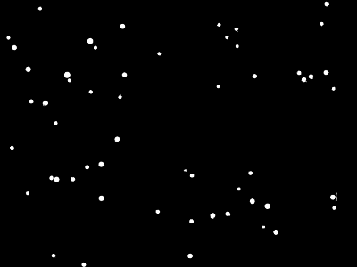

## Get centroids (developing)

Get the coordinates (row,column) of the centroid of each connected region
in a binary image.

**plantcv.get_centroids**(*bin_img*)

**returns** coordinates of centroids

- **Parameters:**
    - bin_img - Binary image containing the connected regions to consider
- **Context:**
    - Given an arbitrary mask of the objects of interest, `get_centroids`
    returns a list of coordinates that can the be imported by
    `plantcv.visualize.ClickCount`.

- **Example use:**
    - Below

**Binary image**



```python

from plantcv import plantcv as pcv


# Apply get centroids to the binary image
coordinates = pcv.get_centroids(bin_img=binary_img)
print(coordinates)
#[[1902, 600], [1839, 1363], [1837, 383], [1669, 1977], [1631, 1889], [1590, 1372], [1550, 1525], [1538, 1633], [1522, 1131], [1494, 2396], [1482, 1917], [1446, 1808], [1425, 726], [1418, 2392], [1389, 198], [1358, 1712], [1288, 522], [1289, 406], [1279, 368], [1262, 1376], [1244, 1795], [1224, 1327], [1201, 624], [1181, 725], [1062, 85], [999, 840], [885, 399], [740, 324], [728, 224], [697, 860], [660, 650], [638, 2390], [622, 1565], [577, 497], [572, 2179], [550, 2230], [547, 1826], [537, 892], [538, 481], [524, 2144], [521, 2336], [497, 201], [385, 1141], [342, 683], [342, 102], [332, 1700], [295, 646], [271, 60], [269, 1626], [210, 1694], [189, 878], [178, 1570], [171, 2307], [61, 286], [28, 2342]]


```
