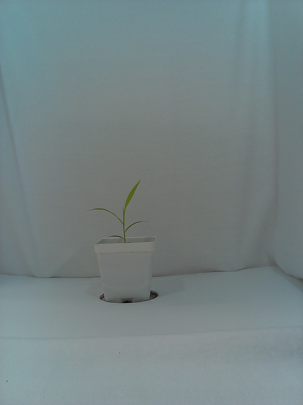
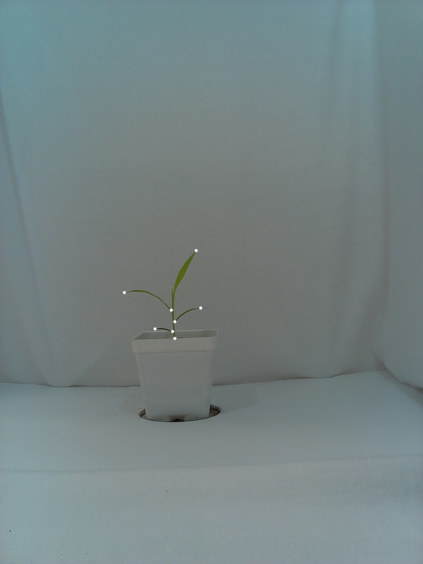

## Homology: Acute

Identify landmark positions within a contour for morphometric analysis

**plantcv.homology.acute**(*img, obj, mask, win, threshold*)

**returns**

homolog_pts = pseudo-landmarks selected from each landmark cluster

start_pts   = pseudo-landmark island starting position; useful in parsing homolog_pts in downstream analyses

stop_pts    = pseudo-landmark island end position ; useful in parsing homolog_pts in downstream analyses

ptvals      = average values of pixel intensity from the mask used to generate cont; 
useful in parsing homolog_pts in downstream analyses

chain       = raw angle scores for entire contour, used to visualize landmark clusters

- **Parameters:**
    - img - The original image, used for plotting purposes
    - obj - A contour of the plant object
    - mask - Binary mask used to generate contour array (necessary for ptvals)
    - win - The maximum cumulative pixel distance window for calculating angle score; 1 cm in pixels often works well
    - thresh - Angle score threshold to be applied for mapping out landmark coordinate clusters within each contour
- **Context:**
    - Used to identify pseudo-landmark positions along the contour of a plant for morphometric analysis 
- **Example use:**
    - [Use In Homology Tutorial](tutorials/homology_tutorial.md)

**Original image**



**Image mask**


```python

from plantcv import plantcv as pcv

# Set global debug behavior to None (default), "print" (to file), 
# or "plot" (Jupyter Notebooks or X11)

pcv.params.debug = "print"

# Given an image, mask, and object contours, identify pseudo-landmarks with acute

homolog_pts, start_pts, stop_pts, ptvals, chain, max_dist = pcv.homology.acute(img=img, obj=obj, 
                                                                               mask=mask, win=25, threshold=90)

```

**Pseudo-landmark points**



**Source Code:** [Here](https://github.com/danforthcenter/plantcv/blob/master/plantcv/plantcv/homology/acute.py)
