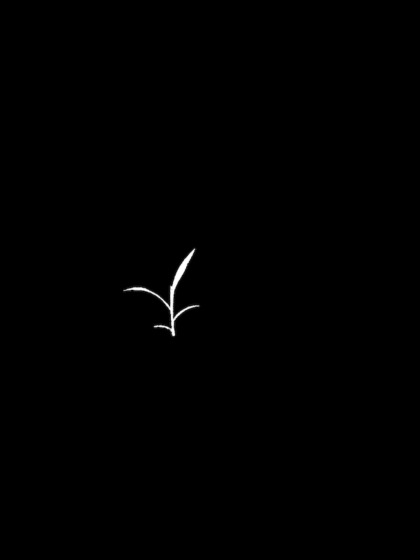

## Homology: Acute

Identify landmark positions within a contour for morphometric analysis

**plantcv.homology.acute**(*img, mask, win, threshold*)

**returns**

homolog_pts = pseudo-landmarks selected from each landmark cluster

start_pts   = pseudo-landmark island starting position; useful in parsing homolog_pts in downstream analyses

stop_pts    = pseudo-landmark island end position ; useful in parsing homolog_pts in downstream analyses

ptvals      = average values of pixel intensity from the mask used to generate cont; 
useful in parsing homolog_pts in downstream analyses

chain       = raw angle scores for entire contour, used to visualize landmark clusters

max_dist    = supplemental list which stores coordinates, distance from
landmark cluster edges, and angle score for entire contour.  Used in troubleshooting.

- **Parameters:**
    - img - The original image, used for plotting purposes
    - mask - Binary mask used to generate contour array (necessary for ptvals)
    - win - The maximum cumulative pixel distance window for calculating angle score; 1 cm in pixels often works well
    - thresh - Angle score threshold to be applied for mapping out landmark coordinate clusters within each contour
- **Context:**
    - Used to identify pseudo-landmark positions along the contour of a plant for morphometric analysis
    - Use `pcv.params.verbose = False` to quiet print statements
- **Example use:**
    - [Use In Homology Tutorial](https://github.com/danforthcenter/plantcv-homology-tutorials/blob/main/README.md)
- **Output data stored:** Data ('num_acute_pts') automatically
gets stored to the [`Outputs` class](outputs.md) when this function is ran. These data can always get accessed during a
workflow (example below). For more detail about data output see [Summary of Output Observations](output_measurements.md#summary-of-output-observations)

**Original image**


**Image mask**



```python

from plantcv import plantcv as pcv

# Set global debug behavior to None (default), "print" (to file), 
# or "plot" (Jupyter Notebooks or X11)
pcv.params.debug = "plot"
# Optionally, set a sample label name
pcv.params.sample_label = "plant"

# Given an image, mask, and object contours, identify pseudo-landmarks with acute
homolog_pts, start_pts, stop_pts, ptvals, chain, max_dist = pcv.homology.acute(img=img, mask=mask, win=25, threshold=90)

# Access data stored in outputs
num_pts = pcv.outputs.observations['plant']['num_acute_pts']['value']

```

**Pseudo-landmark points**


**Source Code:** [Here](https://github.com/danforthcenter/plantcv/blob/master/plantcv/plantcv/homology/acute.py)
