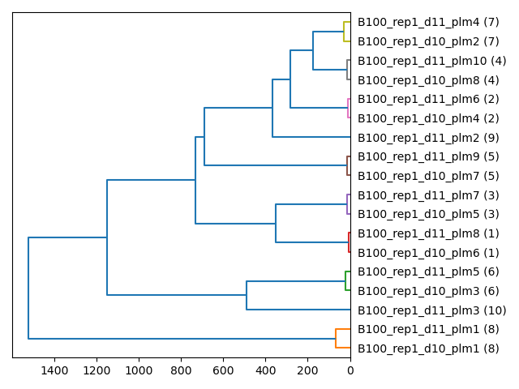

## Homology: Constella

Group pseudo-landmarks into homology groupings

**plantcv.homology.constella**(*cur_plms, pc_starscape, group_iter, outfile_prefix*)

**returns** dataframe of grouped pseudo-landmarks and a group ID counter

- **Parameters:**
    - cur_plms - A pandas array of plm multivariate space representing capturing two adjacent frames in a time series or otherwise analogous dataset in order to enable homology assignments
    - pc_starscape - PCA results from starscape
    - group_iter - Group ID counter
    - outfile_prefix - User defined file path and prefix name for output graphics
- **Context:**
    - Used to group pseudo-landmarks into homology groupings
- **Example use:**
    - [Use In Homology Tutorial](tutorials/homology_tutorial.md)


```python

from plantcv import plantcv as pcv

# Set global debug behavior to None (default), "print" (to file), 
# or "plot" (Jupyter Notebooks or X11)

pcv.params.debug = "print"

cur_plms, group_iter = pcv.homology.constella(cur_plms=cur_plms, pc_starscape=starscape_df, 
                                              group_iter=group_iter, outfile_prefix="./B100_d10_d11")

cur_plms

# 	    group	plmname	            filename	    plm_x	plm_y	SS_x	SS_y	TS_x	TS_y	CC_ratio	bot_left_dist	bot_right_dist	top_left_dist	top_right_dist	centroid_dist	orientation	centroid_orientation
# 0	    8	    B100_rep1_d10_plm1	B100_rep1_d10	901	    1151	892	    1173	885	    1167	255.000000	521.647390	    404.545424	    331.185748	    35.000000	    284.613773	    -146.659293	155.506063
# 1	    7	    B100_rep1_d10_plm2	B100_rep1_d10	787	    1425	789	    1401	773	    1405	6.219512	252.103153	    187.416648	    371.295031	    330.800544	    15.524175	    -15.255119	14.931417
# 2	    6	    B100_rep1_d10_plm3	B100_rep1_d10	571	    1344	594	    1338	595	    1342	255.000000	211.000000	    409.538765	    221.000000	    414.779459	    222.036033	    99.659893	-72.707551
# 3	    2	    B100_rep1_d10_plm4	B100_rep1_d10	793	    1523	796	    1511	783	    1519	18.888889	224.294449	    132.909744	    457.475682	    420.286807	    113.441615	    -23.629378	5.057249
# 4	    3	    B100_rep1_d10_plm5	B100_rep1_d10	712	    1511	736	    1508	736	    1512	255.000000	147.705789	    214.560015	    412.825629	    441.184769	    123.458495	    92.385944	-144.893921
# 5	    1	    B100_rep1_d10_plm6	B100_rep1_d10	803	    1555	795	    1533	807	    1532	255.000000	232.000000	    119.000000	    490.354973	    448.090393	    146.372812	    -5.079608	7.853313
# 6	    5	    B100_rep1_d10_plm7	B100_rep1_d10	922	    1415	898	    1420	898	    1416	255.000000	377.890196	    140.000000	    456.579675	    292.000000	    139.089899	    -97.125016	87.939889
# 7	    4	    B100_rep1_d10_plm8	B100_rep1_d10	803	    1478	816	    1459	801	    1454	12.207447	244.444268	    141.739197	    424.086076	    374.414209	    70.880181	    165.650668	16.389540
# 8	    8	    B100_rep1_d11_plm1	B100_rep1_d11	912	    1123	904	    1146	895	    1139	255.000000	550.368059	    432.115725	    341.000000	    10.000000	    314.658545	    -147.339087	155.797162
# 9	    9	    B100_rep1_d11_plm2	B100_rep1_d11	786	    1370	794	    1347	784	    1346	0.000000	283.637092	    229.610540	    327.466029	    281.966310	    40.112342	    172.724995	175.710847
# 10	10	    B100_rep1_d11_plm3	B100_rep1_d11	752	    1236	761	    1258	754	    1260	255.000000	366.772409	    361.470607	    213.377600	    204.129861	    176.739922	    13.448615	-10.101876
# 11	7	    B100_rep1_d11_plm4	B100_rep1_d11	783	    1427	781	    1403	770	    1406	32.692308	247.644907	    188.957667	    370.621100	    334.270848	    17.000000	    -18.434949	0.000000
# 12	6	    B100_rep1_d11_plm5	B100_rep1_d11	576	    1353	598	    1342	599	    1347	255.000000	202.061872	    400.649473	    230.054341	    415.470817	    214.704448	    110.695451	-74.604451
# 13	2	    B100_rep1_d11_plm6	B100_rep1_d11	790	    1525	791	    1509	780	    1517	23.448276	221.045244	    135.366170	    457.782700	    423.117005	    115.212847	    -20.556045	3.483271
# 14	3	    B100_rep1_d11_plm7	B100_rep1_d11	706	    1510	729	    1505	730	    1509	255.000000	142.302495	    220.637712	    409.870711	    443.198601	    126.210142	    97.275005	-142.403729
# 15	1	    B100_rep1_d11_plm8	B100_rep1_d11	802	    1553	791	    1532	801	    1530	255.000000	231.008658	    120.016666	    488.119862	    446.430286	    144.256716	    -15.255119	7.568397
# 16	5	    B100_rep1_d11_plm9	B100_rep1_d11	914	    1417	891	    1423	890	    1417	255.000000	369.720164	    138.231690	    451.757678	    294.108823	    131.186890	    -97.275005	86.941302
# 17	4	    B100_rep1_d11_plm10	B100_rep1_d11	798	    1475	809	    1464	795	    1458	0.000000	240.684441	    147.566934	    418.847228	    373.202358	    66.708320	    164.054604	12.994617

```

**Dendrogram**



**Source Code:** [Here](https://github.com/danforthcenter/plantcv/blob/master/plantcv/plantcv/homology/constella.py)
