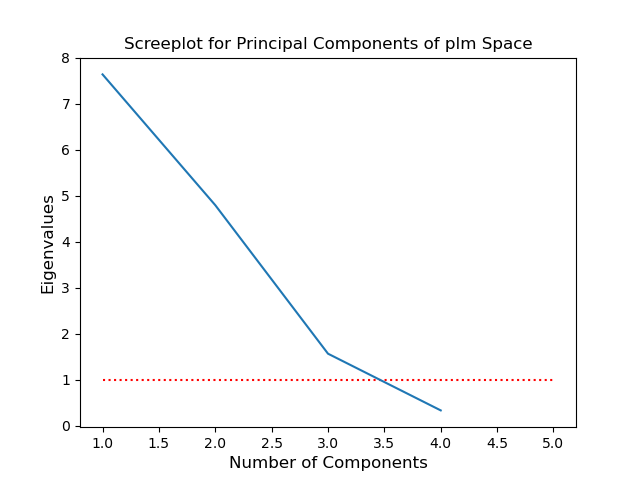
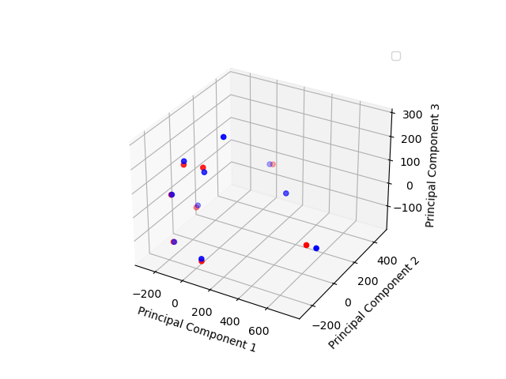

## Homology: Starscape

Principal Component Analysis on pseudo-landmark data between two timepoints

**plantcv.homology.starscape**(*cur_plms, group_a, group_b, outfile_prefix*)

**returns** a dataframe of PCA results, a NumPy array of PC eigenvalues, and a dataframe of PC loadings

- **Parameters:**
    - cur_plms - A pandas array of plm multivariate space representing capturing two adjacent frames in a time series or otherwise analogous dataset in order to enable homology assignments
    - group_a - Name of group A (timepoint 1)
    - group_b - Name of group B (timepoint 2)
    - outfile_prefix - User defined file path and prefix name for PCA output graphics
- **Context:**
    - Used to do Principal Component Analysis on pseudo-landmark data between two timepoints
- **Example use:**
    - [Use In Homology Tutorial](tutorials/homology_tutorial.md)


```python

from plantcv import plantcv as pcv
import pandas as pd

# Set global debug behavior to None (default), "print" (to file), 
# or "plot" (Jupyter Notebooks or X11)

pcv.params.debug = "print"

final_df, eigenvals, loadings = pcv.homology.starscape(cur_plms=cur_plms, group_a="B100_rep1_d10", 
                                                       group_b="B100_rep1_d11", outfile_prefix="./B100_d10_d11")

final_df.head()

# 	plmname	            filename	    PC1	        PC2	        PC3
# 0	B100_rep1_d10_plm1	B100_rep1_d10	679.414040	-71.488066	-34.624416
# 1	B100_rep1_d10_plm2	B100_rep1_d10	-62.215929	-55.052674	153.806037
# 2	B100_rep1_d10_plm3	B100_rep1_d10	14.256346	475.918362	-30.316153
# 3	B100_rep1_d10_plm4	B100_rep1_d10	-237.327344	-127.302125	38.876346
# 4	B100_rep1_d10_plm5	B100_rep1_d10	-274.667223	120.381513	-126.398386
```

**Screeplot**



**Principal Components 1-3**



**Source Code:** [Here](https://github.com/danforthcenter/plantcv/blob/master/plantcv/plantcv/homology/starscape.py)
