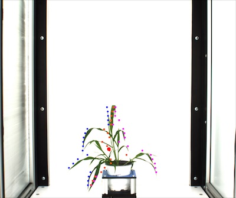

## y_axis_pseudolandmarks

Divide plant object into twenty equidistant bins along the y-axis and assign pseudolandmark points based upon their 
actual (not scaled) position. Once this data is scaled this approach may provide some information regarding shape 
independent of size.

**plantcv.homology.y_axis_pseudolandmarks**(*img, mask, label=None*)

**returns** landmarks_on_leftside (left), landmarks_on_right (right), landmarks_at_center_along_the_horizontal_axis (center_h)

- **Parameters:**
    - img - A copy of the original image (RGB or grayscale) generated using np.copy
    - mask - This is a binary image. The object should be white and the background should be black.
    - label - Optional label parameter, modifies the variable name of observations recorded. (default = `pcv.params.sample_label`)
- **Context:**
    - Used to identify a set of sixty equidistant landmarks on the vertical axis. Once scaled these can be used for shape analysis.
- **Output data stored:** Data ('left_lmk', 'right_lmk', 'center_h_lmk') automatically gets stored to the [`Outputs` class](outputs.md) when this function is ran. 
    These data can always get accessed during a workflow (example below). For more detail about data output see [Summary of Output Observations](output_measurements.md#summary-of-output-observations)

**Input object contour and image**


```python

from plantcv import plantcv as pcv

# Set global debug behavior to None (default), "print" (to file), 
# or "plot" (Jupyter Notebooks or X11)
pcv.params.debug = "plot"
# Optionally, set a sample label name
pcv.params.sample_label = "plant"

# Identify a set of land mark points
# Results in set of point values that may indicate tip points
left, right, center_h  = pcv.homology.y_axis_pseudolandmarks(img=img, mask=mask)

# Access data stored out from y_axis_pseudolandmarks
left_landmarks = pcv.outputs.observations['plant']['left_lmk']['value']

```

**Image of points selected**



**Source Code:** [Here](https://github.com/danforthcenter/plantcv/blob/main/plantcv/plantcv/homology/y_axis_pseudolandmarks.py)
