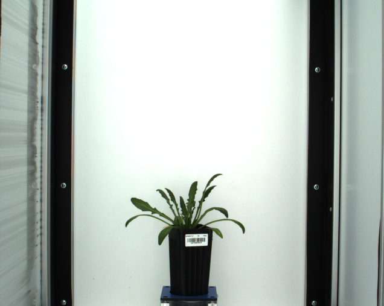
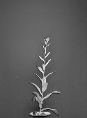
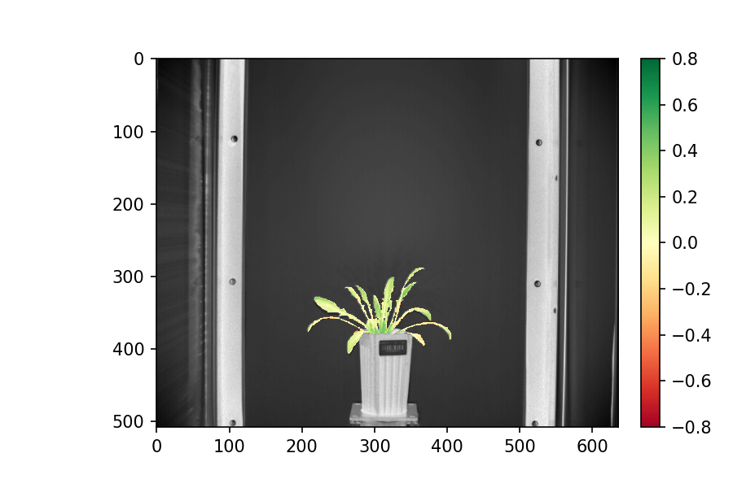

## Image fusion

This is a method used to fuse two images of the same size by concatenating them together. A `PlantCV.Spectral_data` 
class instance will be created based on the concatenated image and proveded wavelengths. 

**plantcv.image_fusion**(*img1, img2, wvs1, wvs2, array_type="multispectral"*)

**returns** Fused image represented by a `PlantCV.Spectral_data` class instance.
When in debug mode of `"plot"`, the pseudocolored image will be displayed.

- **Parameters:**
    - img1 - 1st image to be fused
    - img2 - 2nd image to be fused
    - wvs1 - wavelengths representing all bands in the 1st image
    - wvs2 - wavelengths representing all bands in the 2nd image
    - array_type - (optional) description of the fused array, default = "multispectral"
  
- **Context:**
    - Used to fuse two same-sized images. 
  
- **Example use:**
<!---[Use In Image Registration](xxx.md)--->
    
**Image 1 to be fused** (near infra-red image)



**Image 2 to be fused** (rgb image)


```python
from plantcv import plantcv as pcv

pcv.params.debug = "plot"

# Add two images together
wvs1 = [480.0, 550.0, 670.0]
wvs2 = [800.0]

fused_img = pcv.image_fusion(img1=img1, img2=img2, wvs1=wvs1, wvs2=wvs2, 
                             array_type="vis-nir_fusion")

```

To show an example of the potential application of image fusion, a vegetation index, NDVI is calculated and the result 
is presented. The NDVI is calculated using PlantCV tool [spectral_index](spectral_index.md) .

```python
from plantcv import plantcv as pcv

pcv.params.debug = "plot"
ndvi = pcv.spectral_index.ndvi(fused_img)

# Pseudocolor the NDVI image
colmap = pcv.visualize.pseudocolor(gray_img=ndvi.array_data, mask=mask, cmap="RdYlGn", 
                                   min_value=-0.8, max_value=0.8)

```
**NDVI index image calculated based on the fused image**



**NDVI index image calculated based on the fused image**



**Source Code:** [Here](https://github.com/danforthcenter/plantcv/blob/master/plantcv/plantcv/image_fusion.py)
