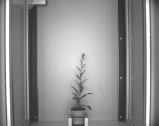
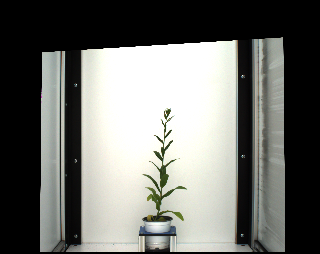
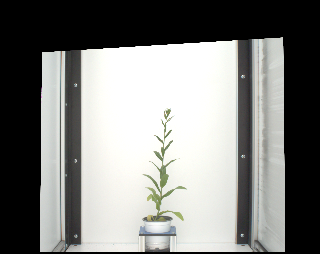

## Image fusion

This is a method used to fuse two images of the same size by concatenating them together. A `PlantCV.Spectral_data` 
class instance will be created based on the concatenated image and proveded wavelengths. 

**plantcv.image_fusion**(*img1, img2, wvs1, wvs2, array_type = None, filename = None*)

**returns** Fused image represented by a `PlantCV.Spectral_data` class instance.
When in debug mode of ``plot``, the pseudocolored image would be displayed.

- **Parameters:**
    - img1 - 1st image to be fused
    - img2 - 2nd image to be fused
    - wvs1 - wavelengths representing all bands in the 1st image
    - wvs2 - wavelengths representing all bands in the 2nd image
    - array_type - (optional) description of the fused array, default = None
    - filename - (optional) desired filename of the fused array, default = None
  
- **Context:**
    - Used to fuse two same-sized images. 
  
- **Example use:**
<!---[Use In Image Registration](xxx.md)--->
    
**Image 1 to be fused** (near infra-red image)



**Image 2 to be fused** (rgb image)



```python
from plantcv import plantcv as pcv

pcv.params.debug = "plot"

# Add two images together
wvs1 = [800.0]
wvs2 = [480.0,550.0,670.0]
fused_img = pcv.image_fusion(img1, img2, wvs1, wvs2, array_type="nir-vis_fusion", filename="fused_im")

```

**Pseudocolored fused image**



**Source Code:** [Here](https://github.com/danforthcenter/plantcv/blob/master/plantcv/plantcv/image_fusion.py)
