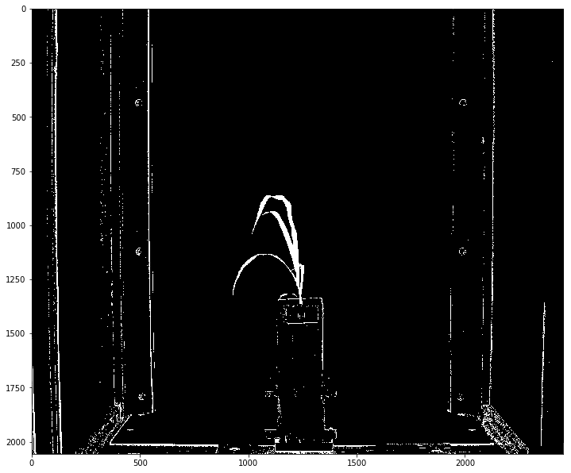
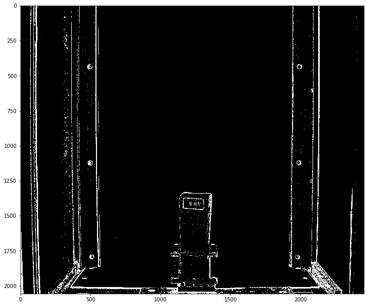
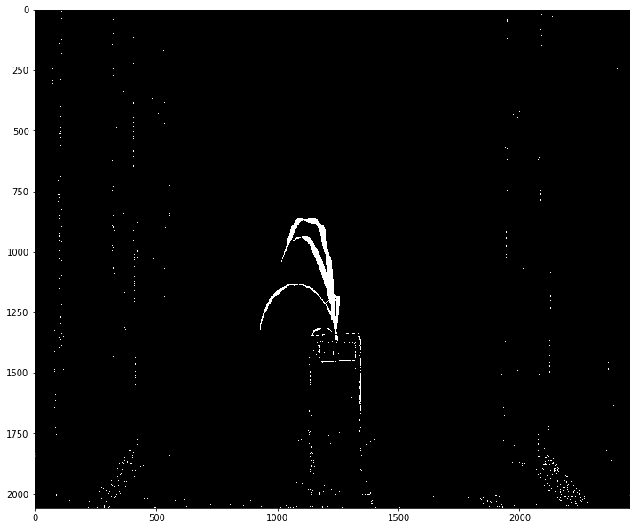

## Image Subtract

This is a function is used to subtract values of one gray-scale image array from another gray-scale image array. The
    resulting gray-scale image array has a minimum element value of zero. That is all negative values resulting from the
    subtraction are forced to zero.

**plantcv.image_subtract**(*gray_img1, gray_img2*)

**returns** new_img

- **Parameters:**
    - gray_img1 - Grayscale image data from which gray_img2 will be subtracted
    - gray_img2 - Grayscale image data to be subtracted from gray_img1
- **Context:**
    - returns difference in pixel values of two images 
- **Example use:**
    - [Use In NIR Tutorial](nir_tutorial.md)

**Gray_Img1**



**Gray_Img2**



```python
from plantcv import plantcv as pcv

# Set global debug behavior to None (default), "print" (to file), or "plot" (Jupyter Notebooks or X11)
pcv.params.debug = "print"

# Subtract image from another image. 
subtracted_img = pcv.image_subtract(gray_img1, gray_img2)
```

**Result**


