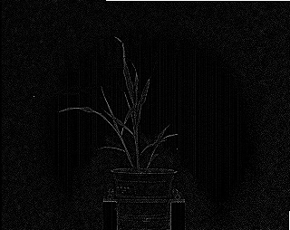
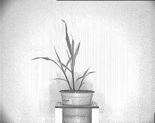

## Image Subtract

Obtain a image of the pixelwise input values within two image files. 
This is a wrapper for the OpenCV function [subtract](http://docs.opencv.org/2.4/modules/core/doc/operations_on_arrays.html#subtract).

<<<<<<< HEAD
**image_subtract**(*img, img2, device, debug=None*)
=======
**image_subtract**(*img, img2, device, debug=False*)
>>>>>>> master

**returns** device, subtracted image

- **Parameters:**
    - img - image to be analyzed
    - img2 - image to subtract
    - device - Counter for image processing steps
<<<<<<< HEAD
    - debug - None, "print", or "plot". Print = save to file, Plot = print to screen. Default = None
=======
    - debug- Default value is False, if True, masked intermediate image will be printed
>>>>>>> master
- **Context:**
    - Get features that are different between images
- **Example use:**
    - [Use In NIR Tutorial](nir_tutorial.md)

**Original grayscale image (image 1)**


**Image to be subtracted (image 2)**



```python
import plantcv as pcv

# Subtract image from another image. 
<<<<<<< HEAD
device, subtracted_img = pcv.image_subtract(img, img2,  device, debug="print")
=======
device, subtracted_img = pcv.image_subtract(img, img2,  device, debug=True)
>>>>>>> master
```

**Subtraction of image 2 from image 1**


