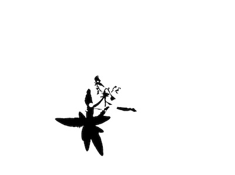

## Invert

Invert a binary image. This is a wrapper for the OpenCV function [bitwise_not](http://docs.opencv.org/2.4/modules/core/doc/operations_on_arrays.html#bitwise-not)

**plantcv.invert**(*gray_img*)

**returns** inverted image

- **Parameters:**
    - gray_img - Grayscale image data
- **Context:**
    - Invert image values. Useful for inverting an image mask.
- **Example use:**
    - Below
    
**Input binary image**


```python
from plantcv import plantcv as pcv

# Set global debug behavior to None (default), "print" (to file), 
# or "plot" (Jupyter Notebooks or X11)
pcv.params.debug = "plot"

# Invert a binary mask.
inverted_img = pcv.invert(gray_img)

```

**Inverted image**



**Source Code:** [Here](https://github.com/danforthcenter/plantcv/blob/main/plantcv/plantcv/invert.py)
