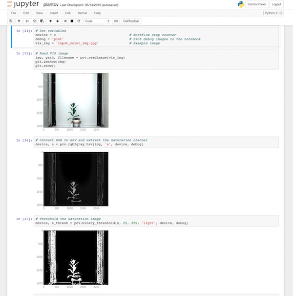

## Using PlantCV with Jupyter Notebooks

### About Jupyter

Jupyter Notebook is a web application that allows you to create
documents that contain code, outputs, and documentation. The code
in Jupyter Notebooks can be re-executed to refresh outputs after you
change a section of code. Jupyter Notebooks support many programming
languages. See [http://jupyter.org/](http://jupyter.org/).

### How to use PlantCV with Jupyter

In previous versions of PlantCV, debugging image analysis workflows
required running scripts with debug mode enabled so that intermediate
output images would be created for each step. In the latest versions
of PlantCV, analysis workflow scripts can be developed in Jupyter
Notebooks so that the input and output images of each step in a workflow
can be visualized instantly within the notebook. 

**Example of PlantCV running in Jupyter**



PlantCV is automatically set up to run in Jupyter Notebook but there
are a couple of considerations. Jupyter must be opened within the PlantCV 
environment. For example, launch Jupyter from the command line from within
a PlantCV environment with `jupyter notebook`, launch Jupyter from the 
Anaconda Navigator (if installed with conda) from within the PlantCV environment, 
etc. 

First, if PlantCV is installed in the global Python search path, you can
import the PlantCV library like normal:

```python
from plantcv import plantcv as pcv
```

On the other hand, if you installed PlantCV into a local Python path,
you will need to configure the Jupyter Python kernel to find it. For
example:

```python
import sys
sys.path.append("/home/user/plantcv")
from plantcv import plantcv as pcv 
```

Second, we use [matplotlib](http://matplotlib.org/) to do the
in-notebook plotting. To make this work, add the following to the top
of your notebook:

```python
%matplotlib inline
```

Third, PlantCV has a built-in debug mode that is set to `None` by 
default. Setting debug to `"print"` will cause PlantCV to print debug
images to files, which is the original debug method. In Jupyter, setting
debug to `"plot"` will cause PlantCV to plot debug images directly into
the notebook.

Bringing it all together, the first part of a notebook running PlantCV
would look like the following example:

```python
%matplotlib inline
import os
import sys
sys.path.append('/home/user/plantcv')
import numpy as np
import cv2
from matplotlib import pyplot as plt
from plantcv import plantcv as pcv

# Set variables
pcv.params.debug = 'plot'                     # Plot debug images to the notebook
img_file = 'input_color_img.jpg'              # Example image

```

Not all of these imports are required, this is just to demonstrate that
in addition to importing PlantCV you can import any other useful Python
packages as well.

### Converting Jupyter Notebooks to PlantCV workflow scripts

Once a workflow has been developed, it needs to be converted into a pure
Python script if the goal is to use it on many images using the PlantCV
workflow [parallelization](pipeline_parallel.md) tools. To make a
Python script that is compatible with the `plantcv-workflow.py` program,
first use Jupyter to convert the notebook to Python. This can be done
through the web interface, or on the command line:

```
jupyter nbconvert --to python notebook.ipynb
```

The resulting Python script will be named `notebook.py` in the example
above. Next, open the Python script with a text editor. Several
modifications to the script are needed. Modify the list of imported
packages as needed, but in particular, remove
`get_ipython().magic('matplotlib inline')` and add `import argparse`.
If PlantCV is importable in your normal shell environment, you can
remove `sys.path.append('/home/user/plantcv')` also.

All of the remaining script (other than the imports) needs to be added
to a function called `main`. To do this, add a main function and indent
the remaining code within main, for example:

```python
def main():
    
    # all the code from Jupyter

if __name__ == '__main__':
    main()
    
```

Add a function for parsing command line options using [argparse](https://docs.python.org/2.7/library/argparse.html).
The `plantcv-workflow.py` script requires a few command-line arguments for
workflow scripts to work properly. If the script analyzes a single image
the options minimally should look like the following:

```python
def options():
    parser = argparse.ArgumentParser(description="Imaging processing with PlantCV.")
    parser.add_argument("-i", "--image", help="Input image file.", required=True)
    parser.add_argument("-r","--result", help="Result file.", required= True )
    parser.add_argument("-o", "--outdir", help="Output directory for image files.", required=False)
    parser.add_argument("-w","--writeimg", help="Write out images.", default=False, action="store_true")
    parser.add_argument("-D", "--debug", help="Turn on debug, prints intermediate images.")
    args = parser.parse_args()
    return args
    
```

If the script analyzes two images using co-processing, the options
should minimally should looks like the following:

```python
def options():
    parser = argparse.ArgumentParser(description="Imaging processing with opencv")
    parser.add_argument("-i", "--image", help="Input image file.", required=True)
    parser.add_argument("-r","--result", help="Result file.", required=True )
    parser.add_argument("-r2","--coresult", help="Result file for co-processed image.", required=True )
    parser.add_argument("-o", "--outdir", help="Output directory for image files.", required=False)
    parser.add_argument("-w","--writeimg", help="Write out images.", default=False, action="store_true")
    parser.add_argument("-D", "--debug", help="Turn on debug, prints intermediate images.")
    args = parser.parse_args()
    return args
    
```

Within the `main` function, call the `options` function to get the
values of the command-line options. Swap any hard-coded values with
the argument values instead:

```python
def main():
    # Get options
    args = options()
    
    # Set variables
    pcv.params.debug = args.debug     # Replace the hard-coded debug with the debug flag
    img_file = args.image             # Replace the hard-coded input image with image flag
    
```

Make any other alterations as necessary after testing. Based on the
simple Jupyter Notebook example above, the fully modified version would
look like the following:

```python
import os
import sys
import numpy as np
import cv2
from matplotlib import pyplot as plt
from plantcv import plantcv as pcv

def options():
    parser = argparse.ArgumentParser(description="Imaging processing with PlantCV.")
    parser.add_argument("-i", "--image", help="Input image file.", required=True)
    parser.add_argument("-r","--result", help="Result file.", required= True )
    parser.add_argument("-o", "--outdir", help="Output directory for image files.", required=False)
    parser.add_argument("-w","--writeimg", help="Write out images.", default=False, action="store_true")
    parser.add_argument("-D", "--debug", help="Turn on debug, prints intermediate images.")
    args = parser.parse_args()
    return args

def main():
    # Get options
    args = options()
    
    # Set variables
    pcv.params.debug = args.debug        # Replace the hard-coded debug with the debug flag
    img_file = args.image     # Replace the hard-coded input image with image flag
    
    # Put workflow 
    # steps from 
    # Jupyter here
    
    # Print data that gets collected into the Outputs 
    pcv.outputs.save_results(filename=.result, outformat="json")

if __name__ == '__main__':
    main()
    
```

There are examples of full Python scripts found at the bottom of each tutorial.

*  [VIS Image Workflow](tutorials/vis_tutorial.md)
*  [NIR Image Workflow](tutorials/nir_tutorial.md)
*  [PSII Workflow](tutorials/psII_tutorial.md)
*  [VIS / NIR Dual Workflow](tutorials/vis_nir_tutorial.md)
*  [Multi Plant Tutorial](tutorials/multi-plant_tutorial.md)
*  [Morphology Tutorial](tutorials/morphology_tutorial.md) 
*  [Machine Learning Tutorial](tutorials/machine_learning_tutorial.md)
*  [Color Correction Tutorial](tutorials/transform_color_correction_tutorial.md)
*  [Morphology Tutorial](tutorials/morphology_tutorial.md) 
*  [Thermal Tutorial](tutorials/thermal_tutorial.md) 
*  [Hyperspectral Tutorial](tutorials/hyperspectral_tutorial.md)
