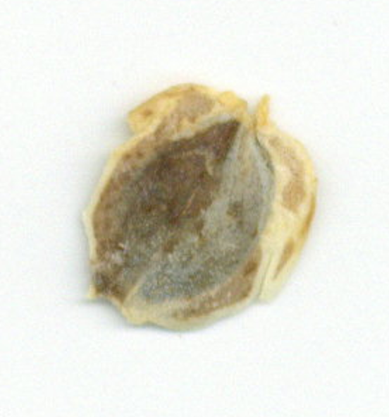
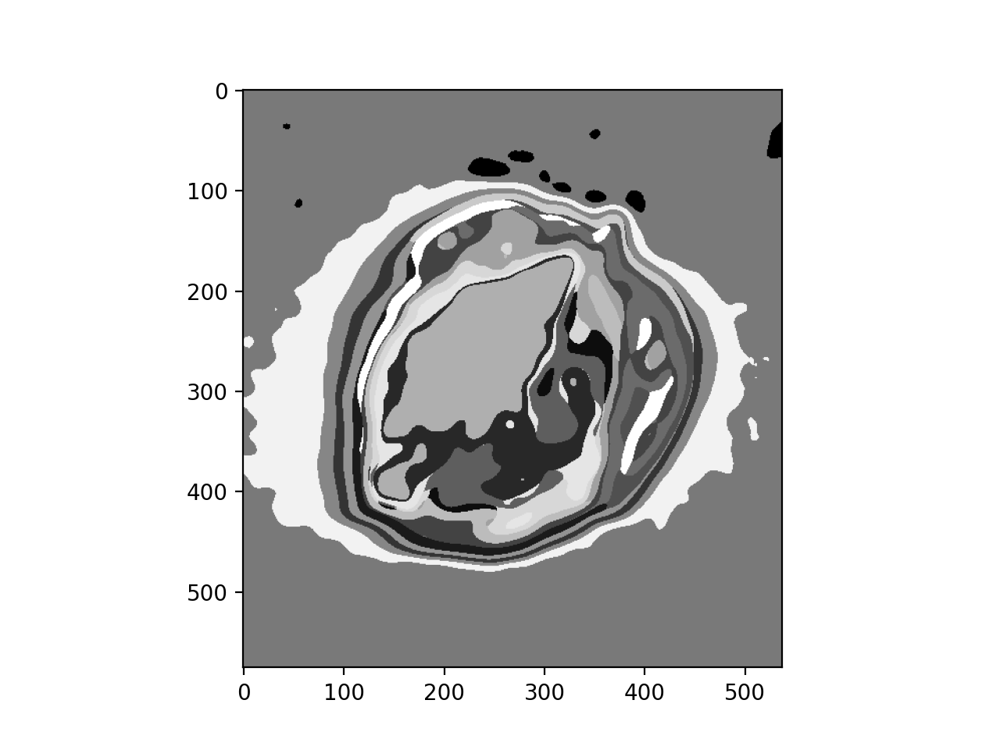
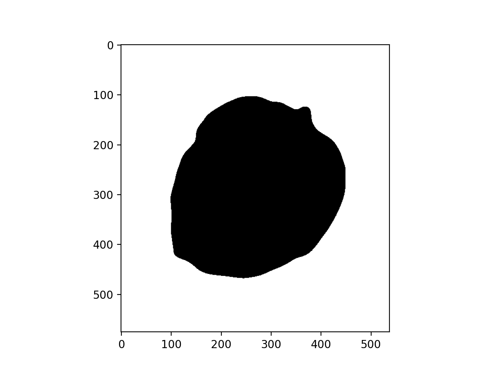
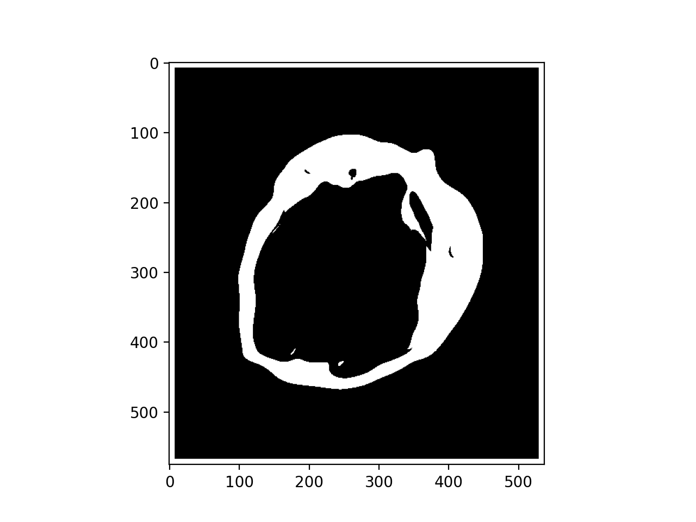
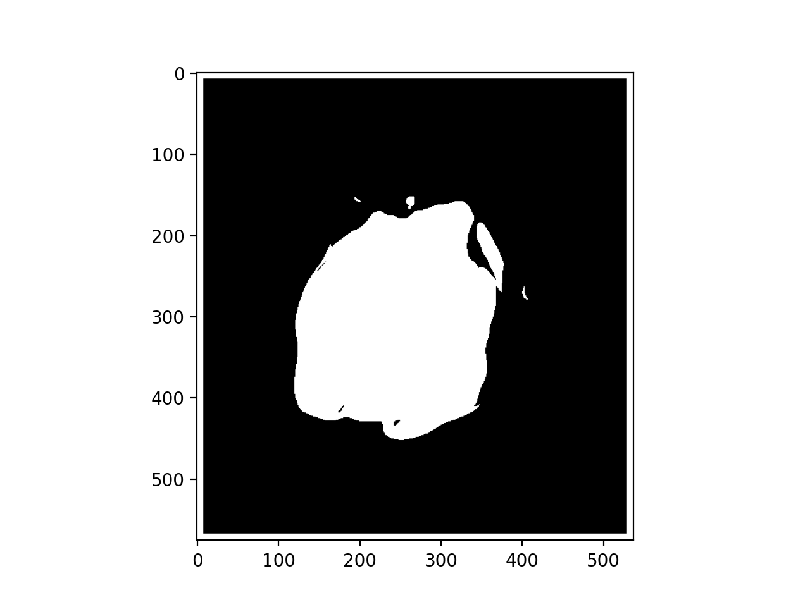

## Classification using a kmeans cluster model

The first function (predict_kmeans) takes a target image and uses a trained kmeans model produced by plantcv.learn.train_kmeans.py to classify regions of the target image by the trained clusters. The second function (mask_kmeans) takes a list of clusters and produces the combined mask from clusters of interest. 

**plantcv.kmeans_classifier.predict_kmeans**(img, model_path="./kmeansout.fit", patch_size=10)

**outputs** An images with regions colored and labeled according to cluster assignment

- **Parameters:**
    - img = Path to target image
    - model_path = Path to where the model fit (output from plantcv.learn.train_kmeans.py) is stored
    - patch_size = Size of the NxN neighborhood around each pixel, used for classification

- **Context:**
    - Used to classify cluster assignment of pixels in a target image using a trained kmeans clustering model.

- **Example use below**


**plantcv.kmeans_classifier.mask_kmeans**(labeled_img, K, patch_size, cat_list=[])

**outputs** Either a combined mask of the requestedlist of clusters or a dictionary of each cluster as a separate mask with keys corresponding to the cluster number 

- **Parameters:**
    - labeled_img = The output from predict_kmeans, an image with pixels labeled according to their cluster assignment
    - K = The number of clusters in the trained model
    - patch_size = Size of the NxN neighborhood around each pixel, used for classification
    - cat_list = List of clusters to include in a combined mask. If empty, output is a dictionary of separate masks for each cluster

- **Context:**
    - Used to create masks from kmeans cluster assignments on a target image.  

- **Example use:**

**Input image example**



```python

from plantcv import plantcv as pcv

#Labeling a target image
labeled_img = predict_kmeans(img='./Silphium_seed_example.png',
                             model_path="./kmeansout_seed.fit", patch_size=16)

#Choosing clusters for each category within the seed image
background = mask_kmeans(labeled_img=labeled_img, K=20, patch_size=16, 
                         cat_list=[0, 4, 9, 10, 18])
wings = mask_kmeans(labeled_img=labeled_img, K=20, patch_size=16, 
                    cat_list=[19, 2, 11, 8, 6, 5, 15, 12])
seed = mask_kmeans(labeled_img=labeled_img, K=20, patch_size=16, 
                   cat_list=[13, 3, 7, 17, 1, 16, 14])

```

**Labeled image**



**Combined mask of background clusters**



**Combined mask of wing clusters**



**Combined mask of seed clusters**



**Source Code:** [Here](https://github.com/danforthcenter/plantcv/blob/main/plantcv/plantcv/kmeans_classifier.py)