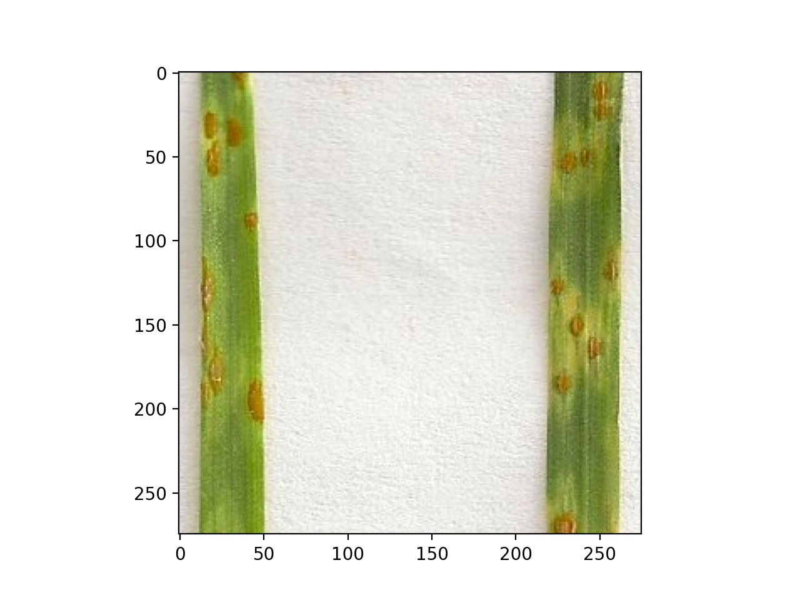
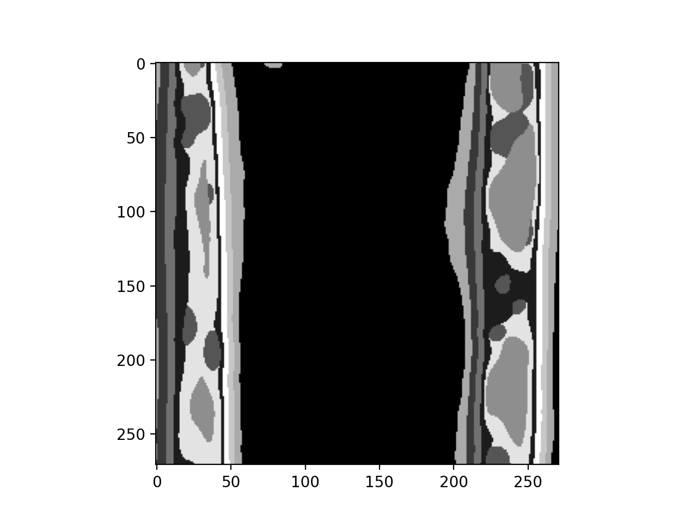
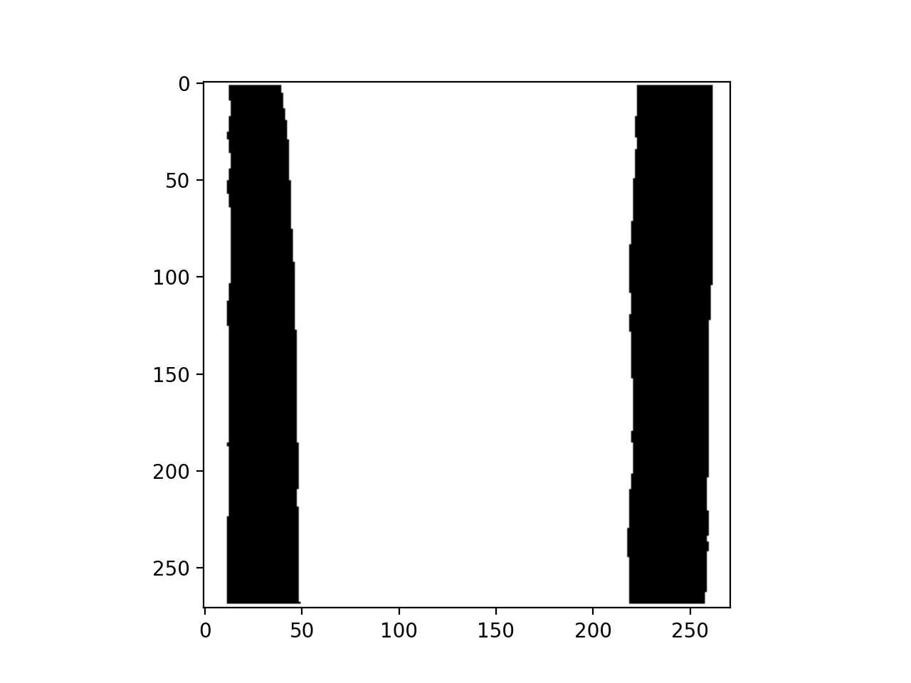
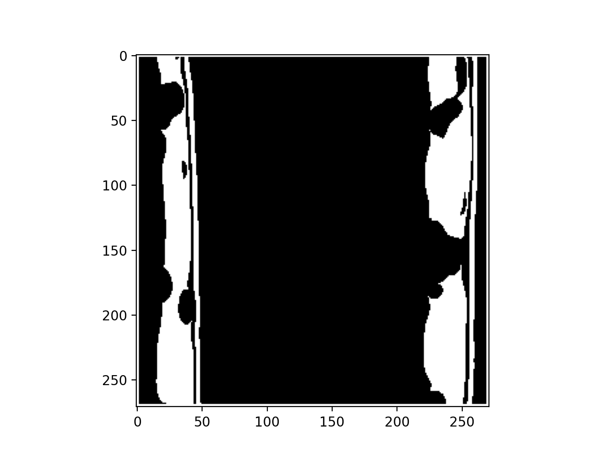
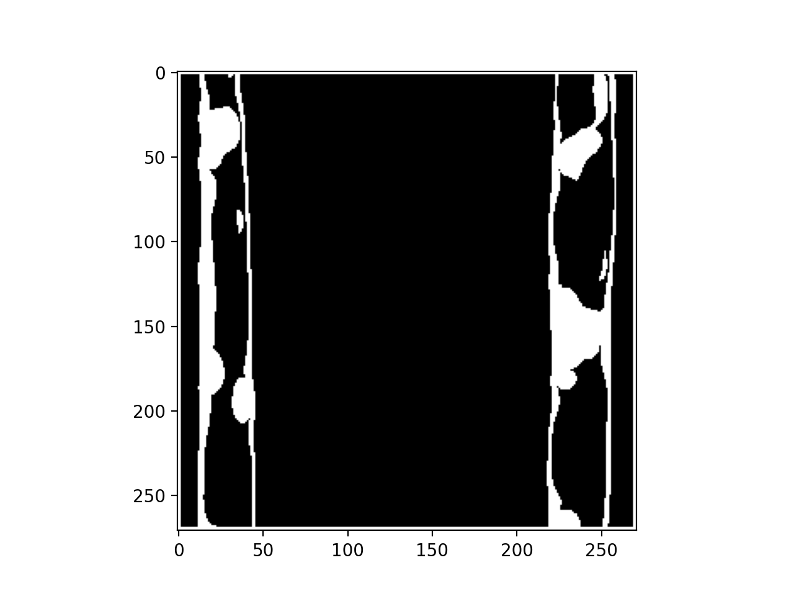

## Classification using a kmeans cluster model

The first function (`pcv.predict_kmeans`) takes a target image and uses a trained kmeans model produced by [`pcv.learn.train_kmeans`](train_kmeans.md) to classify regions of the target image by the trained clusters. The second function (`pcv.mask_kmeans`) takes a list of clusters and produces the combined mask from clusters of interest. The target and training images may be in grayscale or RGB image format.

**plantcv.predict_kmeans**(*img, model_path="./kmeansout.fit", patch_size=10*)

**outputs** An image with regions colored and labeled according to cluster assignment

- **Parameters:**
    - img = Path to target image
    - model_path = Path to where the model fit (output from plantcv.learn.train_kmeans.py) is stored
    - patch_size = Size of the NxN neighborhood around each pixel, used for classification

- **Context:**
    - Used to classify cluster assignment of pixels in a target image using a trained kmeans clustering model.
    - [Command line interface](tools.md) also available

- **Example use below**


**plantcv.mask_kmeans**(*labeled_img, k, cat_list=None*)

**outputs** Either a combined mask of the requestedlist of clusters or a dictionary of each cluster as a separate mask with keys corresponding to the cluster number 

- **Parameters:**
    - labeled_img = The output from predict_kmeans, an image with pixels labeled according to their cluster assignment
    - k = The number of clusters in the trained model
    - cat_list = List of clusters to include in a combined mask. If None, output is a dictionary of separate masks for each cluster

- **Context:**
    - Used to create masks from kmeans cluster assignments on a target image.  

- **Example use:**

**Input image example**



```python

from plantcv import plantcv as pcv

#Labeling a target image
labeled_img = pcv.predict_kmeans(img='./leaf_example.png',
                                 model_path="./kmeansout_leaf.fit", patch_size=5)

#Choosing clusters for each category within the seed image
background = pcv.mask_kmeans(labeled_img=labeled_img, k=10 cat_list=[0, 2, 4, 6, 7])
sick = pcv.mask_kmeans(labeled_img=labeled_img, k=10, cat_list=[1, 3])
leaf = pcv.mask_kmeans(labeled_img=labeled_img, k=10, cat_list=[5, 8, 9])

```

**Labeled image**



**Combined mask of background clusters**



**Combined mask of healthy clusters**



**Combined mask of sick clusters**



**Source Code:** [Here](https://github.com/danforthcenter/plantcv/blob/main/plantcv/plantcv/kmeans_classifier.py)
