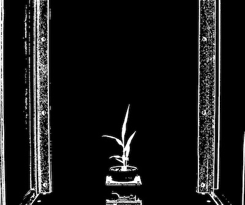
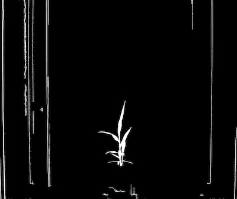
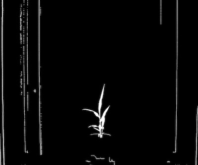

## Logical Operations - And

Join two images using the bitwise AND operator. Images must be the same size. 
This is a wrapper for the Opencv Function [bitwise_and](http://docs.opencv.org/2.4/modules/core/doc/operations_on_arrays.html#bitwise-and).  

<<<<<<< HEAD
**logical_and**(*img1, img2, device, debug=None*)
=======
**logical_and**(*img1, img2, device, debug=False*)
>>>>>>> master

**returns** device, 'and' image

- **Parameters:**
    - img1 - image object 1.
    - img2 - image object 2.
    - device - Counter for image processing steps
<<<<<<< HEAD
    - debug - None, "print", or "plot". Print = save to file, Plot = print to screen. Default = None
=======
    - debug- Default value is False, if True, intermediate image will be printed
>>>>>>> master
- **Context:**
    - Used to combine to images. Very useful when combining image channels that have been thresholded seperately.
- **Example use:**
    - [Use In VIS Tutorial](vis_tutorial.md)

**Input binary image 1**



**Input binary image 2**



```python
import plantcv as pcv

# Combine two images that have had different thresholds applied to them.
# For logical 'and' operation object pixel must be in both images to be included in 'and' image.
<<<<<<< HEAD
device, and_image = pcv.logical_and(s_threshold, b_threshold, device, debug="print")
=======
device, and_image = pcv.logical_and(s_threshold, b_threshold, device, args.debug)
>>>>>>> master
```

**Combined image**


