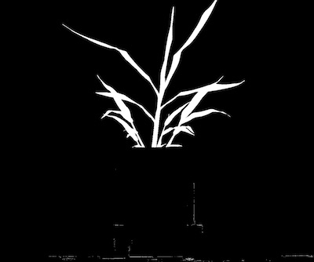
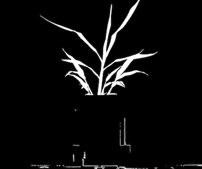

## Logical Operations - Or

Join two images using the bitwise OR operator. Images must be the same size. 
This is a wrapper for the Opencv Function [bitwise_or](http://docs.opencv.org/2.4/modules/core/doc/operations_on_arrays.html#bitwise-or).  

**plantcv.logical_or**(*bin_img1, bin_img2*)

**returns** 'or' image

- **Parameters:**
    - bin_img1 - Binary image data to be compared to bin_img2.
    - bin_img2 - Binary image data to be compared to bin_img1.
    
- **Context:**
    - Used to combine to images. Very useful when combining image channels that have been thresholded seperately.
- **Example use:**
    - [Use In VIS Tutorial](vis_tutorial.md)
    - [Use In NIR Tutorial](nir_tutorial.md)
    
**Input binary image 1**



**Input binary image 2**



```python
from plantcv import plantcv as pcv

# Set global debug behavior to None (default), "print" (to file), or "plot" (Jupyter Notebooks or X11)
pcv.params.debug = "print"

# Combine two images that have had different thresholds applied to them.
# For logical 'or' operation object pixel in either image object will be included in 'or' image.
ab = pcv.logical_or(maskeda_thresh, maskedb_thresh)
```

**Combined image**


