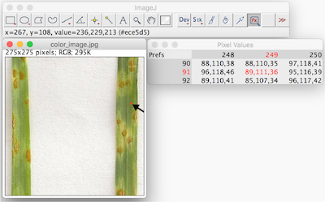
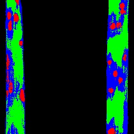

## Tutorial: Machine Learning

Machine learning methods can be used to train a trainable classifier to detect features of interest. In the tutorial
below we describe how to train and use the first trainable classifier we have made available in PlantCV. See the 
[Naive Bayes Classifier](naive_bayes_classifier.md) documentation for more details on the methodology.

### Naive Bayes

The naive Bayes approach used here can be trained to label pixels as plant or background. In other words, it can be
trained to, given a color image, output a binary image where background is labeled as black (0) and plant is labeled
as white (255). The goal is to replace the need to set [binary threshold](binary_threshold.md) values manually.

To train the classifier, we need to label a relatively small set of images using a binary mask (just like above).
We can use PlantCV to create a binary mask for a set of input images using the methods described in the 
[VIS Tutorial](vis_tutorial.md).

For the purpose of this tutorial, we assume we are in a folder containing two subfolders, one containing original RGB
images, and one containing black and white masks that match the set of RGB images.

First, use `plantcv-train.py` to use the training images to output probability density functions (PDFs) for plant
and background.

```
plantcv-train.py naive_bayes --imgdir ./images --maskdir ./masks --outfile naive_bayes_pdfs.txt --plots
```

The output file from `plantcv-train.py` will contain one row for each color channel (hue, saturation, and value) for
each class (plant and background). The first and second column are the class and channel label, respectively. The
remaining 256 columns contain the p-value from the PDFs for each intensity value observable in an 8-bit image (0-255).

Once we have the `plantcv-train.py` output file, we can classify pixels in a color image in PlantCV.

```python
from plantcv import plantcv as pcv

# Set global debug behavior to None (default), "print" (to file), or "plot" (Jupyter Notebooks or X11)
pcv.params.debug = "print"

# Read in a color image
img, path, filename = pcv.readimage("color_image.png")

# Classify the pixels as plant or background
mask = pcv.naive_bayes_classifier(img, pdf_file="naive_bayes_pdfs.txt")
```

See the [Naive Bayes Classifier](naive_bayes_classifier.md) documentation for example input/output.

### Naive Bayes Multiclass

The naive Bayes multiclass approach is an extension of the naive Bayes approach described above. Just like the approach
above it can be trained to output binary images given an input color image. Unlike the naive Bayes method above, the
naive Bayes multiclass approach can be trained to classify two or more classes, defined by the user. Additionally,
the naive Bayes multiclass method is trained using colors sparsely sampled from images rather than the need to label all
pixels in a given image.

To train the classifier, we need to build a table of red, green, and blue color values for pixels sampled evenly from
each class. The idea here is to collect a relevant sample of pixel color data for each class. The size of the sample 
needed to build robust probability density functions for each class will depend on a number of factors, including the
variability in class colors and imaging quality/reproducibility. To collect pixel color data we currently use the Pixel
Inspection Tool in [ImageJ](https://imagej.nih.gov/ij/). An example table built from pixel samples looks like this:

```
Plant	    Pustule	    Chlorosis	Background
109,122,68	136,96,0	151,155,65	227,226,221
103,114,58	139,93,0	148,151,67	232,231,226
92,103,46	142,94,0	143,147,59	230,229,224
94,110,52	156,110,33	177,170,109	226,225,220
94,110,52	166,116,49	179,172,111	226,225,220
91,107,48	162,106,43	182,173,107	230,229,224
91,104,50	161,103,40	187,181,79	228,227,222
78,91,35	153,96,26	180,174,70	228,227,222
85,99,44	148,90,17	183,179,77	230,229,224
90,100,48	150,95,23	129,129,37	229,228,223
81,91,38	147,95,23	118,118,22	230,229,224
```

Each column in the tab-delimited table is a feature class (in this example, plant, pustule, chlorosis, or background)
and each cell is a comma-separated red, green, and blue triplet for a pixel.

To collect pixel samples, open the color image in ImageJ.


Use the Pixel Inspector Tool to select regions of the image belonging to a single class. Copy and paste the pixel red,
green, and blue values into a spreadsheet or text editor and reformat into a single column per class. In this example,
nine pixels are sampled with one click but the radius is adjustable.



Once a satisfactory sample of pixels is collected, save the table as a tab-delimited text file. Like the naive Bayes
method described above, us `plantcv-train.py` to use the pixel samples to output probability density functions (PDFs)
for each class.

```
plantcv-train.py naive_bayes_multiclass --file pixel_samples.txt --outfile naive_bayes_pdfs.txt --plots
```

The output file from `plantcv-train.py` will contain one row for each color channel (hue, saturation, and value) for
each class. The first and second column are the class and channel label, respectively. The
remaining 256 columns contain the p-value from the PDFs for each intensity value observable in an 8-bit image (0-255).

Once we have the `plantcv-train.py` output file, we can classify pixels in a color image in PlantCV using the same
function described in the naive Bayes section above. The example image above, pseudocolored by class is shown below:



### Parallelizing image classification

To parallelize the naive Bayes methods described above, construct a pipeline script following the guidelines in the 
[Pipeline Parallelization tutorial](pipeline_parallel.md), but with an additional argument provided for the probability
density functions file output by `plantcv-train.py`. For example:

```python
#!/usr/bin/env python

import argparse
from plantcv import plantcv as pcv

# Parse command-line arguments
def options():
    parser = argparse.ArgumentParser(description="Imaging processing with opencv")
    parser.add_argument("-i", "--image", help="Input image file.", required=True)
    parser.add_argument("-o", "--outdir", help="Output directory for image files.", required=False)
    parser.add_argument("-r", "--result", help="result file.", required=False)
    parser.add_argument("-r2", "--coresult", help="result file.", required=False)
    parser.add_argument("-p", "--pdfs", help="Naive Bayes PDF file.", required=True)
    parser.add_argument("-w", "--writeimg", help="write out images.", default=False, action="store_true")
    parser.add_argument("-D", "--debug", help="Turn on debug, prints intermediate images.", default=None)
    args = parser.parse_args()
    return args


def main():
    # Get options
    args = options()
    
    # Initialize device counter
    pcv.params.debug = args.debug
    
    # Read in the input image
    vis, path, filename = pcv.readimage(filename=args.image)
    
    # Classify each pixel as plant or background (background and system components)
    masks = pcv.naive_bayes_classifier(rgb_img=vis, pdf_file=args.pdfs)
    
    # Additional steps in the pipeline go here
```

Then run `plantcv-pipeline.py` with options set based on the input images, but where the naive Bayes PDF file is input
using the `--other_args` flag, for example:

```bash
plantcv-pipeline.py \
--dir ./my-images \
--pipeline my-naive-bayes-script.py \
--db my-db.sqlite3 \
--outdir . \
--meta imgtype_camera_timestamp \
--create \
--other_args="--pdfs naive_bayes_pdfs.txt"
```
