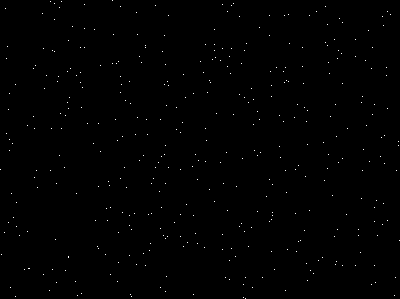

## Mask bad pixels Threshold

Creates a binary image from a grayscale based on pixel values and the definition of "bad" pixels.
"Bad" pixels are invalid numeric data such as not a number (nan) or infinite (inf).

**plantcv.threshold.mask_bad(*float_img, bad_type="native"*)**

**returns** thresholded/binary image

- **Parameters:**
    - float_img - Input float image data (most likely an image that is the result of some numeric calculation, e.g. a hyperspectral index image). The datatype should be "float".
    - bad_type  - The definition of "bad" pixels ("nan", "inf", or "native", default="native")
- **Context:**
    - Used to threshold based on value of pixels. This can be useful to post-process calculated hyperspectral indices.  
- **Example use:**
    - Below (to be followed with "visualize.pseudocolor" to visualize the result). 

```python

from plantcv import plantcv as pcv
# Mask all types of bad pixels out present in the original image  (nan and inf)
bad_mask_1 = pcv.threshold.mask_bad(float_img=float_img, bad_type="native")

# Mask pixels with nan values (if any) in the original image out
bad_mask_2 = pcv.threshold.mask_bad(float_img=float_img, bad_type="nan")

# Mask pixels with inf values (if any) in the original image out
bad_mask_3 = pcv.threshold.mask_bad(float_img=float_img, bad_type="inf")
                                    
```

**Mask for bad pixels**

We can see that a mask indicating locations of "bad" pixels generated. 



To visualize the original image with "bad" pixels highlighted, check [here](https://github.com/danforthcenter/plantcv/blob/master/docs/visualize_pseudocolor.md)

**Source Code:** [Here](https://github.com/danforthcenter/plantcv/blob/master/plantcv/plantcv/threshold/threshold_methods.py)
