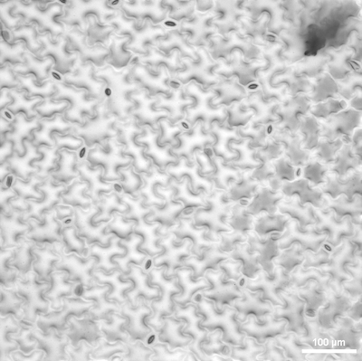

## Masks to Labels

Convert a list of masks to a single labeled mask

**plantcv.masks2labels**(*mask_list*)

**returns** labeled mask, colored img, number of objects

- **Parameters:**
    - mask_list - List of masks to convert to a labeled mask, empty masks will be removed

- **Context:**
    - Used to convert a list of masks to a single labeled mask 


```python

from plantcv import plantcv as pcv

# Set global debug behavior to None (default), "print" (to file),
# or "plot" (Jupyter Notebooks or X11)

pcv.params.debug = "plot"

# Change list of masks to a single labeled mask
labeled_mask, colored_img, num_label = pcv.masks2labels(filtered_area1)

```
**Original Image**




**Debug Labeled Image**


**Source Code:** [Here](https://github.com/danforthcenter/plantcv/blob/main/plantcv/plantcv/masks2labels.py)
