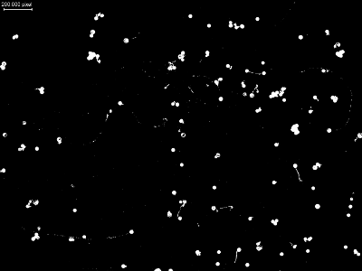

## Mean Adaptive Threshold

Creates a binary image from a grayscale image using the mean adaptive thresholding method.

Adaptive thresholds use a threshold value that varies across the image.
This local threshold depends on the local average, computed in a squared portion of the image of
*ksize* by *ksize* pixels, and on the *offset* relative to that local average.

In the mean adaptive threshold, the local average is the average of the pixel values in the block.

**plantcv.threshold.mean**(*gray_img, ksize, offset, object_type="light"*)

**returns** thresholded/binary image

- **Parameters:**
    - gray_img - Grayscale image data
    - ksize - Size of the block of pixels used to compute the local average
    - offset - Value substracted from the local average to compute the local threshold.
    A negative offset sets the local threshold above the local average.
    - object_type - "light" or "dark" (default: "light").
      - "light" for objects brighter than the background, sets the pixels above
      the local threshold to 255 and the pixels below to 0.
      - "dark" for objects darker than the background, sets the pixels below the
      local threshold to 255 and the pixels above to 0.
- **Context:**
    - Useful for unevenly illuminated images


**Grayscale image**


```python
from plantcv import plantcv as pcv

# Set global debug behavior to None (default), "print" (to file),
# or "plot" (Jupyter Notebooks or X11)

pcv.params.debug = "plot"

# Adaptive threshold with different parameters
threshold_mean1 = pcv.threshold.mean(gray_img=gray_img, ksize=250, offset=25,
                                    object_type='dark')

threshold_mean2 = pcv.threshold.mean(gray_img=gray_img, ksize=15, offset=5,
                                    object_type='dark')

threshold_mean3 = pcv.threshold.mean(gray_img=gray_img, ksize=2000, offset=25,
                                    object_type='dark')
```

**Thresholded image**



**Thresholded image using a small block size**


**Thresholded image using a large block size**


**Source Code:** [Here](https://github.com/danforthcenter/plantcv/blob/main/plantcv/plantcv/threshold/threshold_methods.py)
