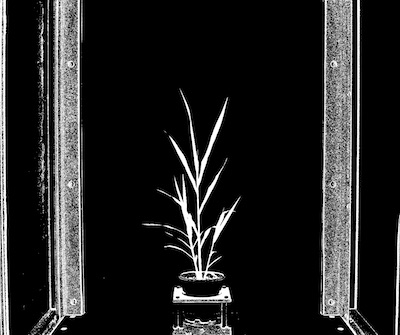
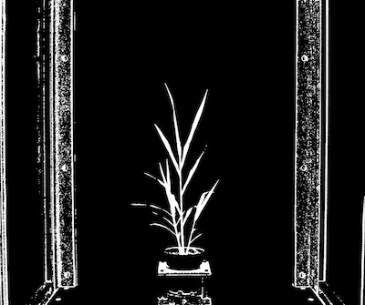
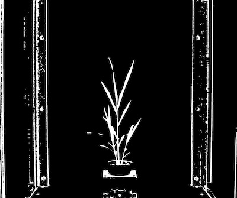

## Median Blur

Applies a median blur filter. Applies median value to central pixel within a kernel size (ksize x ksize). 
The function is a wrapper for the OpenCV function [median blur](http://docs.opencv.org/doc/tutorials/imgproc/gausian_median_blur_bilateral_filter/gausian_median_blur_bilateral_filter.html_).  

**plantcv.median_blur**(*gray_img, ksize*)**

**returns** blurred image

- **Parameters:**
    - gray_img - Grayscale image data
    - ksize - kernel size => integer or tuple, ksize x ksize box if integer, (n, m) size box if tuple 
- **Context:**
    - Used to reduce image noise
- **Example use:**
    - [Use In VIS Tutorial](vis_tutorial.md)
    - [Use In NIR Tutorial](nir_tutorial.md)
    - [Use In PSII Tutorial](psII_tutorial.md)


**Thresholded image**



```python
from plantcv import plantcv as pcv

# Set global debug behavior to None (default), "print" (to file), or "plot" (Jupyter Notebooks or X11)
pcv.params.debug = "print"

# Apply median blur to a binary image that has been previously thresholded.
blur_5 = pcv.median_blur(img, 5)
```

**Median blur (k = 5)**



```python
from plantcv import plantcv as pcv

# Set global debug behavior to None (default), "print" (to file), or "plot" (Jupyter Notebooks or X11)
pcv.params.debug = "print"

# Apply median blur to a binary image that has been previously thresholded.
blur_11 = pcv.median_blur(img, 11)
```

**Median blur (k = 11)**


