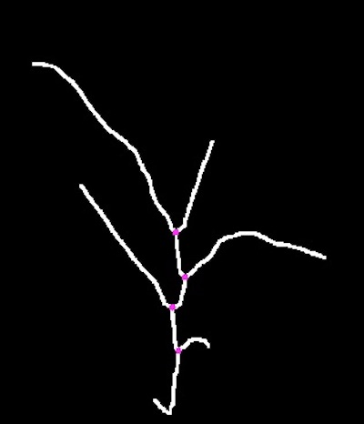
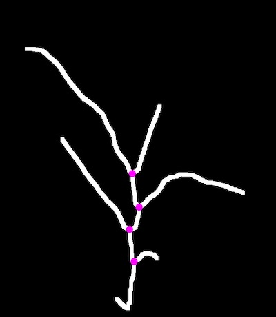

## Find Branch/Junction Points 

**plantcv.morphology.*find_branch_pts*(*skel_img*)

**returns** Binary mask of branch points 

- **Parameters:**
    - skel_img - Skeleton image (output from [plantcv.morphology.skeletonize](morph_skeletonize.md))
- **Context:**
    - Identifies branch/junction points in a skeleton image

**Reference Image**


```python

from plantcv import plantcv as pcv

# Set global debug behavior to None (default), "print" (to file), or "plot" (Jupyter Notebooks or X11)
pcv.params.debug = "plot"

branch_points_img = pcv.morphology.find_branch_pts(skel_img=skeleton)

# Adjust line thickness with the global line thickness parameter (default = 5)
pcv.params.line_thickness = 8
thick_branch_points_img = pcv.morphology.find_branch_pts(skel_img=skeleton)

```
*Default Thickness (5)*



*pcv.params.line_thickness = 8*



