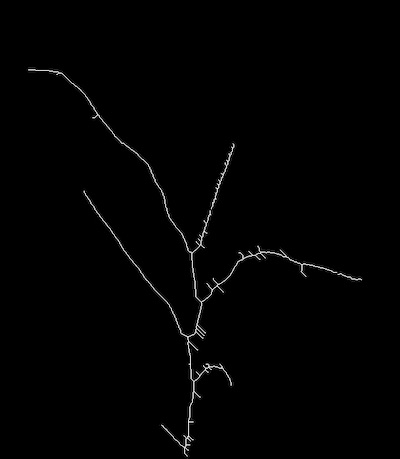
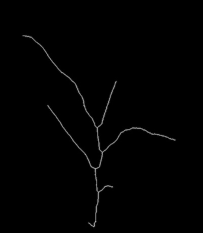

## Prune

**plantcv.morphology.*prune*(*skel_img, size*)

**returns** Pruned skeleton image 

- **Parameters:**
    - skel_img - Skeleton image (output from [plantcv.morphology.skeletonize](morph_skeletonize.md))
    - size - How many pixels to trim off 
- **Context:**
    - Iteratively remove endpoints (tips) from a skeletonized image. This "prunes" spurious branches/barbs off a skeleton.
- **Important Note:**
    - The function prunes all tips of a skeletonized image, and should be used as sparingly as possible since leaves will also get trimmed. 

**Reference Image**



```python

from plantcv import plantcv as pcv

# Set global debug behavior to None (default), "print" (to file), 
# or "plot" (Jupyter Notebooks or X11)
pcv.params.debug = "print"

pruned_skeleton = pcv.morphology.prune(skel_img=skeleton, size=10)

```


