## Tutorial: Morphology Functions 

PlantCV is composed of modular functions that can be arranged (or rearranged) and adjusted quickly and easily.
Workflows do not need to be linear (and often are not). Please see Workflow example below for more details.
A global variable "debug" allows the user to print out the resulting image. The debug has three modes: either None, 'plot', or print'. If set to
'print' then the function prints the image out, if using a [Jupyter](jupyter.md) notebook you could set debug to 'plot' to have
the images plot to the screen. Debug mode allows users to visualize and optimize each step on individual test images and small test sets before workflows
are deployed over whole datasets.

Morphology sub-package functions can be used once a binary mask has been created (see the [VIS tutorial](vis_tutorial.md) and the [VIS/NIR tutorial](vis_nir_tutorial.md)
for examples of masking background). This tutorial will start with a binary mask (after object segmentation has been completed) but in a complete 
workflow users will need to use other functions to achieve plant isolation. Morphology functions are intended to be one type of object analysis. These functions 
can potentially return information about leaf length, leaf angle, and leaf curvature.

[](https://mybinder.org/v2/gh/danforthcenter/plantcv-binder.git/master?filepath=notebooks/morphology_tutorial.ipynb) Check out our interactive morphology tutorial! 

Also see [here](#morphology-script) for the complete script. 

**Workflow**

1.  Optimize workflow on individual image with debug set to 'print' (or 'plot' if using a Jupyter notebook).
2.  Run workflow on small test set (ideally that spans time and/or treatments).
3.  Re-optimize workflows on 'problem images' after manual inspection of test set.
4.  Deploy optimized workflow over test set using parallelization script.

**Running A Workflow**

To run a morphology workflow over a single VIS image there are two required inputs:

1.  **Mask:** Images can be processed regardless of what type of VIS camera was used (high-throughput platform, digital camera, cell phone camera).
Image processing will work with adjustments if images are well lit and free of background that is similar in color to plant material. Once background is 
masked, morphology functions can be used.   
2.  **Output directory:** If debug mode is set to 'print' output images from each step are produced.

Optional inputs:  

*  **Result File:** File to print results to
*  **Write Image Flag:** Flag to write out images, otherwise no result images are printed (to save time).
*  **Debug Flag:** Prints an image at each step
*  **Region of Interest:** The user can input their own binary region of interest or image mask (make sure it is the same size as your image or you will have problems).

Sample command to run a workflow on a single image:  

*  Always test workflows (preferably with -D 'print' option for debug mode) before running over a full image set

```
./workflowname.py -i testimg.png -o ./output-images -r results.txt -w -D 'print'

``` 

##### Workflows start by importing necessary packages, and by defining user inputs.

```python

#!/usr/bin/env python
# import sys, traceback
import argparse
from plantcv import plantcv as pcv

### Parse command-line arguments
def options():
    parser = argparse.ArgumentParser(description="Imaging processing with opencv")
    parser.add_argument("-i", "--image", help="Input image file.", required=True)
    parser.add_argument("-o", "--outdir", help="Output directory for image files.", required=False)
    parser.add_argument("-r","--result", help="result file.", required= False )
    parser.add_argument("-w","--writeimg", help="write out images.", default=False, action="store_true")
    parser.add_argument("-D", "--debug", help="can be set to 'print' or None (or 'plot' if in jupyter) prints intermediate images.", default=None)
    args = parser.parse_args()
    return args
    
```

**Figure 1.** Original image.

This particular image was captured by a 
[high-throughput phenotyping system](http://www.danforthcenter.org/scientists-research/core-technologies/phenotyping). 

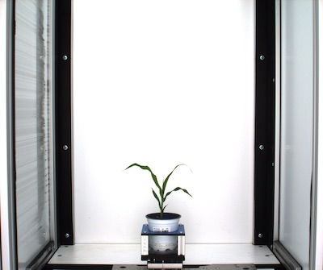

**Figure 2.** Masked image with background removed.

Masking an image is likely with completed a multi-step process. There are many ways to approach object segmentation. See the 
[VIS tutorial](vis_tutorial.md) and [VIS/NIR tutorial](vis_nir_tutorial.md) for examples on multi-step object segmentation. One 
PlantCV function that can sometimes mask images in a single step is [plantcv.threshold.custom_range](custom_range_threshold.md). 


#### Start of the Morphology portion of the workflow.

```python
### Main workflow
def main():
    # Get options
    args = options()
    
    pcv.params.debug=args.debug #set debug mode
    pcv.params.debug_outdir=args.outdir #set output directory
    
    ########################################
    ## Segmentation Steps Here      
    ########################################

    # We skip to reading in the previously created image mask 
    mask, path, filename = pcv.readimage("plant_mask.png")
    
    # Crop the mask 
    cropped_mask = mask[1150:1750, 900:1550]

```

**Figure 3.** Cropped mask 

To better see details in this tutorial we cropped the image so there is less blank space. We did this manually but 
[plantcv.auto_crop](auto_crop.md) is a useful tool if the plant takes up a small amount of the total image. 


```python
    
    # Skeletonize the mask 
    
    # Inputs:
    #   mask = Binary image data
    
    skeleton = pcv.morphology.skeletonize(mask=cropped_mask)

```

**Figure 4.** Skeletonized image

[Skeletonizing](skeletonize.md) takes a binary object and reduces it to a 1 pixel wide representations (skeleton). 


```python
    # Adjust line thickness with the global line thickness parameter (default = 5),
    # and provide binary mask of the plant for debugging. NOTE: the objects and
    # hierarchies returned will be exactly the same but the debugging image (segmented_img)
    # will look different.
    pcv.params.line_thickness = 3 
    
    # Prune the skeleton  
    
    # Inputs:
    #   skel_img = Skeletonized image
    #   size     = Pieces of skeleton smaller than `size` should get removed. (Optional) Default `size=0`. 
    #   mask     = Binary mask for debugging (optional). If provided, debug images will be overlaid on the mask.
    
    pruned, seg_img, edge_objects = pcv.morphology.prune(skel_img=skeleton, size=0, mask=cropped_mask)

```

 **Figure 4, 5, & 6.** Pruned image
 
Generally, skeletonized images will have barbs, representing the width, that need to get pruned off. Mask quality is highly influential in the 
 number of barbs present after skeletonizing. See [plantcv.morphology.prune](prune.md) for an example. 
 The function returns a pruned skeleton but the image that gets plot for debugging shows the portions of skeleton that get pruned 
off. The function prunes only secondary segments; primary segments that are smaller than `size` pixels long will not get removed with pruning. 


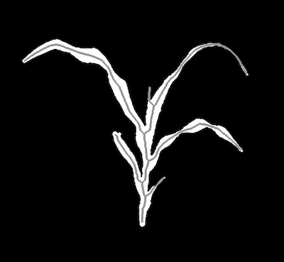

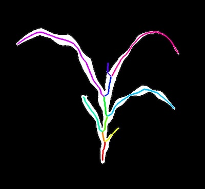


```python
    
    # Identify branch points   
    
    # Inputs:
    #   skel_img = Skeletonized image
    #   mask     = (Optional) binary mask for debugging. If provided, debug image will be overlaid on the mask.
    #   label    = (Optional) label parameter, modifies the variable name of observations recorded. (default `label="default"`)
    branch_pts_mask = pcv.morphology.find_branch_pts(skel_img=skeleton, mask=cropped_mask, label="default")

```

**Figure 7 and 8.** Branch Points 

The [plantcv.morphology.find_branch_pts](find_branch_pts.md) function returns a binary mask, where the white pixels are the branch points identified,
but while debug mode is on it plots out an image to verify the function is working properly. This can help a user decide is more pruning needs to be done
to remove all barbs. 

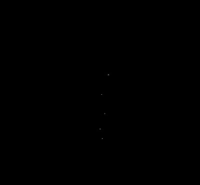

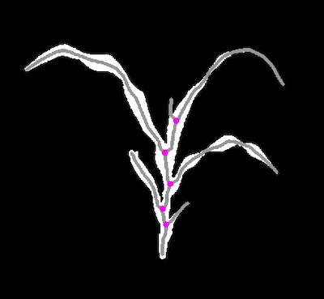

```python
    
    # Identify tip points   
    
    # Inputs:
    #   skel_img = Skeletonized image
    #   mask     = (Optional) binary mask for debugging. If provided, debug image will be overlaid on the mask.
    #   label    = (Optional) label parameter, modifies the variable name of observations recorded. (default `label="default"`)
    
    tip_pts_mask = pcv.morphology.find_tips(skel_img=skeleton, mask=None, label="default")

```

**Figure 9 and 10.** Tip Points

The [plantcv.morphology.find_tips](find_tips.md) function also returns a binary mask of tip points identified, but will plot a debugging image that is 
easier to see what the function is returning. This example shows the output when no mask if provided to the function. 


```python
    
    # Sort segments into leaf objects and stem objects  
      
    # Inputs:
    #   skel_img  = Skeletonized image
    #   objects   = List of contours
    #   mask      = (Optional) binary mask for debugging. If provided, debug image will be overlaid on the mask.
    
    leaf_obj, stem_obj = pcv.morphology.segment_sort(skel_img=skeleton, 
                                                     objects=edge_objects,
                                                     mask=cropped_mask)

```

**Figure 11.** Sorted Segments

The [plantcv.morphology.segment_sort](segment_sort.md) function sorts pieces of the skeleton into leaf and "other". It returns the leaf objects separate from 
the stem objects, and their corresponding hierarchies. The debugging image produced when [plantcv.params.debug](params.md) is turned on plots all segments
sorted into the leaf category as green while the rest of the segments are fuschia. 


```python
    
    # Identify segments     
    
    # Inputs:
    #   skel_img  = Skeletonized image
    #   objects   = List of contours
    #   mask      = (Optional) binary mask for debugging. If provided, debug image will be overlaid on the mask.
    
    segmented_img, labeled_img = pcv.morphology.segment_id(skel_img=skeleton,
                                                           objects=leaf_obj,
                                                           mask=cropped_mask)

```

**Figure 12.** Identify Segments

All PlantCV functions in the morphology sub-package will perform analysis on objects in the same order each time. 
While there isn't currently a method for tracking leaves over time, or identifying specific leaves (we encourage you to 
reach out to our [GitHub repository](https://github.com/danforthcenter/plantcv/issues) with any questions/suggestions). 
For this tutorial we assume leaves are the objects of interest, and just pass those objects and hierarchies to the 
[plantcv.morphology.segment_id](segment_id.md) function. 

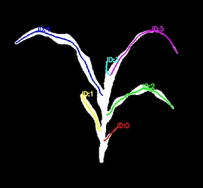

```python
    
    # Measure path lengths of segments     
    
    # Inputs:
    #   segmented_img = Segmented image to plot lengths on
    #   objects       = List of contours
    #   label    = (Optional) label parameter, modifies the variable name of observations recorded. (default `label="default"`)
    
    labeled_img  = pcv.morphology.segment_path_length(segmented_img=segmented_img, 
                                                      objects=leaf_obj, label="default")

```

**Figure 13.** Find Leaf Path Lengths 

With the [plantcv.morphology.segment_path_length](segment_pathlength.md) function we find the geodesic distance of each segment
passed into the function. 

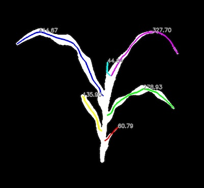

```python
    
    # Measure euclidean distance of segments      
    
    # Inputs:
    #   segmented_img = Segmented image to plot lengths on
    #   objects       = List of contours
    #   label    = (Optional) label parameter, modifies the variable name of observations recorded. (default `label="default"`)
    
    labeled_img = pcv.morphology.segment_euclidean_length(segmented_img=segmented_img, 
                                                          objects=leaf_obj, label="default")

```

**Figure 14.** Find Leaf Euclidean Distance 

With the [plantcv.morphology.segment_euclidean_length](segment_euclidean_length.md) function we find the 
euclidean distance of each segment passed to the function. 

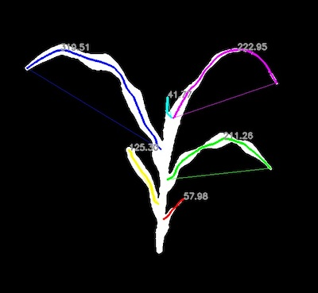

```python
    
    # Measure curvature of segments      
    
    # Inputs:
    #   segmented_img = Segmented image to plot curvature on
    #   objects       = List of contours
    #   label    = (Optional) label parameter, modifies the variable name of observations recorded. (default `label="default"`)
    
    labeled_img = pcv.morphology.segment_curvature(segmented_img=segmented_img, 
                                                   objects=leaf_obj, label="default")

```

**Figure 15.** Find Leaf Curvature

With the [plantcv.morphology.segment_curvature](segment_curvature.md) function we find the 
ratio of the geodesic distance and euclidean distance of each segment passed to the function. 
This results in a measurement of two-dimensional tortuosity. Values closer to 1 indicate that a segment 
is a straight line while larger values indicate the segment has more curvature. 


```python
    
    # Measure the angle of segments      
    
    # Inputs:
    #   segmented_img = Segmented image to plot angles on
    #   objects       = List of contours
    #   label    = (Optional) label parameter, modifies the variable name of observations recorded. (default `label="default"`)
    
    labeled_img = pcv.morphology.segment_angle(segmented_img=segmented_img, 
                                               objects=leaf_obj, label="default")

```

**Figure 16.** Find Leaf Angles

The [plantcv.morphology.segment_angles](segment_angle.md) function calculates angles of segments (in degrees) 
by fitting a linear regression line to each segment. 

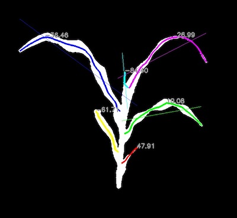

```python
    
    # Measure the tangent angles of segments      
    
    # Inputs:
    #   segmented_img = Segmented image to plot tangent angles on
    #   objects       = List of contours
    #   size          = Size of ends used to calculate "tangent" lines
    #   label    = (Optional) label parameter, modifies the variable name of observations recorded. (default `label="default"`)
    
    labeled_img = pcv.morphology.segment_tangent_angle(segmented_img=segmented_img, 
                                                       objects=leaf_obj, size=15, label="default")

```

**Figure 17.** Find Leaf Tangent Angles 

The [plantcv.morphology.segment_tangent_angle](segment_tangent_angle.md) function aims to measure a segment
curvature in different way. By fitting lines to either end of segment tips, and measuring the intersection angle 
between those two lines. Very rigid leaves will have tangent line intersection angles close to 180 degrees while
leaves that are more "floppy" will have smaller angles. 


```python
    
    # Measure the leaf insertion angles      
    
    # Inputs:
    #   skel_img         = Skeletonize image 
    #   segmented_img    = Segmented image to plot insertion angles on
    #   leaf_objects     = List of leaf contours
    #   stem_objects     = List of stem objects 
    #   size             = Size of the inner portion of each leaf to find a linear regression line
    #   label    = (Optional) label parameter, modifies the variable name of observations recorded. (default `label="default"`)
    
    labeled_img = pcv.morphology.segment_insertion_angle(skel_img=skeleton,
                                                         segmented_img=segmented_img, 
                                                         leaf_objects=leaf_obj, 
                                                         stem_objects=stem_obj,
                                                         size=20, label="default")

```

**Figure 18.** Find Leaf Insertion Angles

The [plantcv.morphology.segment_insertion_angle](segment_insertion_angle.md) function aims to measure 
leaf insertion angle. By fitting lines to the innermost part of a leaf and the stem, leaves that grow straight 
out from a stem will have larger insertion angles than those that grow upward. 


```python
    
    # Fill in segments (also stores out area data)  
    
    # Inputs:
    # mask         = Binary image, single channel, object = 1 and background = 0
    # objects      = List of contours
    # label        = (Optional) label parameter, modifies the variable name of observations recorded. (default `label="default"`)
    filled_img = pcv.morphology.fill_segments(mask=cropped_mask, objects=edge_objects, label="all_segments")


```

**Figure 19.** Fill Segment Area 

The [plantcv.morphology.fill_segment](fill_segments.md) function aims to measure 
area of segments filled in. By using watershed segmentation to flood fill the mask by
using the segments as markers. 

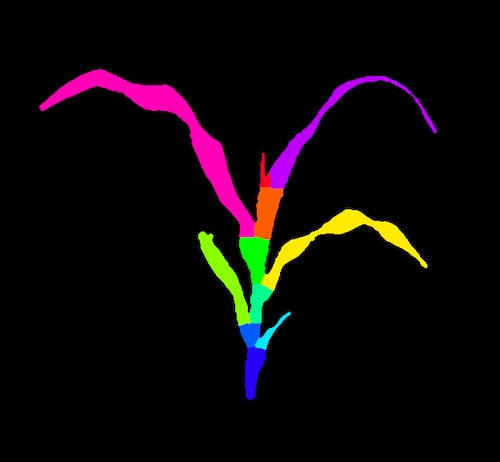


```python
    
    # Fill in leaves (also stores out area data)  
    
    filled_img2 = pcv.morphology.fill_segments(mask=cropped_mask, objects=leaf_obj, stem_objects=stem_obj, label="separate_leaves")


```

**Figure 20.** Fill Leaf/Stem Area 

The [plantcv.morphology.fill_segment](fill_segments.md) function can also measure segments
separately. When inputting sorted stem and leaf segments, the stem segments will be combined into 
one object while the leaves remain separate.  

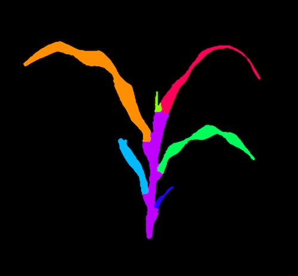

To deploy a workflow over a full image set please see tutorial on 
[workflow parallelization](pipeline_parallel.md).

```python
    # Write all data to results file
    pcv.outputs.save_results(filename=args.result)
     
if __name__ == '__main__':
    main()                                                          
``` 

## Morphology Script 

In the terminal:

```
./workflowname.py -i testimg.png -o ./output-images -r results.txt -w -D 'print'

``` 

*  Always test workflows (preferably with -D flag set to 'print') before running over a full image set

Python script: 

```python
#!/usr/bin/env python
# import sys, traceback

import argparse
from plantcv import plantcv as pcv


### Parse command-line arguments
def options():
    parser = argparse.ArgumentParser(description="Imaging processing with opencv")
    parser.add_argument("-i", "--image", help="Input image file.", required=True)
    parser.add_argument("-o", "--outdir", help="Output directory for image files.", required=False)
    parser.add_argument("-r", "--result", help="result file.", required=False)
    parser.add_argument("-w", "--writeimg", help="write out images.", default=False, action="store_true")
    parser.add_argument("-D", "--debug",
                        help="can be set to 'print' or None (or 'plot' if in jupyter) prints intermediate images.",
                        default=None)
    args = parser.parse_args()
    return args

#### Start of the Main/Customizable portion of the workflow.

### Main workflow
def main():
    # Get options
    args = options()

    pcv.params.debug = args.debug  # set debug mode
    pcv.params.debug_outdir = args.outdir  # set output directory
    
    ########################################
    ## Segmentation Steps Here      
    ########################################
    
    # # Read in the previously created image mask 
    mask, path, filename = pcv.readimage("plant_mask.png")

    # Crop the mask 
    cropped_mask = mask[1150:1750, 900:1550]
    
    # Skeletonize the mask 
    skeleton = pcv.morphology.skeletonize(mask=cropped_mask)
    
    # Adjust line thickness with the global line thickness parameter (default = 5),
    # and provide binary mask of the plant for debugging. NOTE: the objects and
    # hierarchies returned will be exactly the same but the debugging image (segmented_img)
    # will look different.
    pcv.params.line_thickness = 3         
    
    # Prune the skeleton  
    pruned, seg_img, edge_objects = pcv.morphology.prune(skel_img=skeleton, size=0, mask=cropped_mask)
        
    # Identify branch points   
    branch_pts_mask = pcv.morphology.find_branch_pts(skel_img=skeleton, mask=cropped_mask, label="default")
        
    # Identify tip points   
    tip_pts_mask = pcv.morphology.find_tips(skel_img=skeleton, mask=None, label="default")
    
    # Sort segments into leaf objects and stem objects  
    leaf_obj, stem_obj = pcv.morphology.segment_sort(skel_img=skeleton, objects=edge_objects,
                                                     mask=cropped_mask)
        
    # Identify segments     
    segmented_img, labeled_img = pcv.morphology.segment_id(skel_img=skeleton, objects=leaf_obj,
                                                           mask=cropped_mask)
        
    # Measure path lengths of segments     
    labeled_img2 = pcv.morphology.segment_path_length(segmented_img=segmented_img, 
                                                      objects=leaf_obj, label="default")
        
    # Measure euclidean distance of segments      
    labeled_img3 = pcv.morphology.segment_euclidean_length(segmented_img=segmented_img, 
                                                           objects=leaf_obj, label="default")
       
    # Measure curvature of segments      
    labeled_img4 = pcv.morphology.segment_curvature(segmented_img=segmented_img, 
                                                    objects=leaf_obj, label="default")
        
    # Measure the angle of segments      
    labeled_img5 = pcv.morphology.segment_angle(segmented_img=segmented_img, objects=leaf_obj, label="default")
    
    # Measure the tangent angles of segments      
    labeled_img6 = pcv.morphology.segment_tangent_angle(segmented_img=segmented_img, 
                                                        objects=leaf_obj, size=15, label="default")
                                                                         
    # Measure the leaf insertion angles      
    labeled_img7 = pcv.morphology.segment_insertion_angle(skel_img=skeleton,
                                                          segmented_img=segmented_img, 
                                                          leaf_objects=leaf_obj, 
                                                          stem_objects=stem_obj,
                                                          size=20, label="default")
    
    # Fill in segments (also stores out area data)                                                       
    filled_img = pcv.morphology.fill_segments(mask=cropped_mask, objects=edge_objects, label="all_segments")
    filled_img2 = pcv.morphology.fill_segments(mask=cropped_mask, objects=leaf_obj, stem_objects=stem_obj, label="separate_leaves")
                                                          
                                                          
    # Write out data collected about angles and lengths                                                       
    pcv.outputs.save_results(filename=args.result)

if __name__ == '__main__':
    main()
``` 
