## Tutorial: Multi Plant Image Pipeline

PlantCV is composed of modular functions that can be arranged (or rearranged) and adjusted quickly and easily.
Pipelines do not need to be linear (and often are not). Please see pipeline example below for more details.
A global variable "debug" allows the user to print out the resulting image. The debug has three modes: either None, 'plot', or print'. If set to
'print' then the function prints the image out, if using a [Jupyter](jupyter.md) notebook you could set debug to 'plot' to have
the images plot to the screen. Debug mode allows users to visualize and optimize each step on individual test images and small test sets before pipelines
are deployed over whole datasets.

For multi-plant pipelines, images with multiple plants are processed and result in individual pictures for each plant, allowing a secondary pipeline
(see [VIS tutorial](vis_tutorial.md) for example) to be used.
The challenge of multi-plant processing is that a single plant can be composed of several contours, therefore contours need to be sorted and clustered together in some way.
There are several functions that help with multi-plant image processing. First, the current clustering functions work by asking the user to provide an approximation of the number of desired
'rows' and 'columns' that they would like to split the image into. There does not need to be a plant in each spot, but the grid is used as an approximate region to cluster contours within.
The [rotation](rotate2.md) and [shift](shift.md) functions allow the image to be moved to optimize accurate clustering. Major assumptions that are made are that plants grow but
that the imaging position does not change drastically.
Also, the clustering functions will not work properly once plants start overlapping, since contours would also start overlapping.

**Workflow**

1.  Optimize pipeline on individual image with debug set to 'print' (or 'plot' if using a Jupyter notebook).
2.  Run pipeline on small test set (ideally that spans time and/or treatments).
3.  Re-optimize pipelines on 'problem images' after manual inspection of test set.
4.  Deploy optimized pipeline over test set using parallelization script.

**Running A Pipeline**

To run a multi-plant pipeline over a single VIS image there are two required inputs:

1.  **Image:** Images can be processed regardless of what type of VIS camera was used (high-throughput platform, digital camera, cell phone camera).
Image processing will work with adjustments if images are well lit and free of background that is similar in color to plant material.  
2.  **Output directory:** If debug mode is set to 'print' output images from each step are produced.

Optional inputs:  

*  **Names File:** path to txt file with names of genotypes to split images into (order of names would be top to bottom, left to right).
*  **Debug Flag:** Prints an image at each step.

Sample command to run a pipeline on a single image:  

*  Always test pipelines (preferably with -D 'print' option for debug mode) before running over a full image set

```
./pipelinename.py -i multi-plant-img.png -o ./output-images -n names.txt -D 'print'
```

### Walk Through A Sample Pipeline

#### Pipelines start by importing necessary packages, and by defining user inputs.

```python
#!/usr/bin/python

import sys, traceback
import cv2
import os
import re
import numpy as np
import argparse
import string
from plantcv import plantcv as pcv

### Parse command-line arguments
def options():
    parser = argparse.ArgumentParser(description="Imaging processing with opencv")
    parser.add_argument("-i", "--image", help="Input image file.", required=True)
    parser.add_argument("-o", "--outdir", help="Output directory for image files.", required=True)
    parser.add_argument("-n", "--names", help="path to txt file with names of genotypes to split images into", required =False)
    parser.add_argument("-D", "--debug", help="Turn on debug, prints intermediate images.", action=None)
    args = parser.parse_args()
    return args
```

#### Start of the Main/Customizable portion of the pipeline.

The image input by the user is [read in](read_image.md).

```python
### Main pipeline
def main():
    # Get options
    args = options()
    
    # Read image
    img, path, filename = pcv.readimage(args.image)
    
    params.debug=args.debug #set debug mode
```

**Figure 1.** Original image.
This particular image was captured by a raspberry pi camera, just to show that PlantCV works on images not captured on a 
[high-throughput phenotyping system](http://www.danforthcenter.org/scientists-research/core-technologies/phenotyping) with idealized VIS image capture conditions.
In this dataset images were captured over time of a flat (throughout the day and night).

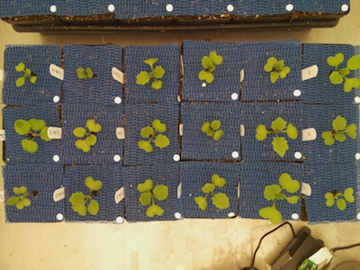

Check if this is an image captured at night.

```python
 
# STEP 1: Check if this is a night image, for some of these dataset's images were captured
# at night, even if nothing is visible. To make sure that images are not taken at
# night we check that the image isn't mostly dark (0=black, 255=white).
# if it is a night image it throws a fatal error and stops the pipeline.

if np.average(img) < 50:
    pcv.fatal_error("Night Image")
else:
    pass
```

[White balance](white_balance.md) the image so that color can be compared across images and so that image processing can be the same between images (ideally).

```python
    
# STEP 2: Normalize the white color so you can later
# compare color between images.
# Inputs:
#   img = image object, RGB colorspace
#   roi = region for white reference, if none uses the whole image,
#         otherwise (x position, y position, box width, box height)

# white balance image based on white toughspot

img1 = pcv.white_balance(img,roi=(400,800,200,200))
```

**Figure 2.** White balance the image so that later image processing is easier.


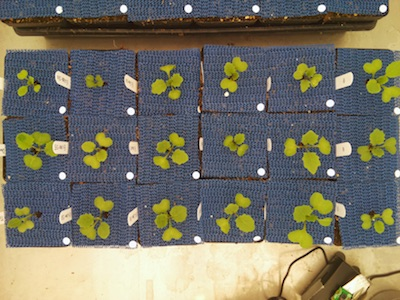

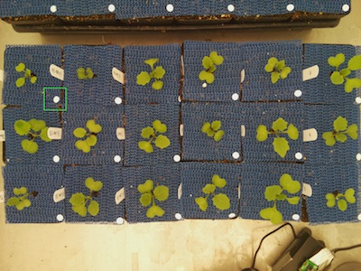

[Rotate](rotate2.md) image slightly so that plants line up with grid (later step)

```python

# STEP 3: Rotate the image

rotate_img = pcv.rotate(img1, -1)
```

**Figure 3.** Rotated image

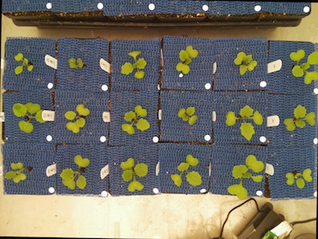

[Shift](shift.md) image slightly so that plants line up with grid (later step)

```python

# STEP 4: Shift image. This step is important for clustering later on.
# For this image it also allows you to push the green raspberry pi camera
# out of the image. This step might not be necessary for all images.
# The resulting image is the same size as the original.
# Inputs:
#   img    = image object
#   number = integer, number of pixels to move image
#   side   = direction to move from "top", "bottom", "right","left"

shift1 = pcv.shift_img(img1, 300, 'top')
img1 = shift1
```

**Figure 4.** Shifted image


Convert the image from [RGB to LAB](rgb2lab.md) and select single color channel that has contrast between the target object and background.

```python

# STEP 5: Convert image from RGB colorspace to LAB colorspace
# Keep only the green-magenta channel (grayscale)
# Inputs:
#    img     = image object, RGB colorspace
#    channel = color subchannel ('l' = lightness, 'a' = green-magenta , 'b' = blue-yellow)

a = pcv.rgb2gray_lab(img1, 'a')
```

**Figure 5.** Green-magenta channel from LAB color space from original image.

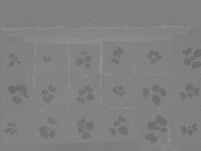

Use the [binary threshold](binary_threshold.md) function to threshold green-magenta image.

```python

# STEP 6: Set a binary threshold on the saturation channel image
# Inputs:
#    img         = img object, grayscale
#    threshold   = threshold value (0-255)
#    maxValue    = value to apply above threshold (usually 255 = white)
#    object_type = light or dark
#       - If object is light then standard thresholding is done
#       - If object is dark then inverse thresholding is done

img_binary = pcv.threshold.binary(a, 120, 255, 'dark')
#                                     ^
#                                     |
#                                 adjust this value
```

**Figure 6.** Thresholded image.

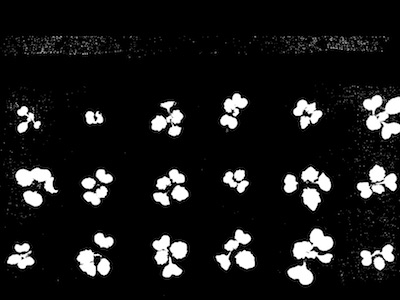

[Fill](fill.md) noise in the image.

```python

# STEP 7: Fill in small objects (speckles)
# Inputs:
#    img  = image object, grayscale. img will be returned after filling
#    size = minimum object area size in pixels (integer)

fill_image = pcv.fill(img_binary, 100)
#                                  ^
#                                  |
#                         adjust this value
```

**Figure 7.** Fill noise.


[Dilate](dilate.md) binary image.

```python

# STEP 8: Dilate so that you don't lose leaves (just in case)
# Inputs:
#    img    = input image
#    kernel = integer
#    i      = interations, i.e. number of consecutive filtering passes

dilated = pcv.dilate(fill_image, 1, 1)
```

**Figure 8.** Dilated image.


[Find objects](find_objects.md) within the image.

```python

# STEP 9: Find objects (contours: black-white boundaries)
# Inputs:
#    img  = image that the objects will be overlayed
#    mask = what is used for object detection

id_objects, obj_hierarchy = pcv.find_objects(img1, dilated)
```

**Figure 9.** Identified objects. 

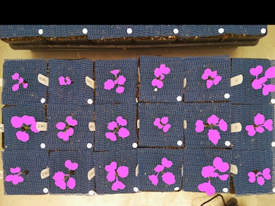

Define a [rectangular region of interest](roi_rectangle.md) in the image.

```python

# STEP 10: Define region of interest (ROI)
# Inputs:
#    x_adj     = adjust center along x axis
#    y_adj     = adjust center along y axis
#    w_adj     = adjust width
#    h_adj     = adjust height
#    img       = img to overlay roi
# roi_contour, roi_hierarchy = pcv.roi.rectangle(10, 500, -10, -100, img1)
#                                                ^                ^
#                                                |________________|
#                                            adjust these four values

roi_contour, roi_hierarchy = pcv.roi.rectangle(10, 500, -10, -100, img1)
```

**Figure 10.** Define ROI.

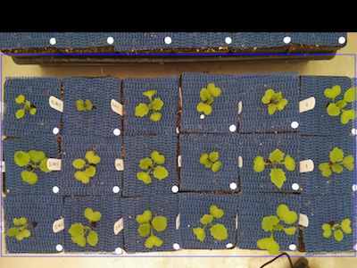

The objects within and overlapping are kept with the [region of interest objects function](roi_objects.md).
Alternately the objects can be cut to the region of interest.

```python

# STEP 11: Keep objects that overlap with the ROI
# Inputs:
#    img            = img to display kept objects
#    roi_type       = 'cutto' or 'partial' (for partially inside)
#    roi_contour    = contour of roi, output from "View and Ajust ROI" function
#    roi_hierarchy  = contour of roi, output from "View and Ajust ROI" function
#    object_contour = contours of objects, output from "Identifying Objects" fuction
#    obj_hierarchy  = hierarchy of objects, output from "Identifying Objects" fuction

roi_objects, roi_obj_hierarchy, kept_mask, obj_area = pcv.roi_objects(img1, 'partial', roi_contour, roi_hierarchy,
                                                                      id_objects, obj_hierarchy)
```

**Figure 11.** Define ROI.

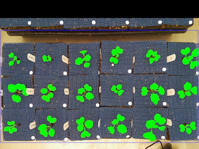

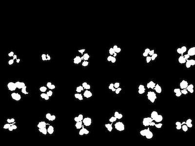

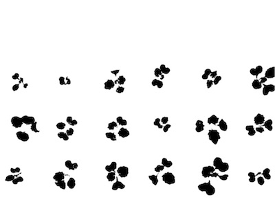

[Cluster](cluster_contours.md) plants based on defined grid.

```python

# STEP 12: This function take a image with multiple contours and
# clusters them based on user input of rows and columns

# Inputs:
#    img               = An RGB image
#    roi_objects       = object contours in an image that are needed to be clustered.
#    roi_obj_hierarchy = object hierarchy
#    nrow              = number of rows to cluster (this should be the approximate  number of desired rows in the entire image even if there isn't a literal row of plants)
#    ncol              = number of columns to cluster (this should be the approximate number of desired columns in the entire image even if there isn't a literal row of plants)

clusters_i, contours, hierarchies = pcv.cluster_contours(img1, roi_objects, roi_obj_hierarchy, 4, 6)
```

**Figure 12.** Cluster contours

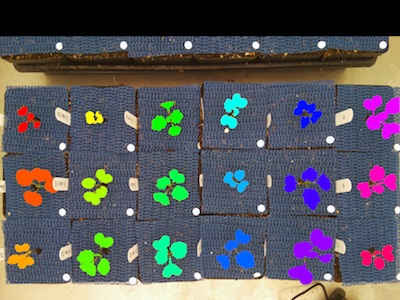

[Split](cluster_contours_splitimg.md) the images.

```python

# STEP 13: This function takes clustered contours and splits them into multiple images,
# also does a check to make sure that the number of inputted filenames matches the number
# of clustered contours. If no filenames are given then the objects are just numbered
# Inputs:
#    img                     = ideally a masked RGB image.
#    grouped_contour_indexes = output of cluster_contours, indexes of clusters of contours
#    contours                = contours to cluster, output of cluster_contours
#    hierarchy               = object hierarchy
#    outdir                  = directory for output images
#    file                    = the name of the input image to use as a base name , output of filename from read_image function
#    filenames               = input txt file with list of filenames in order from top to bottom left to right (likely list of genotypes)

# Set global debug behavior to None (default), "print" (to file), or "plot" (Jupyter Notebooks or X11)
pcv.params.debug = "print"

out = args.outdir
names = args.names

output_path = pcv.cluster_contour_splitimg(img1, clusters_i, contours, hierarchies, out, file=filename, filenames=names)
```

**Figure 13.** Split image based on clustering.
---------------------------------------------

---

---

---

---

---

---

---

---

---

---

---

---

---

---

---

---

---

---
To deploy a pipeline over a full image set please see tutorial on 
[pipeline parallelization](pipeline_parallel.md).
