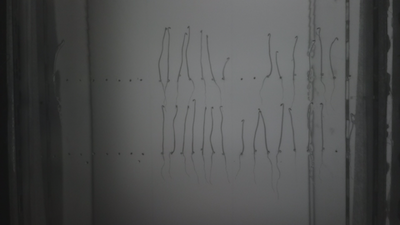
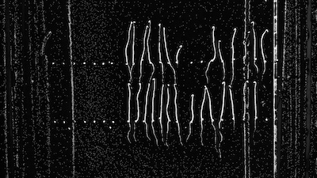

# Nonuniform Illumination Correction

Corrects for nonuniform lighting in an image.

**plantcv.nonuniform_illumination**(*img, ksize*)

**returns** Grayscale image after correction

- **Parameters:**
    - img - RGB or grayscale image 
    - ksize - Kernel size
   
- **Context:**
    - Corrects for nonuniform illumination for situations where there is no available background image
    to do [background subtraction](background_subtraction.md). The function corrects for nonuniform lighting
    by creating a background image from the original by blurring with the specified kernel size.
    
**Input image**



```python

from plantcv import plantcv as pcv

# Set global debug behavior to None (default), "print" (to file), 
# or "plot" (Jupyter Notebooks or X11)
pcv.params.debug = "plot"

# Correct illumination in the image
corrected_img = pcv.transform.nonuniform_illumination(img=img, ksize=31)

```

**Image after correction**



**Source Code:** [Here](https://github.com/danforthcenter/plantcv/blob/main/plantcv/plantcv/transform/nonuniform_illumination.py)
