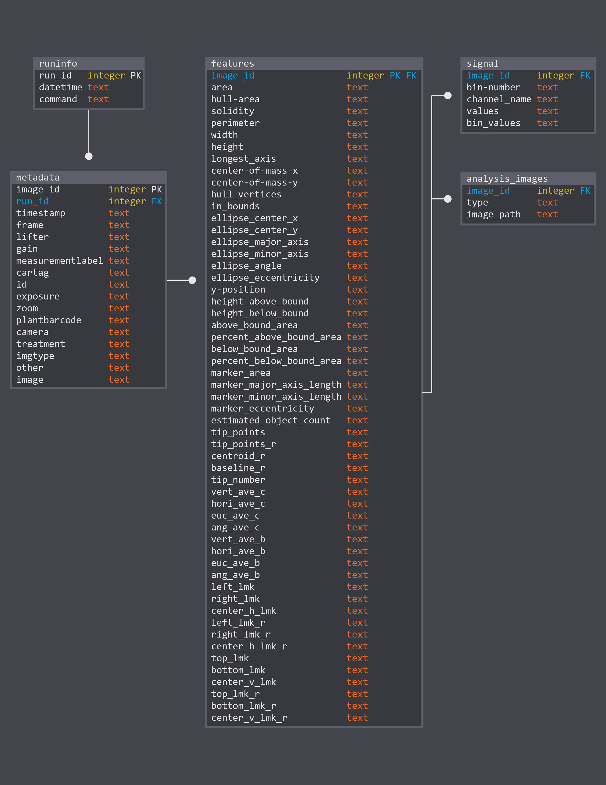

## Organization of PlantCV Outputs

During [parallel processing](pipeline_parallel.md), outputs from PlantCV analysis functions are collected into an 
SQLite database. The database is used to collect information about each PlantCV pipeline command that is used in
conjunction with the database (runinfo table), image metadata (metadata table), object size and shape measurements 
(features table), object color or intensity measurements (signal table), and output image paths (analysis_images table).
The database structure is updated as new features are added. The current schema is shown below.

### Database schema


For each table, the diagram shows three columns: the field names, data types, and index types. Index types are
Primary Key (PK) and Foreign Key (FK). Foreign Keys are used to join tables in queries.

## Summary of Output Measurements and Units

### [Analyze object](analyze_shape.md) function (features table)

| Measurement          | Units   | Description                                                                                               | 
| -------------------- | ------- |---------------------------------------------------------------------------------------------------------- | 
| area                 | pixels  | object area                                                                                               | 
| hull-area            | pixels  | convex hull area                                                                                          | 
| solidity             | none    | ratio of object area divided by convex hull area                                                          |
| perimeter            | pixels  | object perimeter length                                                                                   |
| width                | pixels  | maximum object width (horizontal)                                                                         |
| height               | pixels  | maximum object height (vertical)                                                                          |
| longest_axis         | pixels  | longest path between convex hull vertices through the center of mass                                      |
| center-of-mass-x     | none    | x-axis coordinate of the object center of mass                                                            |
| center-of-mass-y     | none    | y-axis coordinate of the object center of mass                                                            |
| hull_vertices        | none    | number of convex hul vertices                                                                             |
| in_bounds            | none    | true of false (false if the object is touching the border of the image)                                   |
| ellipse_center_x     | none    | x-axis coordinate of the center of the minimum bounding ellipse                                           |
| ellipse_center_y     | none    | y-axis coordinate of the center of the minimum bounding ellipse                                           |
| ellipse_major_axis   | pixels  | length of the major axis of the minimum bounding ellipse                                                  |
| ellipse_minor_axis   | pixels  | length of the minor axis of the minimum bounding ellipse                                                  | 
| ellipse_angle        | degrees | degrees of rotation of the bounding ellipse major axis                                                    |
| ellipse_eccentricity | none    | [eccentricity](https://en.wikipedia.org/wiki/Eccentricity_(mathematics)#Ellipses) of the bounding ellipse |

### Analyze bound function (features table), either [horizontal](analyze_bound_horizontal.md) or [vertical](analyze_bound_vertical.md)

| Measurement              | Units   | Description                                                          | 
| ------------------------ | ------- |--------------------------------------------------------------------- | 
| y-position               | none    | y-axis reference position used for measurements (boundary line)      | 
| height_above_bound       | pixels  | maximum object height (vertical) above the y-position                | 
| height_below_bound       | pixels  | maximum object height (vertical) below the y-position                |
| above_bound_area         | pixels  | area of object above the y-position                                  |
| percent_above_bound_area | none    | percentage of total object area above the y-position                 |
| below_bound_area         | pixels  | area of object below the y-position                                  |
| percent_below_bound_area | none    | percentage of total object area below the y-position                 |

### [Report size marker](report_size_marker.md) function (features table)

| Measurement              | Units   | Description                                                                                               | 
| ------------------------ | ------- |---------------------------------------------------------------------------------------------------------- | 
| marker_area              | pixels  | area of reference object (marker)                                                                         | 
| marker_major_axis_length | pixels  | length of the major axis of the marker bounding ellipse                                                   | 
| marker_minor_axis_length | pixels  | length of the minor axis of the marker bounding ellipse                                                   |
| marker_eccentricity      | none    | [eccentricity](https://en.wikipedia.org/wiki/Eccentricity_(mathematics)#Ellipses) of the bounding ellipse |

### [Watershed segmentation](watershed.md) function (features table)

| Measurement            | Units   | Description                                                          | 
| ---------------------- | ------- |--------------------------------------------------------------------- | 
| estimated_object_count | none    | number of segmented objects (e.g. leaves)                            | 
 
### [Analyze color](analyze_color.md) function (signal table)

| Measurement            | Units   | Description                                                                                      | 
| ---------------------- | ------- |------------------------------------------------------------------------------------------------- | 
| bin-number             | none    | number of histogram bins (e.g. 256/8-bit)                                                        |
| channel_name           | none    | possible values: red, green, blue, hue, saturation, value, lightness, green-magenta, blue-yellow |
| values                 | none    | list of pixel intensity value counts per bin                                                     |
| bin_values             | none    | list of bin intensity values                                                                     |

### [Analyze NIR](analyze_NIR_intensity.md) intensity function (signal table)

| Measurement            | Units   | Description                                                                                      | 
| ---------------------- | ------- |--------------------------------------------- | 
| bin-number             | none    | number of histogram bins (e.g. 256/8-bit)    |
| channel_name           | none    | possible values: nir                         |
| values                 | none    | list of pixel intensity value counts per bin |
| bin_values             | none    | list of bin intensity values                 |
