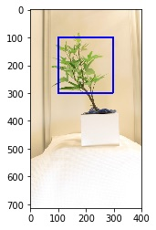
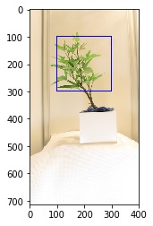

## class Params

A global PlantCV parameters class.

*class* plantcv.**Params**

`Params` is a class that stores global PlantCV attributes. An instance of `Params` is created on import automatically
as `plantcv.params`. Updated PlantCV functions import the `plantcv.params` instance to access globally
configured attributes.

### Attributes

Attributes are accessed as plantcv.params.*attribute*.

**device**: A counter for image processing steps that is autoincremented by functions that use `params`. Default = 0.

**debug**: Debugging mode. Values are `None`, "print", or "plot". Default = `None`.

**debug_outdir**: The directory to output debug images to when `plantcv.debug` = "print".

**line_thickness**: The line thickness for plots created by [plantcv.analyze_object](analyze_shape.md), [plantcv.analyze_bound_horizontal](analyze_bound_horizontal.md).
[plantcv.analyze_bound_vertical](analyze_bound_vertical.md), [plantcv.roi_objects](roi_objects.md), [plantcv.object_composition](object_composition.md),
[plantcv.scale_features](scale_features.md), [plantcv.x_axis_pseudolandmarks](x_axis_pseudolandmarks.md), [plantcv.y_axis_pseudolandmarks](y_axis_pseudolandmarks.md),
[plantcv.acute_vertex](acute_vertex.md), [plantcv.morphology.prune](prune.md), [plantcv.morphology.find_branch_pts](find_branch_pts.md), [plantcv.morphology.check_cycles](check_cycles.md),
 [plantcv.morphology.find_tips](find_tips.md), [plantcv.morphology.segment_skeleton](segment_skeleton.md), [plantcv.morphology.segment_tangent_angle](segment_tangent_angle.md),
 [plantcv.morphology.segment_id](segment_id.md), and every region of interest function. Default = 5. 

**dpi**: Dots per inch for plotting debugging images. 

**text_size**: Size of the text for labels in debugging plots created by [segment_angle](segment_angle.md), [segment_curvature](segment_curvature.md), [segment_euclidean_length](segment_euclidean_length.md),
[segment_id](segment_id.md), [segment_insertion_angle](segment_insertion_angle.md), [segment_path_length](segment_pathlength.md), and [segment_tangent_angle](segment_tangent_angle.md) from
the morphology sub-package. 

**text_thickness**: Thickness of the text for labels in debugging plots created by [segment_angle](segment_angle.md), [segment_curvature](segment_curvature.md), [segment_euclidean_length](segment_euclidean_length.md),
[segment_id](segment_id.md), [segment_insertion_angle](segment_insertion_angle.md), [segment_path_length](segment_pathlength.md), and [segment_tangent_angle](segment_tangent_angle.md) from
the morphology sub-package. 

**marker_size**: Size of markers in debugging plots created by [plantcv.transform.warp](transform_warp.md). Default = 60.

**color_scale**: The name of a color scale (a Matplot lib colormap) used by [segment_angle](segment_angle.md), [segment_curvature](segment_curvature.md), 
[segment_euclidean_length](segment_euclidean_length.md), [segment_insertion_angle](segment_insertion_angle.md), [segment_path_length](segment_pathlength.md), and [segment_skeleton](segment_skeleton.md), 
[segment_tangent_angle](segment_tangent_angle.md) from the morphology sub-package, and [cluster_contours](cluster_contours.md), [spatial_clustering](spatial_clustering.md), and 
[watershed_segmentation](watershed.md) from the base package. Default = "gist_rainbow". See the [Matplotlib](https://matplotlib.org/tutorials/colors/colormaps.html#sphx-glr-tutorials-colors-colormaps-py) website for available options.

**color_sequence**: Set the sequence of colors from the `color_scale` created by the `color_palette` function to "sequential" or "random" order. Default = "sequential".

**saved_color_scale**: Using the `color_palette` function will save the color scale here for reuse in downstream functions. Set to `None` to remove. Default = `None`.

**verbose**: Set the status of verboseness. When in "verbose" mode, the deprecation warning will always be printed once triggered. Default: `True`. Users can turn off deprecation warnings by setting `verbose=False`.
### Example

Updated PlantCV functions use `params` implicitly, so overriding the `params` defaults will alter the behavior of
updated functions. In the meantime, it can also be used with older-style functions.

```python
from plantcv import plantcv as pcv

# Set debug to plot instead of None
pcv.params.debug = "plot"

# Use a pre-v3 function to open an image
# Note that pcv.params.debug is passed to the debug argument
img, imgpath, imgname = pcv.readimage(filename="test.png")

# Use a v3 function to create a region of interest
# Note that debug is not explicitly provided but is used implicitly by the function
roi_contour, roi_hierarchy = pcv.roi.rectangle(x=100, y=100, h=200, w=200, img=img)

# It might be preferred to have a thicker or thinner line drawn depending on the size of the image.
# Change line thickness from the default (5) to make it thinner, and plot the rectangular ROI again,  
# (note: this won't change the returns for most functions but instead is a purely optional preference regarding the plot in debug='print' and debug='plot') 
pcv.params.line_thickness = 3 
roi_contour, roi_hierarchy = pcv.roi.rectangle(x=100, y=100, h=200, w=200, img=img)

```
*Default Thickness (5)*



*pcv.params.line_thickness = 3*



**Source Code:** [Here](https://github.com/danforthcenter/plantcv/blob/master/plantcv/plantcv/classes.py)
