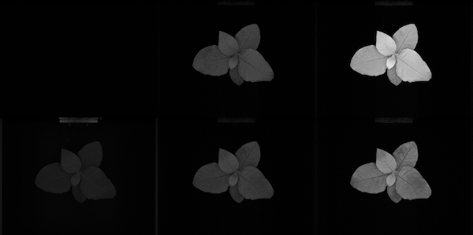
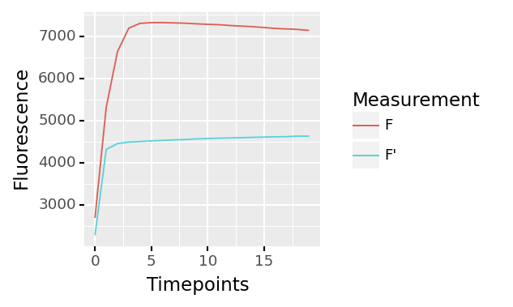
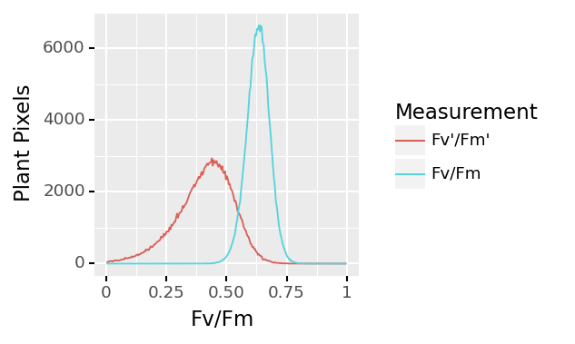
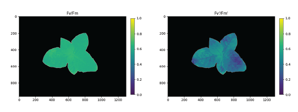

## Analyze Fv/Fm and Fv'/Fm'

Extract Fv/Fm and Fv'/Fm' data from a masked region.

**plantcv.photosynthesis.analyze_fvfm**(*ps, mask, bins=256, measurement="both", label="default"*)

**returns** Fluorescence induction curve figure, Fv/Fm and Fv'/Fm' histogram, and PSII analysis images 
(Fv/Fm and Fv'Fm' images)

- **Parameters:**
    - ps - photosynthesis [Xarray](http://xarray.pydata.org/en/stable/#) DataArray that contains image frames from a
      saturating light pulse chlorophyll fluorescence response measurement protocol for either light- and/or 
      dark-adapted plants.
    - mask - binary mask of selected contours
    - bins - number of grayscale bins (0-256 for 8-bit images and 0 to 65,536), if you would like to bin data, 
      you would alter this number (default bins=256)
    - measurement - choose which measurement protocols to analyze: "light", "dark", or "both" (default)
    - label - Optional label parameter, modifies the variable name of observations recorded. (default `label="default"`)
- **Context:**
    - Used to extract Fv/Fm or Fv'/Fm' per identified plant pixel.
    - Generates a fluorescence induction curve for F and/or F'
    - Generates histogram of Fv/Fm and/or Fv'/Fm' data.
    - Generates Fv/Fm and/or Fv'/Fm' image.
- **Example use:**
    - [Use In PSII Tutorial](psII_tutorial.md)
- **Output data stored:** Data ('fvfm_hist', 'fvfm_hist_peak', 'fvfm_median', 'fdark_passed_qc', fvpfmp_hist, 
  fvpfmp_hist_peak, fvpfmp_median, fdarkp_passed_qc) automatically gets stored to the [`Outputs` class](outputs.md) 
  when this function is ran. These data can always get accessed during a workflow (example below). 
  [Summary of Output Observations](output_measurements.md#summary-of-output-observations)

**Fluorescence images**



From top-left to bottom-right: Dark-adapted (Fdark, F0, Fm) and Light-adapted (Fdark', F0', and Fm')

```python
from plantcv import plantcv as pcv

# Set global debug behavior to None (default), "print" (to file), 
# or "plot" (Jupyter Notebooks or X11)
pcv.params.debug = "print"

# Analyze Fv/Fm    
ind_fig, hist_fig, fvfm_images = pcv.photosynthesis.analyze_fvfm(ps=data_array, mask=kept_mask, 
                                                                 bins=256, measurement="both", label="fluor")

# Access data stored out from fluor_fvfm
fvfm_median = pcv.outputs.observations['fluor']['fvfm_median']['value']

# Store the two images
fvfm_img = fvfm_images[0]
fvpfmp_img = fvfm_images[1]

# Pseudocolor the Fv/Fm image
fvfm_cmap= pcv.visualize.pseudocolor(gray_img=fvfm_images[0], mask=kept_mask, min_value=0, max_value=1, title="Fv/Fm")
fvpfmp_cmap= pcv.visualize.pseudocolor(gray_img=fvfm_images[1], mask=kept_mask, min_value=0, max_value=1, title="Fv'/Fm'")

```

**Fluorescence response curves**



**Histogram of Fv/Fm and Fv'/Fm' values**



**Pseudocolored output image based on Fv/Fm and Fv'/Fm'**



The grayscale Fv/Fm images (returned to analysis_image) can be used with the 
[pcv.visualize.pseudocolor](visualize_pseudocolor.md) function which allows the user to pick a colormap for plotting.

**Source Code:** [Here](https://github.com/danforthcenter/plantcv/blob/master/plantcv/plantcv/photosynthesis/analyze_fvfm.py)
