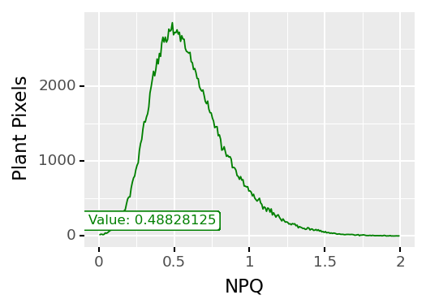
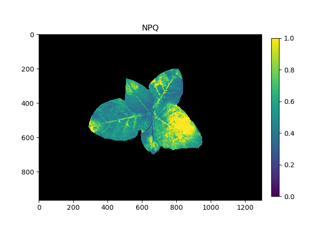

## Analyze Nonphotochemical Quenching of Photosystem II

Extract estimates of the nonphotochemical quenching (NPQ) of Photosystem II (PSII). 
Calculates (Fm/Fm') - 1 data from a masked region. The photosynthesis subpackage is dependent on a PSII_Data instance file structure as created by photosynthesis.read_* files.

**plantcv.photosynthesis.analyze_npq**(*ps_da_light, ps_da_dark, mask, min_bin=0, max_bin="auto", measurement_labels=None, label="default"*)

**returns** Histogram of NPQ values and an NPQ image

- **Parameters:**
    - ps_da_light - photosynthesis xarray DataArray for which to compute npq
    - ps_da_dark - photosynthesis xarray DataArray that contains frame_label `Fm`
    - mask - binary mask of selected contours
    - min_bin - minimum bin value ("auto" or user input minimum value - must be an integer). (default `min_bin=0`)
    - max_bin - maximum bin value ("auto" or user input maximum value - must be an integer). (default `max_bin="auto"`)
    - measurement_labels - list of label(s) for each measurement in `ps_da_light`, modifies the variable name of observations recorded
    - label - Optional label parameter, modifies the entity name of observations recorded. (default `label="default"`)
- **Context:**
    - Used to extract NPQ per identified plant pixel.
    - Generates histogram of NPQ values.
    - Generates an NPQ image.
- **Example use:**
    - [Use In PSII Tutorial](tutorials/psII_tutorial.md)
- **Output data stored:** Data ('npq_hist_{measurement_label}', 'npq_max_{measurement_label}', 'npq_median_{measurement_label}') are automatically stored to the 
  [`Outputs` class](outputs.md) when this function is run. These data can be accessed during a workflow (example below). `{measurement_label}` is automatically created when importing the dataset, e.g. with `read_cropreporter()` but can be overwritten with `measurement_labels` argument.
  [Summary of Output Observations](output_measurements.md#summary-of-output-observations)

```python
from plantcv import plantcv as pcv

# Set global debug behavior to None (default), "print" (to file), 
# or "plot" (Jupyter Notebooks or X11)
pcv.params.debug = "print"

# Analyze NPQ   
npq, npq_hist = pcv.photosynthesis.analyze_npq(ps_da_light=ps.lightadapted, ps_da_dark=ps.darkadapted, mask=kept_mask)

# Access the NPQ median value
# the default measurement label for cropreporter data is t1
npq_median = pcv.outputs.observations['fluor']['npq_median_t1']['value']

# Pseudocolor the NPQ image
pseudo_img = pcv.visualize.pseudocolor(gray_img=npq, mask=kept_mask, min_value=0, max_value=1, title="NPQ")

```

**Histogram of NPQ values**



**Pseudocolored output image based on NPQ**



The grayscale NPQ image can be used with the [pcv.visualize.pseudocolor](visualize_pseudocolor.md) function
which allows the user to pick a colormap for plotting.

**Source Code:** [Here](https://github.com/danforthcenter/plantcv/blob/master/plantcv/plantcv/photosynthesis/analyze_npq.py)
