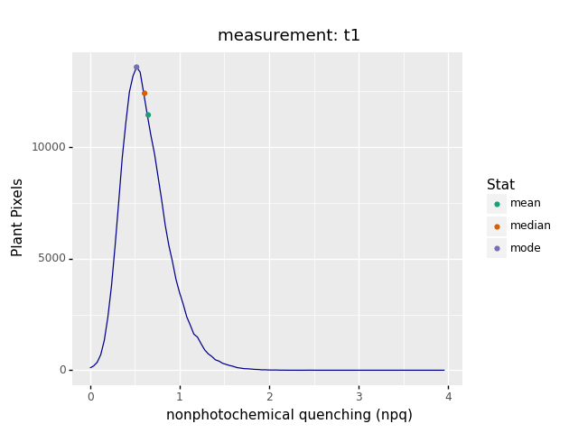

## Analyze Nonphotochemical Quenching of Photosystem II

Extract estimates of the nonphotochemical quenching (NPQ) of Photosystem II (PSII). 
Calculates (Fm/Fm') - 1 data from a masked region.

**plantcv.photosynthesis.analyze_npq**(*ps, mask, bins=256, label="default"*)

**returns** Histogram of NPQ values and an NPQ image

- **Parameters:**
    - ps - photosynthesis [Xarray](http://xarray.pydata.org/en/stable/#) DataArray that contains image frames from a
      saturating light pulse chlorophyll fluorescence response measurement protocol for either light- and/or 
      dark-adapted plants.
    - mask - binary mask of selected contours
    - bins - number of grayscale bins (0-256 for 8-bit images and 0 to 65,536), if you would like to bin data, you 
      would alter this number (default bins=256)
    - label - Optional label parameter, modifies the variable name of observations recorded. (default `label="default"`)
- **Context:**
    - Used to extract NPQ per identified plant pixel.
    - Generates histogram of NPQ values.
    - Generates an NPQ image.
- **Example use:**
    - [Use In PSII Tutorial](psII_tutorial.md)
- **Output data stored:** Data ('npq_hist', 'npq_hist_peak', 'npq_median') are automatically stored to the 
  [`Outputs` class](outputs.md) when this function is run. These data can be accessed during a workflow (example below).
  [Summary of Output Observations](output_measurements.md#summary-of-output-observations)

```python
from plantcv import plantcv as pcv

# Set global debug behavior to None (default), "print" (to file), 
# or "plot" (Jupyter Notebooks or X11)
pcv.params.debug = "print"

# Analyze NPQ   
npq_hist, npq_img = pcv.photosynthesis.analyze_npq(ps=data_array, mask=kept_mask, bins=256, label="fluor")

# Access data stored out from fluor_NPQ
npq_median = pcv.outputs.observations['fluor']['npq_median']['value']

# Pseudocolor the NPQ image
pseudo_img = pcv.visualize.pseudocolor(gray_img=npq_img, mask=kept_mask, min_value=0, max_value=1, title="NPQ")

```

**Histogram of NPQ values**



**Pseudocolored output image based on NPQ**


The grayscale NPQ image can be used with the [pcv.visualize.pseudocolor](visualize_pseudocolor.md) function
which allows the user to pick a colormap for plotting.

**Source Code:** [Here](https://github.com/danforthcenter/plantcv/blob/master/plantcv/plantcv/photosynthesis/analyze_npq.py)
