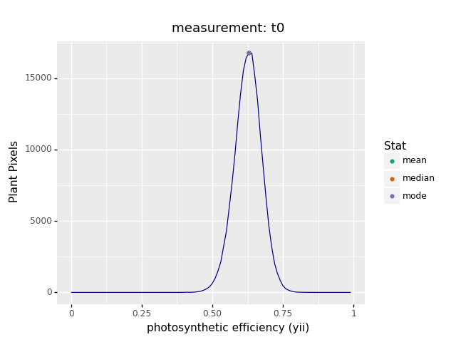

## Analyze the efficiency of Photosystem II

Extract estimates of the efficiency (YII) of Photosystem II (PSII). Calculates Fv/Fm, Fv'/Fm', and Fq'/Fm' data 
from a masked region.

**plantcv.photosynthesis.analyze_yii**(*ps, mask, measurement, bins=256, label="default"*)

**returns** Fluorescence induction curve figure, YII histogram, and YII image

- **Parameters:**
    - ps - photosynthesis [Xarray](http://xarray.pydata.org/en/stable/#) DataArray that contains image frames from a
      saturating light pulse chlorophyll fluorescence response measurement protocol for either light- and/or 
      dark-adapted plants.
    - mask - binary mask of selected contours
    - measurement - choose which measurement protocol to analyze: "Fv/Fm", "Fv'/Fm'", or "Fq'/Fm'"
    - bins - number of grayscale bins (0-256 for 8-bit images and 0 to 65,536), if you would like to bin data, 
      you would alter this number (default bins=256)
    - label - Optional label parameter, modifies the variable name of observations recorded. (default `label="default"`)
- **Context:**
    - Used to extract Fv/Fm, Fv'/Fm' or Fq'/Fm' per identified plant pixel.
    - Generates a fluorescence induction curve for F and/or F'
    - Generates histogram of Fv/Fm, Fv'/Fm' or Fq'/Fm' data.
    - Generates an Fv/Fm, Fv'/Fm' or Fq'/Fm' image.
- **Example use:**
    - [Use In PSII Tutorial](psII_tutorial.md)
- **Output data stored:** Data ('fvfm_hist', 'fvfm_hist_peak', 'fvfm_median', fvpfmp_hist, fvpfmp_hist_peak, 
  fvpfmp_median, fqpfmp_hist, fqpfmp_hist_peak, fqpfmp_median) automatically gets stored to the 
  [`Outputs` class](outputs.md) when this function is ran. These data can always get accessed during a workflow 
  (example below). [Summary of Output Observations](output_measurements.md#summary-of-output-observations)

**Fluorescence images**


From top-left to bottom-right: Dark-adapted (Fdark, F0, Fm) and Light-adapted (Flight', F', and Fm')

**Analyze Fv/Fm**

```python
from plantcv import plantcv as pcv

# Set global debug behavior to None (default), "print" (to file), 
# or "plot" (Jupyter Notebooks or X11)
pcv.params.debug = "print"

# Analyze Fv/Fm    
fvfm_ind, fvfm_hist, fvfm = pcv.photosynthesis.analyze_yii(ps=data_array, mask=kept_mask, measurement="Fv/Fm",
                                                           bins=256, label="fluor")

# Access data stored out from fluor_fvfm
fvfm_median = pcv.outputs.observations['fluor']['fvfm_median']['value']

# Pseudocolor the Fv/Fm image
fvfm_cmap= pcv.visualize.pseudocolor(gray_img=fvfm, mask=kept_mask, min_value=0, max_value=1, title="Fv/Fm")

```

**Fluorescence response curve**


**Histogram of Fv/Fm values**



**Pseudocolored output image based on Fv/Fm**


**Analyze Fq'/Fm'**

```python
from plantcv import plantcv as pcv

# Set global debug behavior to None (default), "print" (to file), 
# or "plot" (Jupyter Notebooks or X11)
pcv.params.debug = "print"

# Analyze Fq'/Fm'    
fqfm_ind, fqfm_hist, fqfm = pcv.photosynthesis.analyze_yii(ps=data_array, mask=kept_mask, measurement="Fq'/Fm'",
                                                           bins=256, label="fluor")

# Access data stored out from fluor_fvfm
fqfm_median = pcv.outputs.observations['fluor']['fqpfmp_median']['value']

fqfm_cmap= pcv.visualize.pseudocolor(gray_img=fqfm, mask=kept_mask, min_value=0, max_value=1, title="Fq'/Fm'")

```

**Fluorescence response curve**


**Histogram of Fq'/Fm' values**


**Pseudocolored output image based on Fq'/Fm'**


The grayscale YII images can be used with the [pcv.visualize.pseudocolor](visualize_pseudocolor.md) function 
which allows the user to pick a colormap for plotting.

**Source Code:** [Here](https://github.com/danforthcenter/plantcv/blob/master/plantcv/plantcv/photosynthesis/analyze_yii.py)
