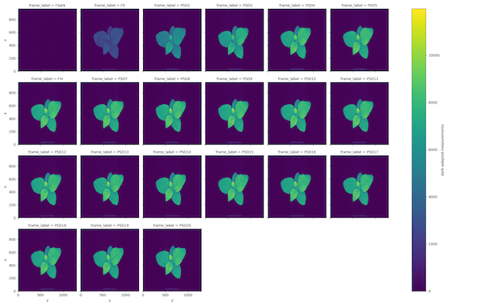
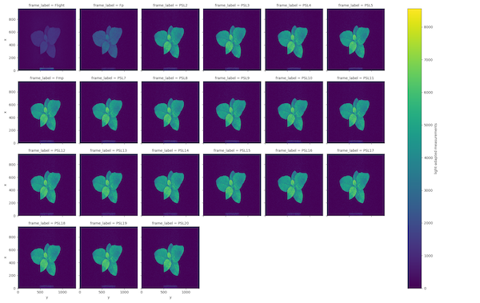
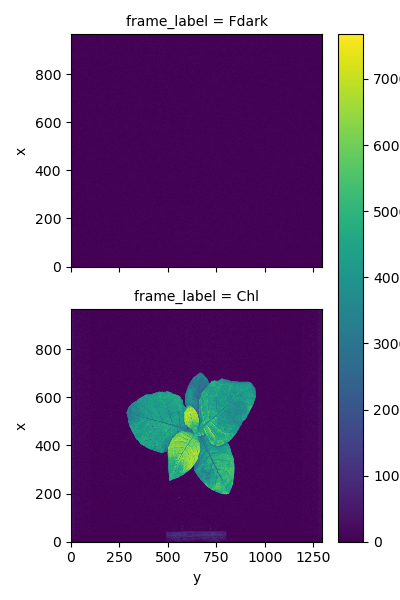
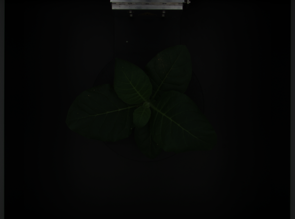

## Read CropReporter Fluorescence Image Files

Reads .INF/.DAT image data from a [PhenoVation CropReporter system](https://phenovation.com/cropreporter/) into a
PSII_data instance containing [xarray DataArrays](http://xarray.pydata.org/en/stable/generated/xarray.DataArray.html)
with labeled frames.

**plantcv.photosynthesis.read_cropreporter**(*filename*)

**returns** ps

- **Parameters:**
    - filename - INF metadata file to be read (possibly including a path). DAT files are automatically detected.

- **Context:**
    - Reads in binary image files to be processed and does so using the metadata contained within a corresponding .INF
      file.
    - Measurements from dark-adapted plant state are stored in the attribute `ojip_dark` or `pam_dark`, depending on the measurement protocol. Frames F0 and Fm are
      labeled according to the metadata in .INF. The default measurement label is 't0'.
    - Measurements from light-adapted plant state are stored in the attribute `ojip_light` or `pam_light`, depending on the measurement protocol. Frames Fp and Fmp are
      labeled according to the metadata in .INF. The default measurement label is 't1'.
    - Measurements from chlorophyll fluorescence are stored in the attribute `chlorophyll` and include a dark frame
      (Fdark) and chlorophyll fluorescence frame (Chl).
    - Spectral measurements are stored as a PlantCV [Spectral_data](Spectral_data.md) object in the attribute
      `spectral`. Frames are stored by reflectance wavelength and can include: blue (460nm), green (500nm), red (670nm),
      green2 (550nm), far-red (700nm), and near-infrared (800nm).
- **Example use:**
    - [Use In PSII Tutorial](tutorials/psII_tutorial.md)

!!! note
    This function assumes a specific pattern between the .INF metadata file and the corresponding .DAT binary image
    filenames. We assume that for metadata file  `HDR_xx.INF` or `xx_HDR_xx.INF` there will be a corresponding image files with the same path, containing `XXX_xxx.DAT` or `xx_XXX_xxx.DAT` where XXX is the analysis protocol (e.g. PSD, PSL, etc.). Some CropReporter imaging protocols will results in multiple binary image .DAT files per .INF metadata file.

```python
from plantcv import plantcv as pcv      

# Set global debug behavior to None (default), "print" (to file),
# or "plot" (Jupyter Notebooks or X11)
pcv.params.debug = "plot"

#read in image
ps = pcv.photosynthesis.read_cropreporter(filename="PSII_HDR_020321_WT_TOP_1.INF")

# you can check which variables were imported at the prompt with:
ps

# to see the frames you imported use xarray plot methods e.g.
ps.ojip_dark.plot(col='frame_label', col_wrap=4)

```

**OJIP Dark-adapted fluorescence measurements**



**OJIP Light-adapted fluorescence measurements**



**Chlorophyll fluorescence measurements**



**Spectral reflectance measurements**



**Source Code:** [Here](https://github.com/danforthcenter/plantcv/blob/main/plantcv/plantcv/photosynthesis/read_cropreporter.py)
