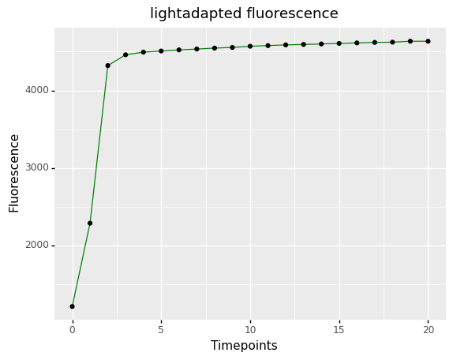

## Reassign Frame Labels

Relabel Fm and Fm' in PSII CropReporter datasets. The photosynthesis subpackage is dependent on a PSII_Data instance
file structure as created by photosynthesis.read_cropreporter.
Some systems (e.g. CropReporter) output a timeseries of fluorescence images that can be used to calculate a fluorescence
induction curve following a saturating light pulse. This function calculates the frame where maximum fluorescence is
observed and relabels the Fm or Fm' frame, if needed.

**plantcv.photosynthesis.reassign_frame_labels**(*ps_da, mask*)

**returns** xarray DataArray with updated frame labels, Fluorescence induction curve plot and corresponding dataframe

- **Parameters:**
    - ps_da - photosynthesis xarray DataArray containing multiple post-saturating light pulse fluorescence images
    - mask - binary mask of plant
- **Context:**
    - Used to assign Fm or Fm' based on observed plant fluorescence.
    - Generates a plot of fluorescence induction over a timeseries.
- **Example use:**
    - [Use In PSII Tutorial](tutorials/psII_tutorial.md)

**Assign Fm**

```python
from plantcv import plantcv as pcv

# Set global debug behavior to None (default), "print" (to file), 
# or "plot" (Jupyter Notebooks or X11)
pcv.params.debug = "print"

psd, psd_ind, psd_df = pcv.photosynthesis.reassign_frame_labels(ps_da=ps.darkadapted, mask=mask)

```

**Fluorescence induction curve for Fm**


**Assign Fm'**

```python
from plantcv import plantcv as pcv

# Set global debug behavior to None (default), "print" (to file), 
# or "plot" (Jupyter Notebooks or X11)
pcv.params.debug = "print"

psl, psl_ind, psl_df = pcv.photosynthesis.reassign_frame_labels(ps_da=ps.lightadapted, mask=mask)

```

**Fluorescence induction curve for Fm**



**Source Code:** [Here](https://github.com/danforthcenter/plantcv/blob/master/plantcv/plantcv/photosynthesis/reassign_frame_labels.py)
