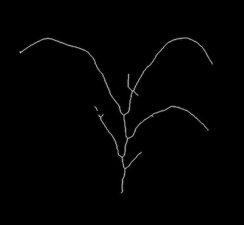
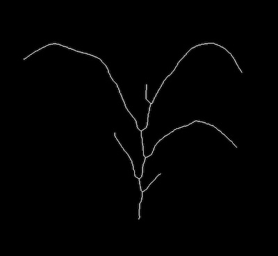
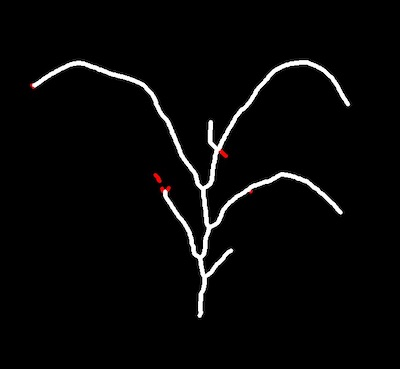
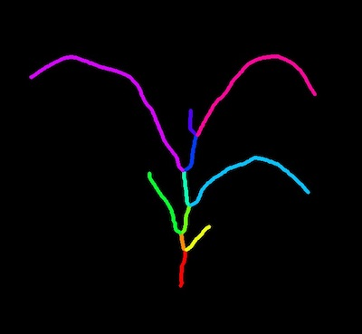
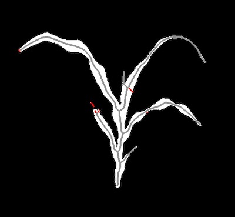
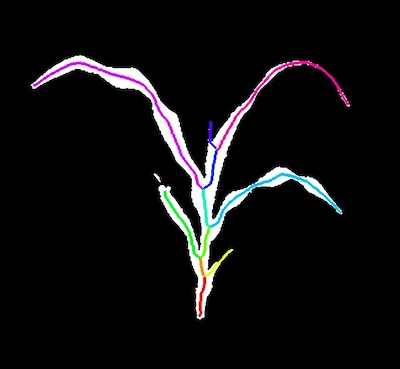

## Prune

Prune barbs off a skeletonized image and turn a skeletonized image into separate pieces. 

**plantcv.morphology.prune**(*skel_img, size=0, mask=None*)

**returns** Pruned skeleton image, segmented image, segment objects

- **Parameters:**
    - skel_img - Skeleton image (output from [plantcv.morphology.skeletonize](skeletonize.md))
    - size - Pieces of skeleton smaller than `size` should get removed.(Optional) Default `size=0`. 
    - mask - Binary mask for debugging (optional). If provided, debug images will be overlaid on the mask.
- **Context:**
    - This "prunes" spurious branches/barbs off a skeleton. The function prunes barbs that are `size` 
    pixels or smaller from a skeleton image. If the default `size=0` is
    used, the pruned skeleton will be identical to the input skeleton image. 


```python

from plantcv import plantcv as pcv

# Set global debug behavior to None (default), "print" (to file), 
# or "plot" (Jupyter Notebooks or X11)
pcv.params.debug = "plot"

pruned_skeleton, segmented_img, segment_objects = pcv.morphology.prune(skel_img=skeleton, size=70)

```

*Skeleton before pruning*



*Pruned Skeleton (image getting returned)*



*Debugging Image*



*Segmented Skeleton (image getting returned)*



```python

from plantcv import plantcv as pcv

# Set global debug behavior to None (default), "print" (to file), 
# or "plot" (Jupyter Notebooks or X11)
pcv.params.debug = "plot"

# The image created for debugging purposes allows for line thickness 
# adjustments with the global line thickness parameter. Try setting 
# pcv.params.line_thickness = 3 for thinner lines (default 5)
pcv.params.line_thickness = 3 

pruned_skeleton, segmented_img, segment_objects = pcv.morphology.prune(skel_img=skeleton, 
                                                                       size=70, 
                                                                       mask=plant_mask)

```

*Pruned Skeleton (image getting returned)*


*Debugging Image with Mask*



*Segmented Skeleton with Mask (image getting returned)*



**Source Code:** [Here](https://github.com/danforthcenter/plantcv/blob/main/plantcv/plantcv/morphology/prune.py)
