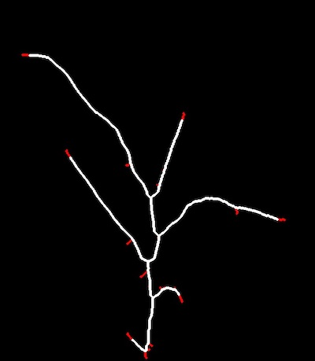

## Prune

Prune/trim tips off a skeletonized image. 

**plantcv.morphology.*prune*(*skel_img, size*)

**returns** Pruned skeleton image 

- **Parameters:**
    - skel_img - Skeleton image (output from [plantcv.morphology.skeletonize](skeletonize.md))
    - size - How many pixels to trim off 
- **Context:**
    - Iteratively remove endpoints (tips) from a skeletonized image. This "prunes" spurious branches/barbs off a skeleton.
- **Important Note:**
    - The function prunes all tips of a skeletonized image, and should be used as sparingly as possible since leaves will also get trimmed. 


```python

from plantcv import plantcv as pcv

# Set global debug behavior to None (default), "print" (to file), 
# or "plot" (Jupyter Notebooks or X11)
pcv.params.debug = "print"

# The image created for debugging purposes allows for line thickness 
# adjustments with the global line thickness parameter. Try setting 
# pcv.params.line_thickness = 3 for thinner lines (default 5)
pcv.params.line_thickness = 3 

pruned_skeleton = pcv.morphology.prune(skel_img=skeleton, size=14)

```
*Pruned Image (image getting returned)*


*Debugging Image*



