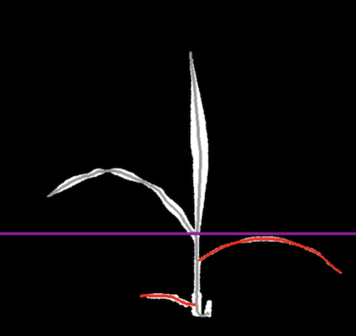

## Prune by Height

Prune segments off a skeletonized image based on a horizontal line position. 

**plantcv.morphology.prune_by_height**(*skel_img, line_position=None, mask=None, label=None*)

**returns** Pruned skeleton image, segmented image, segment objects

- **Parameters:**
    - skel_img - Skeleton image (output from [plantcv.morphology.skeletonize](skeletonize.md))
    - line_position - Height below which to prune secondary segments, if `None` then line position will be set by the highest branch point
    - mask - Binary mask for debugging (optional). If provided, debug images will be overlaid on the mask.
    - label - Optional label parameter, modifies the variable name of observations recorded. (default = `pcv.params.sample_label`)
- **Context:**
    - This type of pruning can be helpful to remove unwanted segments from a skeleton.


```python

from plantcv import plantcv as pcv

# Set global debug behavior to None (default), "print" (to file), 
# or "plot" (Jupyter Notebooks or X11)
pcv.params.debug = "plot"

pruned_skeleton, segmented_img, segment_objects = pcv.morphology.prune_by_height(skel_img=skeleton,
                                                    line_position=None, mask=None, label=None)

```

*Pruning Debug Image*




**Source Code:** [Here](https://github.com/danforthcenter/plantcv/blob/main/plantcv/plantcv/morphology/prune.py)
