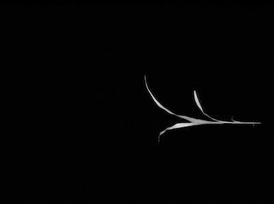
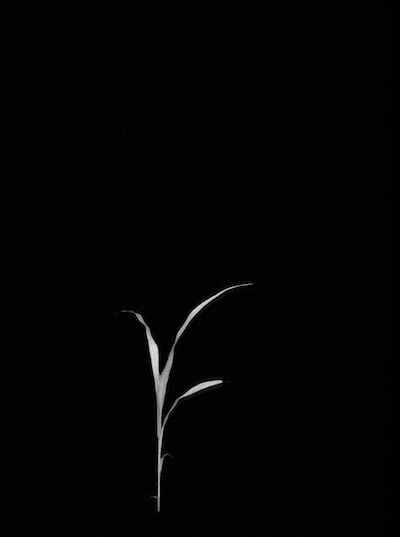
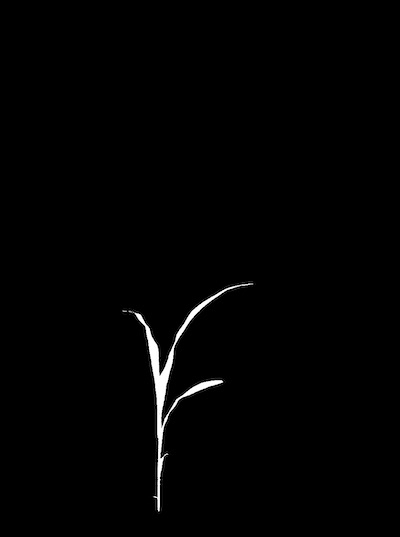
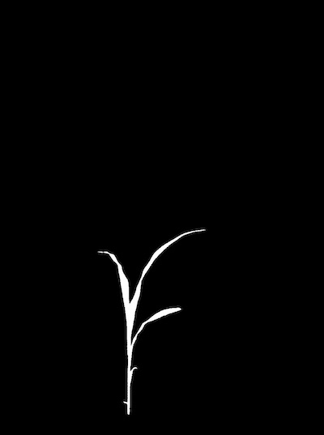
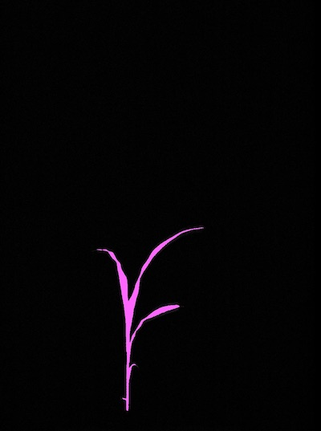
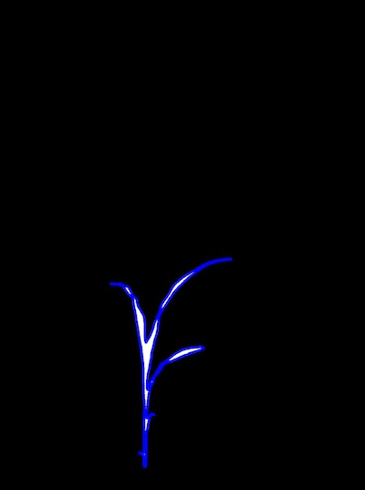
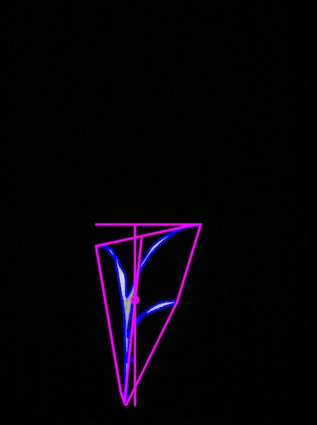
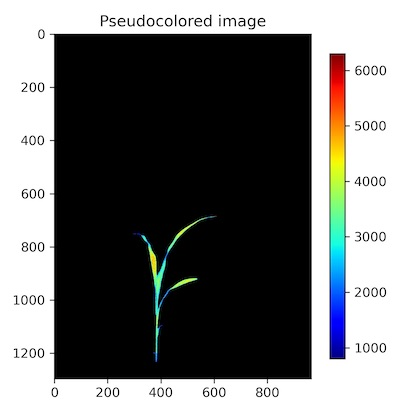

## Tutorial: PSII Image Workflow

PlantCV is composed of modular functions that can be arranged (or rearranged) and adjusted quickly and easily.
Workflows do not need to be linear (and often are not). Please see workflow example below for more details.
A global variable "debug" allows the user to print out the resulting image.
The debug has three modes: either None, 'plot', or 'print'. If set to
'print' then the function prints the image out, or if using a [Jupyter](jupyter.md) notebook you could set debug to 'plot' to have
the images plot to the screen.
This allows users to visualize and optimize each step on individual test images and small test sets before workflows are deployed over whole datasets.

PSII images (3 in a set; Fdark, Fmin (F0), and Fmax) are captured directly following a saturating fluorescence pulse
(red light; 630 nm). These three PSII images can be used to calculate Fv/Fm (efficiency of photosystem II)
for each pixel of the plant. A workflow to analyze PSII images is outlined below.  

Also see [here](#psii-script) for the complete script.

### Workflow

1.  Optimize workflow on individual image with debug set to 'print' (or 'plot' if using a Jupyter notebook).
2.  Run workflow on small test set (ideally that spans time and/or treatments).  
3.  Re-optimize workflows on 'problem images' after manual inspection of test set.  
4.  Deploy optimized workflow over test set using parallelization script.

### Running A Workflow

To run a PSII workflow over a single PSII image set (3 images) there are 4 required inputs:

1.  **Image 1:** Fdark/null image.
2.  **Image 2:** Fmin image.
3.  **Image 3:** Fmax image.
5.  **Output directory:** If debug mode is set to 'print' output images from each step are produced.

This tutorial shows an example workflow for fluorescence images taken with the [CropReporter system](https://www.phenovation.com/cropreporter/).
CropReporter images are stored in .DAT files where multiple frames are stored into a single file. Users with different data formats can still
analyze fluorescence images by reading in individual images for each. Image sets that don't have an `fdark` frame can create a null image of the same size with `np.zeros`.

Optional Inputs:

*  **Debug Flag:** Prints or plots (if in Jupyter or have x11 forwarding on) an image at each step

Sample command to run a workflow on a single PSII image set:  

* Always test workflows (preferably with -D flag for debug mode) before running over a full image set.

```
./workflowname.py -i /home/user/images/PSII_PSD_testimg_22_rep6.DAT -o /home/user/output-images -D 'print'

```

### Walk Through A Sample Workflow

Workflows start by importing necessary packages, and by defining user inputs.

```python
#!/usr/bin/env python
import argparse
from plantcv import plantcv as pcv

### Parse command-line arguments
def options():
    parser = argparse.ArgumentParser(description="Imaging processing with opencv")
    parser.add_argument("-i", "--image", help="Input image file.", required=True)
    parser.add_argument("-o", "--outdir", help="Output directory for image files.", required=True)
    parser.add_argument("-D", "--debug", help="Turn on debug, prints intermediate images.", action="store_true")
    args = parser.parse_args()
    return args

```

All required frames are contained within a single `.DAT` file. See the documentation page for [`plantcv.photosynthesis.read_cropreporter()`](photosynthesis_read_cropreporter.md) to see more detail on
how this type of data is read in.

```python
### Main workflow
def main():
    # Get options
    args = options()

    pcv.params.debug = args.debug #set debug mode
    pcv.params.debug_outdir = args.outdir #set output directory

    # Read fluorescence image data
    fdark1, fmin1, fmax1 = pcv.photosynthesis.read_cropreporter(args.image)

```

**Figure 1.** `Fdark` frame


**Figure 2.** `Fmin` frame


**Figure 3.** `Fmax` frame. This will be used to create a plant mask that will isolate the plant material in the image.



```python
    # Rotate each frame so that plant is upright

    # Inputs:
    #   img             - Image data
    #   rotation_deg    - Rotation angle in degrees, can be a negative number, positive values move counter clockwise
    #   crop            - If crop is set to True, image will be cropped to original image dimensions. If set to False, the image size will be adjusted to accommodate new image dimensions.
    fdark = pcv.transform.rotate(img=fdark1, rotation_deg=-90, crop=False)
    fmin = pcv.transform.rotate(img=fmin1, rotation_deg=-90, crop=False)
    fmax = pcv.transform.rotate(img=fmax1, rotation_deg=-90, crop=False)


```

**Figure 4.** Rotated `fmax` frame  



The resulting image is then thresholded with a [binary threshold](binary_threshold.md) to capture the plant material. In most cases, it is expected that pixel values
range between 0 and 255, but our example image has pixel values from 0 to over 7000. Trial and error is a common method for selecting an appropriate threshold value.

```python
    # Threshold the `fmax` image

    # Inputs:
    #   gray_img        - Grayscale image data
    #   threshold       - Threshold value (usually between 0-255)
    #   max_value       - Value to apply above threshold (255 = white)
    #   object_type     - 'light' (default) or 'dark'. If the object is lighter than the
    #                       background then standard threshold is done. If the object is
    #                       darker than the background then inverse thresholding is done.
    plant_mask = pcv.threshold.binary(gray_img=fmax, threshold=855, max_value=255, object_type="light")

```

**Figure 5.** Binary threshold on masked Fmax image.



Noise is reduced with the [fill](fill.md) function.

```python
    # Fill small objects

    # Inputs:
    #   bin_img         - Binary image data
    #   size            - Minimum object area size in pixels (integer), smaller objects get filled in.
    cleaned_mask = pcv.fill(bin_img=plant_mask, size=20)

```

**Figure 6.** Fill applied.  



Objects (OpenCV refers to them as contours) are then identified within the image using
the [find objects](find_objects.md) function.

```python
    # Identify objects

    # Inputs:
    #   img             - RGB or grayscale image data for plotting
    #   mask            - Binary mask used for detecting contours
    id_objects ,obj_hierarchy = pcv.find_objects(img=fmax, mask=cleaned_mask)

```

**Figure 7.** All objects found within the image are identified.



The isolated objects now should all be plant material. There can be more than one object that makes up a plant,
since sometimes leaves twist making them appear in images as separate objects. Therefore, in order for shape
analysis to perform properly the plant objects need to be combined into one object using the [combine objects](object_composition.md) function.

```python
    # Object combine kept objects

    # Inputs:
    #   img - RGB or grayscale image data for plotting
    #   contours        - Contour list
    #   hierarchy       - Contour hierarchy array
    obj, masked = pcv.object_composition(img=cleaned_mask, contours=id_objects, hierarchy=obj_hierarchy)

```

**Figure 8.** Combined plant object outlined in blue.



The next step is to analyze the plant object for traits such as [shape](analyze_shape.md), or [PSII signal](photosynthesis_analyze_fvfm.md).

```python
################ Analysis ################  
    # Find shape properties, output shape image (optional)

    # Inputs:
    #   img             - RGB or grayscale image data
    #   obj             - Single or grouped contour object
    #   mask            - Binary image mask to use as mask for moments analysis
    #   label        - Optional label parameter, modifies the variable name of observations recorded. (default `label="default"`)
    shape_img = pcv.analyze_object(img=fmax, obj=obj, mask=cleaned_mask, label="default")

    # Analyze fv/fm fluorescence properties

    # Inputs:
    #   fdark           - Grayscale image
    #   fmin            - Grayscale image
    #   fmax            - Grayscale image
    #   mask            - Binary mask of selected contours
    #   bins            - Number of grayscale bins (0-256 for 8-bit img, 0-65536 for 16-bit). Default bins = 256
    #   label        - Optional label parameter, modifies the variable name of observations recorded. (default `label="default"`)
    fvfm_images = pcv.photosynthesis.analyze_fvfm(fdark=fdark, fmin=fmin, fmax=fmax, mask=cleaned_mask, bins=256, label="default")

    # Store the two fv_fm images
    fvfm_img = fvfm_images[0]
    fvfm_hist = fvfm_images[1]

    # Pseudocolor the Fv/Fm grayscale image that is calculated inside the fluor_fvfm function

    # Inputs:
    #     gray_img      - Grayscale image data
    #     obj           - Single or grouped contour object (optional), if provided the pseudocolored image gets cropped down to the region of interest.
    #     mask          - Binary mask (optional)
    #     background    - Background color/type. Options are "image" (gray_img), "white", or "black". A mask must be supplied.
    #     cmap          - Colormap (https://matplotlib.org/tutorials/colors/colormaps.html)
    #     min_value     - Minimum value for range of interest
    #     max_value     - Maximum value for range of interest
    #     dpi           - Dots per inch for image if printed out (optional, if dpi=None then the default is set to 100 dpi).
    #     axes          - If False then the title, x-axis, and y-axis won't be displayed (default axes=True).
    #     colorbar      - If False then the colorbar won't be displayed (default colorbar=True)
    pseudocolored_img = pcv.visualize.pseudocolor(gray_img=fvfm_img, mask=cleaned_mask, cmap='jet')

    # Write shape and nir data to results file
    pcv.outputs.save_results(filename=args.result)

if __name__ == '__main__':
    main()

```

**Figure 9.** Shape analysis debug image




**Figure 10.** Fv/Fm values debug image


**Figure 11.** Image pseudocolored by Fv/Fm values



To deploy a workflow over a full image set please see tutorial on [workflow parallelization](pipeline_parallel.md).

## PSII Script

In the terminal:

```
./workflowname.py -i /home/user/images/PSII_PSD_testimg_22_rep6.DAT -o /home/user/output-images -D 'print'

```

* Always test workflows (preferably with -D flag for debug mode) before running over a full image set.

Python script:

```python
#!/usr/bin/env python
import argparse
from plantcv import plantcv as pcv

### Parse command-line arguments
def options():
    parser = argparse.ArgumentParser(description="Imaging processing with opencv")
    parser.add_argument("-i", "--image", help="Input image file.", required=True)
    parser.add_argument("-o", "--outdir", help="Output directory for image files.", required=True)
    parser.add_argument("-D", "--debug", help="Turn on debug, prints intermediate images.", action="store_true")
    args = parser.parse_args()
    return args

### Main workflow
def main():
    # Get options
    args = options()

    pcv.params.debug = args.debug #set debug mode
    pcv.params.debug_outdir = args.outdir #set output directory

    # Read fluorescence image data
    fdark1, fmin1, fmax1 = pcv.photosynthesis.read_cropreporter(args.image)

    # Rotate so plant is upright
    fdark = pcv.transform.rotate(img=fdark1, rotation_deg=-90, crop=False)
    fmin = pcv.transform.rotate(img=fmin1, rotation_deg=-90, crop=False)
    fmax = pcv.transform.rotate(img=fmax1, rotation_deg=-90, crop=False)

    # Threshold fmax image to make plant mask
    plant_mask = pcv.threshold.binary(gray_img=fmax, threshold=855, max_value=255, object_type="light")

    # Clean the mask by filling in small noise objects
    cleaned_mask = pcv.fill(bin_img=plant_mask, size=20)

    # Object combine kept objects
    id_objects ,obj_hierarchy = pcv.find_objects(img=fmax, mask=cleaned_mask)
    obj, masked = pcv.object_composition(img=cleaned_mask, contours=id_objects, hierarchy=obj_hierarchy)

     # Find shape properties
    shape_img = pcv.analyze_object(img=fmax, obj=obj, mask=cleaned_mask, label="default")

    # Analyze fv/fm fluorescence properties
    fvfm_images = pcv.pcv.photosynthesis.analyze_fvfm(fdark=fdark, fmin=fmin, fmax=fmax, mask=cleaned_mask, bins=256, label="default")

    # Store the two fv_fm images
    fvfm_img = fvfm_images[0]
    fvfm_hist = fvfm_images[1]

    # Pseudocolor the Fv/Fm grayscale image that is calculated inside the fluor_fvfm function
    pseudocolored_img = pcv.visualize.pseudocolor(gray_img=fvfm_img, mask=cleaned_mask, cmap='jet')

    # Write shape and fv/fm data to results file
    pcv.outputs.save_results(filename=args.result)

if __name__ == '__main__':
    main()

```
