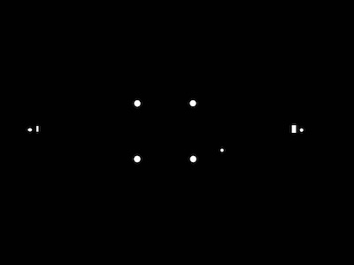
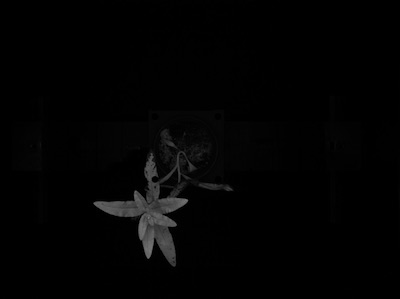
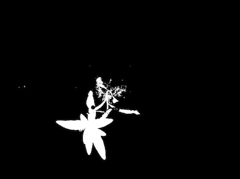
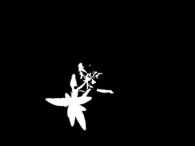
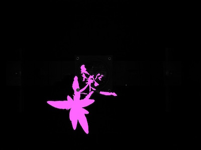
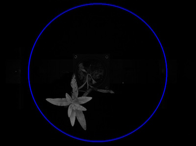
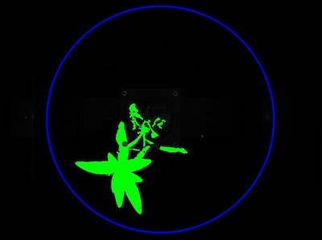
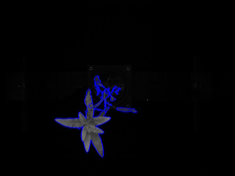
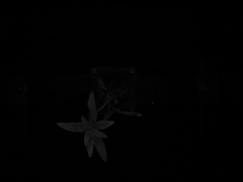

## Tutorial: PSII Image Pipeline

PlantCV is composed of modular functions that can be arranged (or rearranged) and adjusted quickly and easily.
Pipelines do not need to be linear (and often are not). Please see pipeline example below for more details.
Every function has a optional debug mode that prints out the resulting image.
This allows users to visualize and optimize each step on individual test images and small test sets before pipelines are deployed over whole data-sets.

PSII images (3 in a set; F0, Fmin, and Fmax) are captured directly following a saturating fluorescence pulse 
(red light; 630 nm). These three PSII images can be used to calculate Fv/Fm (effciency of photosystem II) 
for each pixel of the plant. Unfortunately, our PSII imaging cabinet has a design flaw when capturing images 
of plants with vertical architecture. You can read more about how we validated this flaw using our PSII 
analysis pipelines in the [PlantCV Paper](http://dx.doi.org/10.1016/j.molp.2015.06.005). 
However, the pipelines to analyze PSII images are functional and a sample pipeline is outlined below.  

### Workflow
 
1.  Optimize pipeline on a PSII image set (3 images) in debug mode.  
2.  Run pipeline on small test set (ideally that spans time and/or treatments).  
3.  Re-optimize pipelines on 'problem images' after manual inspection of test set.  
4.  Deploy optimized pipeline over test set using parallelization script.

### Running A Pipeline

To run a PSII pipeline over a single PSII image set (3 images) there are 4 required inputs:

1.  **Image 1:** F0 (a.k.a Fdark/null) image.
2.  **Image 2:** Fmin image.
3.  **Image 3:** Fmax image. 
5.  **Output directory:** If debug mode is on output images from each step are produced, 
otherwise ~4 final output images are produced.

Optional Inputs:

*  **Debug Flag:** Prints an image at each step
*  **Region of Interest:** The user can input their own binary region of interest or image mask 
(for PSII images we use a premade mask to remove the screws from the image). 
Make sure the input is the same size as your image or you will have problems.  

Sample command to run a pipeline on a single PSII image set:  

Always test pipelines (preferably with -D flag for debug mode) before running over a full image set.

`python pipelinename.py -i1 F0-testimg.png -i2 Fmin-testimg.png -i3 Fmax-testimg.png -m track-mask.png -o ./output-images -D`


### Walk Through A Sample Pipeline

Pipelines start by importing necessary packages, and by defining user inputs.

```python
#!/usr/bin/python
import sys, traceback
import cv2
import numpy as np
import argparse
import string
from plantcv import plantcv as pcv

### Parse command-line arguments
def options():
    parser = argparse.ArgumentParser(description="Imaging processing with opencv")
    parser.add_argument("-i1", "--fdark", help="Input image file.", required=True)
    parser.add_argument("-i2", "--fmin", help="Input image file.", required=True)
    parser.add_argument("-i3", "--fmax", help="Input image file.", required=True)
    parser.add_argument("-m", "--track", help="Input region of interest file.", required=False)
    parser.add_argument("-o", "--outdir", help="Output directory for image files.", required=True)
    parser.add_argument("-D", "--debug", help="Turn on debug, prints intermediate images.", action="store_true")
    args = parser.parse_args()
    return args
```

The PSII pipeline first uses the Fmax image to create an image mask. Our FLU images are 16-bit grayscale, 
but we will initially read the Fmax image in as a 8-bit color image just to create the image mask.

```python
### Main pipeline
def main():
    # Get options
    args = options()
    
    # Read image (converting fmax and track to 8 bit just to create a mask, use 16-bit for all the math)
    mask, path, filename = pcv.readimage(args.fmax)
    #mask = cv2.imread(args.fmax)
    track = cv2.imread(args.track)
    
    mask1, mask2, mask3= cv2.split(mask)
    
    # Pipeline step
    device = 0

```

**Figure 1.** (Top) Fmax image that will be used to create a plant mask that will isolate the plant material in the image. 
(Bottom) Pre-made image mask for the screws and metallic bits that are auto-fluorescent.  




We use a premade-mask for the screws on the car that consistently give background signal, this is not required.
The track mask is an RGB image so a single channel is selected using the [RGB to HSV](rgb2hsv.md).
function and converted to a binary mask with a [binary threshold](http://plantcv.danforthcenter.org/pages/documentation/function_docs/binary_threshold.html).**  
The mask is [inverted](invert.md) since the screws were white in the track image.
The [apply mask function](apply_mask.md) is then used to apply the track mask to one channel of the Fmax image (mask1). 

```python
    # Mask pesky track autofluor
    device, track1 = pcv.rgb2gray_hsv(track, 'v', device, args.debug)
    device, track_thresh = pcv.binary_threshold(track1, 0, 255, 'light', device, args.debug)
    device, track_inv = pcv.invert(track_thresh, device, args.debug)
    device, track_masked = pcv.apply_mask(mask1, track_inv, 'black', device, args.debug)
```

**Figure 2.** (Top) Inverted mask (white portion is kept as objects).
(Bottom) Fmax image (Figure 1) with the inverted mask applied.  




The resulting image is then thresholded with a [binary threshold](binary_threshold.md) to capture the plant material.

```python
    # Threshold the image
    device, fmax_thresh = pcv.binary_threshold(track_masked, 20, 255, 'light', device, args.debug)
```

**Figure 3.** Binary threshold on masked Fmax image.



Noise is reduced with a [median blur](median_blur.md)  

```python
  # Median Filter
  device, s_mblur = pcv.median_blur(fmax_thresh, 5, device, args.debug)
  device, s_cnt = pcv.median_blur(fmax_thresh, 5, device, args.debug)
```

**Figure 4.** Median blur applied.



Noise is also reduced with a [fill step](fill.md).  

```python
    # Fill small objects
    device, s_fill = pcv.fill(s_mblur, s_cnt, 110, device, args.debug)
    device, sfill_cnt = pcv.fill(s_mblur, s_cnt, 110, device, args.debug)
```

**Figure 5.** Fill applied.  


Objects (OpenCV refers to them a contours) are then identified within the image using 
the [Find Objects Function](find_objects.md).  

```python
    # Identify objects
    device, id_objects,obj_hierarchy = pcv.find_objects(mask, sfill_cnt, device, args.debug)
```

**Figure 6.** All objects found within the image are identified.



Next the region of interest is defined using the [Region of Interest Function](define_roi.md).   

```python
    # Define ROI
    device, roi1, roi_hierarchy = pcv.define_roi(mask, 'circle', device, None, 'default', args.debug, True, 0, 0, -50, -50)
```

**Figure 7.** Region of interest is drawn on the image.



The objects within and overlapping are kept with the [Region of Interest Objects Function](roi_objects.md).
Alternately the objects can be cut to the region of interest.

```python
    # Decide which objects to keep
    device, roi_objects, hierarchy3, kept_mask, obj_area = pcv.roi_objects(mask, 'partial', roi1, roi_hierarchy, id_objects, obj_hierarchy, device, args.debug)
```

**Figure 8.** Objects in the region of interest are identified (green).  



The isolated objects now should all be plant material. There can however, be more than one object that makes up a plant, 
since sometimes leaves twist making them appear in images as separate objects. Therefore, in order for shape 
analysis to perform properly the plant objects need to be combined into one object using the Combine Objects function
(for more info see [here](object_composition.md)).

```python
    # Object combine kept objects
    device, obj, masked = pcv.object_composition(mask, roi_objects, hierarchy3, device, args.debug)
```

**Figure 9.** Combined plant object outlined in blue.



The next step is to analyze the plant object for traits such as shape, or PSII signal.
For more info see Shape Function [here](analyze_shape.md),
and the PSII signal function [here](fluor_fvfm.md).

For the PSII signal function the 16-bit F0, Fmin, and  Fmax images are read in so that they can be used 
along with the generated mask to calculate Fv/Fm.

```python
################ Analysis ################  
    
    # Find shape properties, output shape image (optional)
    device, shape_header, shape_data, shape_img = pcv.analyze_object(mask, args.fmax, obj, masked, device, args.debug, args.outdir + '/' + filename)
    
    # Fluorescence Measurement (read in 16-bit images)
    fdark = cv2.imread(args.fdark, -1)
    fmin = cv2.imread(args.fmin, -1)
    fmax = cv2.imread(args.fmax, -1)
    
    device, fvfm_header, fvfm_data = pcv.fluor_fvfm(fdark,fmin,fmax,kept_mask, device, args.outdir+'/'+filename, 1000, args.debug)
    
    # Output shape and color data
    pcv.print_results(args.fmax, shape_header, shape_data)
    pcv.print_results(args.fmax, fvfm_header, fvfm_data)
  
if __name__ == '__main__':
    main()
```

**Figure 10.** Input images from top to bottom: F0 (null image also known as Fdark); Fmin image; Fmax image.





**Figure 11.** (Left) Image pseudocolored by Fv/Fm values. (Right) Histogram of raw Fv/Fm values.


To deploy a pipeline over a full image set please see tutorial on Pipeline Parallelization [here](pipeline_parallel.md).