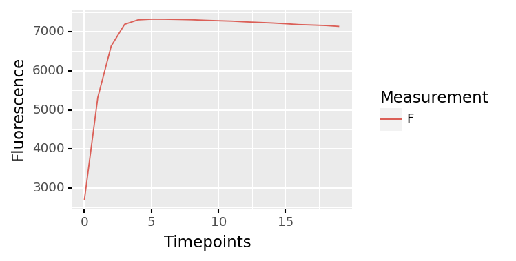
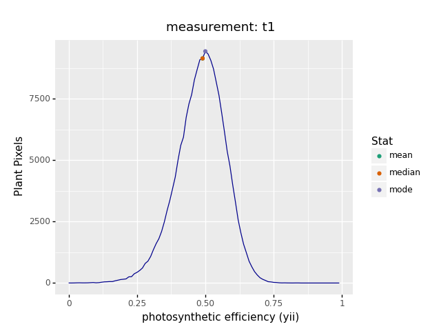
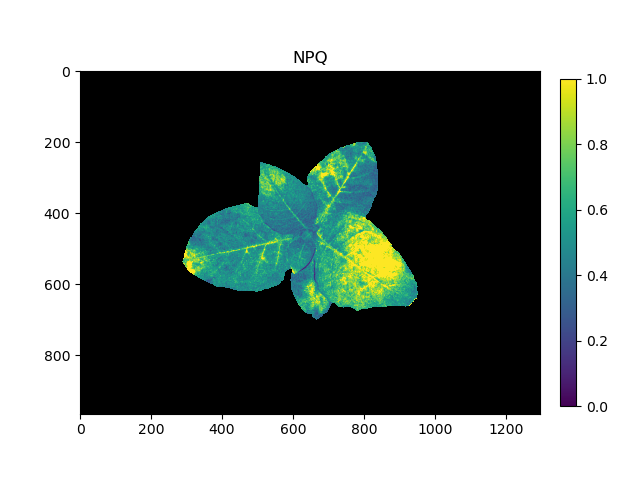

## Tutorial: Photosystem II Analysis Workflow

PlantCV is composed of modular functions that can be arranged (or rearranged) and adjusted quickly and easily.
Workflows do not need to be linear (and often are not). Please see workflow example below for more details.
A global variable "debug" allows the user to print out the resulting image.
The debug has three modes: either None, 'plot', or 'print'. If set to
'print' then the function prints the image out, or if using a [Jupyter](jupyter.md) notebook you could set debug to 
'plot' to have the images plot to the screen.
This allows users to visualize and optimize each step on individual test images and small test sets before workflows 
are deployed over whole datasets.

Measurement of chlorophyll fluorescence is a tool that can be used to monitor/estimate photosynthetic performance 
(Baker 2008). Several systems exist that use imaging to detect chlorophyll fluorescence and support multiple measurement
protocols. PlantCV currently supports data from the [PhenoVation CropReporter](https://phenovation.com/) system, which
has measurement protocols for Fv/Fm, Fv'/Fm', Fq'/Fm', NPQ, among others. In PlantCV, CropReporter data (and later 
other data sources) are imported into PlantCV as an [Xarray](http://xarray.pydata.org/en/stable/) DataArray with frame 
labels and attributes that enable quick access to the frames needed to measure each parameter. A workflow to analyze 
PSII images is outlined below.  

Also see [here](#psii-script) for the complete script.

### Citations

Baker NR. 2008. Chlorophyll fluorescence: A probe of photosynthesis in vivo. *Annual Review of Plant Biology* 59:89–113. 
DOI: [10.1146/annurev.arplant.59.032607.092759](https://doi.org/10.1146/annurev.arplant.59.032607.092759).

### Workflow

1.  Optimize workflow on individual image with debug set to 'print' (or 'plot' if using a Jupyter notebook).
2.  Run workflow on small test set (ideally that spans time and/or treatments).  
3.  Re-optimize workflows on 'problem images' after manual inspection of test set.  
4.  Deploy optimized workflow over test set using parallelization script.

### Running A Workflow

The example workflow below utilizes a CropReporter dataset that utilized the Fv/Fm, Fq'/Fm', and NPQ measurement 
protocols, but workflows could also be designed to analyze data with fewer protocols enabled.

To run this workflow over a single dataset there are 2 required inputs:

1.  **Metadata File:** PSII_HDR.INF (also requires a PSII_PSD.DAT and PSII_PSL.DAT to be stored at the same location)
2.  **Output directory:** Location where output images (if any) will be saved

This tutorial shows an example workflow for fluorescence images taken with the 
[CropReporter system](https://www.phenovation.com/cropreporter/). CropReporter images are stored in a metadata (.INF) 
file and .DAT files where multiple frames are stored into a single file. 

Optional Inputs:

*  **Writeimg Flag:** Enables saving output images, where applicable
*  **Debug Flag:** Prints or plots (if in Jupyter or have x11 forwarding on) an image at each step

Sample command to run a workflow on a single PSII image set:  

* Always test workflows (preferably with -D flag for debug mode) before running over a full image set.

```
./workflowname.py -i PSII_HDR_020321_WT_TOP_1.INF -o /home/user/output-images -D 'print'

```

### Walk Through A Sample Workflow

Workflows start by importing necessary packages, and by defining user inputs.

```python
#!/usr/bin/env python
import os
import argparse
from plantcv import plantcv as pcv

### Parse command-line arguments
def options():
    parser = argparse.ArgumentParser(description="Imaging processing with opencv")
    parser.add_argument("-i", "--image", help="Input INF file.", required=True)
    parser.add_argument("-o", "--outdir", help="Output directory for image files.", required=True)
    parser.add_argument("-w", "--writeimg", help="Save output images.", action="store_true")
    parser.add_argument("-D", "--debug", help="Turn on debug, prints intermediate images.", action="store_true")
    args = parser.parse_args()
    return args

```

All required frames are contained within the `.DAT` files. See the documentation page for 
[`plantcv.photosynthesis.read_cropreporter()`](photosynthesis_read_cropreporter.md) to see more detail on
how this type of data is read in.

```python
### Main workflow
def main():
    # Get options
    args = options()

    pcv.params.debug = args.debug #set debug mode
    pcv.params.debug_outdir = args.outdir #set output directory

    # Read fluorescence image data
    ps, pspath, inf_filename = pcv.photosynthesis.read_cropreporter(args.image)

```

**Figure 1.** CropReporter images


From top-left to bottom-right: F-dark (lights off), F0 (minimum fluorescence of dark-adapted plant), Fm 
(maximum fluorescence of dark-adapted plant), F-light (lights on), F' (steady-state fluorescence of light-adapted 
plant), and Fm' (maximum fluorescence of light-adapted plant).

The `ps` object is an Xarray DataArray that contains 21 images for the Fv/Fm and 21 images for the Fq'/Fm' protocols.
Individual frames can be accessed through frame labels. Frames that have specific importance in estimating 
photosynthetic parameters are labeled with attributes.

CropReporter data are 16-bit images. We first identify the F0 (minimum fluorescence) frame and rescale it to 8-bit
so that we can generate a binary mask.

```python
    fmin = pcv.transform.rescale(gray_img=ps.sel(frame_label="F0").data)

```

**Figure 2.** 8-bit F0 image


The resulting image is then thresholded to segment the image into foreground (plant) and background with the 
autothreshold method [Otsu](otsu_threshold.md). In different imaging scenarios it may be easier to segment a brighter
image from the fluorescence induction series (e.g. F1, F2, ..., Fn). When fluorescence is brighter the image will have
a higher dynamic range to more easily threshold the whole plant, but Fmin may have less errant signal 
(e.g., if a leaf moved during imaging).

```python
    # Threshold the F0 image

    # Inputs:
    #   gray_img        - Grayscale image data
    #   max_value       - Value to apply above threshold (255 = white)
    #   object_type     - 'light' (default) or 'dark'. If the object is lighter than the
    #                       background then standard threshold is done. If the object is
    #                       darker than the background then inverse thresholding is done.
    plant_mask = pcv.threshold.otsu(gray_img=fmin, max_value=255, object_type="light")

```

**Figure 3.** Thresholded F0 image.


Fill in missing areas of the plant with the [fill_holes](fill_holes.md) function.

```python
    # Fill small objects

    # Inputs:
    #   bin_img         - Binary image data
    cleaned_mask = pcv.fill_holes(bin_img=plant_mask)

```

**Figure 4.** Fill holes applied.  


In this experiment, the plant was dark-adapted. An image is taken of the plant in the dark (Fdark). The plant is then
exposed to a saturating red light pulse briefly. An image of chlorophyll fluorescence is taken immediately after the
pulse to measure minimal fluorescence (F0). Successive images are taken at a fixed time interval (20 total frames from
F0 to F19 in this example). Here we will use the [analyze_yii](photosynthesis_analyze_yii.md) to analyze the
fluorescence induction curve and identify the frame with maximal fluorescence (Fm) and then calculate the metric Fv/Fm
to estimate the maximum efficiency of PSII.

```python
    # Analyze Fv/Fm

    # Inputs:
    #   ps          - photosynthesis xarray DataArray
    #   mask        - mask of plant (binary, single channel)
    #   measurement - choose which measurement routine to analyze: "Fv/Fm", "Fv'/Fm'", or "Fq'/Fm'"
    #   bins        - number of bins (1 to 256 for 8-bit; 1 to 65,536 for 16-bit; default is 256)
    #   label       - optional label parameter, modifies the variable name of observations recorded

    fvfm_ind, fvfm_hist, fvfm_img = pcv.photosynthesis.analyze_yii(ps=ps, mask=cleaned_mask, measurement="Fv/Fm", 
                                                                   bins=256, label="default")

```

**Figure 5.** Dark-adapted fluorescence induction curve.  



**Figure 6.** Fv/Fm histogram.  


After the Fv/Fm protocol, the plant is light-adapted. An image is taken of the plant in the light (Flight). The plant
is then exposed to an actinic light, and an image of chlorophyll fluorescence is taken to measure steady-state
fluorescence (F'). The plant is then exposed to a saturating red light pulse briefly. Successive images are taken at a 
fixed time interval (20 total frames from F0 to F19 in this example). Here we will use the 
[analyze_yii](photosynthesis_analyze_yii.md) to analyze the light-adapted fluorescence induction curve and identify the 
frame with maximal fluorescence (Fm') and then calculate the metric Fq'/Fm' to estimate the operating efficiency of 
PSII.

```python
    # Analyze Fq'/Fm'

    # Inputs:
    #   ps          - photosynthesis xarray DataArray
    #   mask        - mask of plant (binary, single channel)
    #   measurement - choose which measurement routine to analyze: "Fv/Fm", "Fv'/Fm'", or "Fq'/Fm'"
    #   bins        - number of bins (1 to 256 for 8-bit; 1 to 65,536 for 16-bit; default is 256)
    #   label       - optional label parameter, modifies the variable name of observations recorded

    fqfm_ind, fqfm_hist, fqfm_img = pcv.photosynthesis.analyze_yii(ps=ps, mask=cleaned_mask, measurement="Fq'/Fm'", 
                                                                   bins=256, label="default")

```

**Figure 7.** Light-adapted fluorescence induction curve.  


**Figure 8.** Fq'/Fm' histogram.  



After analyze the Fv/Fm and Fq'Fm' protocols, the photosynthesis data array (ps) is updated. Attributes are added to
the Xarray DataArray to mark the Fm and Fm' frames based on analysis of the induction curves (these can be manually
modified if usage of other frames was desirable). Now that Fm and Fm' have been identified, nonphotochemical quanching
(NPQ) can be estimated using the [analyze_npq](photosynthesis_analyze_npq.md) function.

```python
    # Analyze NPQ

    # Inputs:
    #   ps          - photosynthesis xarray DataArray
    #   mask        - mask of plant (binary, single channel)
    #   bins        - number of bins (1 to 256 for 8-bit; 1 to 65,536 for 16-bit; default is 256)
    #   label       - optional label parameter, modifies the variable name of observations recorded

    npq_hist, npq_img = pcv.photosynthesis.analyze_npq(ps=ps, mask=cleaned_mask, bins=256, label="default")

```

**Figure 9.** NPQ histogram.  


Optionally, the Fv/Fm, Fq'/Fm', and NPQ images can be visualized using the [pseudocolor](visualize_pseudocolor.md)
function to assess the distribution of values across the plant.

```python
    # Pseudocolor the PSII metric images

    # Inputs:
    # gray_img    - grayscale image data
    # obj         - (optional) ROI or plant contour object. If provided, the pseudocolored image gets cropped
    #               down to the region of interest. default = None
    # mask        - (optional) binary mask
    # cmap        - (optional) colormap. default is the matplotlib default, viridis
    # background  - (optional) background color/type, options are "image" (gray_img), "white", or "black"
    #               (requires a mask). default = 'image'
    # min_value   - (optional) minimum value for range of interest. default = 0
    # max_value   - (optional) maximum value for range of interest. default = 255
    # axes        - (optional) if False then x- and y-axis won't be displayed, nor will the title. default = True
    # colorbar    - (optional) if False then colorbar won't be displayed. default = True
    # obj_padding - (optional) if "auto" (default) and an obj is supplied, then the image is cropped to an extent 20%
    #               larger in each dimension than the object. An single integer is also accepted to define the padding
    #               in pixels
    # title       - (optional) custom title for the plot gets drawn if title is not None. default = None
    # bad_mask    - (optional) binary mask of pixels with "bad" values, e.g. nan or inf or any other values considered
    #               to be not informative and to be excluded from analysis. default = None
    # bad_color   - (optional) desired color to show "bad" pixels. default = "red"
    fvfm_cmap = pcv.visualize.pseudocolor(gray_img=fvfm_img, mask=cleaned_mask, cmap="viridis", 
                                          min_value=0, max_value=1, title="Fv/Fm")
    fqfm_cmap = pcv.visualize.pseudocolor(gray_img=fqfm_img, mask=cleaned_mask, cmap="viridis", 
                                          min_value=0, max_value=1, title="Fq'/Fm'")
    npq_cmap = pcv.visualize.pseudocolor(gray_img=npq_img, mask=cleaned_mask, cmap="viridis", 
                                         min_value=0, max_value=1, title="NPQ")

```

**Figure 10.** Pseudocolored Fv/Fm.  


**Figure 11.** Pseudocolored Fq'/Fm'.  


**Figure 12.** Pseudocolored NPQ.  



Save results and finish the workflow

```python
    # Save Fv/Fm, Fq'/Fm', and NPQ results
    pcv.outputs.save_results(filename=args.result)
    
    if args.writeimg:
        pcv.print_image(img=fvfm_ind, filename=os.path.join(args.outdir, inf_filename[:-4] + "_fvfm_induction.png"))
        pcv.print_image(img=fqfm_ind, filename=os.path.join(args.outdir, inf_filename[:-4] + "_fqfm_induction.png"))
        pcv.print_image(img=fvfm_hist, filename=os.path.join(args.outdir, inf_filename[:-4] + "_fvfm_histogram.png"))
        pcv.print_image(img=fqfm_hist, filename=os.path.join(args.outdir, inf_filename[:-4] + "_fqfm_histogram.png"))
        pcv.print_image(img=npq_hist, filename=os.path.join(args.outdir, inf_filename[:-4] + "_npq_histogram.png"))
        pcv.print_image(img=fvfm_cmap, filename=os.path.join(args.outdir, inf_filename[:-4] + "_fvfm_cmap.png"))
        pcv.print_image(img=fqfm_cmap, filename=os.path.join(args.outdir, inf_filename[:-4] + "_fqfm_cmap.png"))
        pcv.print_image(img=npq_cmap, filename=os.path.join(args.outdir, inf_filename[:-4] + "_npq_cmap.png"))

if __name__ == '__main__':
    main()

```

To deploy a workflow over a full image set please see tutorial on [workflow parallelization](pipeline_parallel.md).

## PSII Script

In the terminal:

```
./workflowname.py -i /home/user/images/PSII_PSD_testimg_22_rep6.INF -o /home/user/output-images -D 'print'

```

* Always test workflows (preferably with -D flag for debug mode) before running over a full image set.

Python script:

```python
#!/usr/bin/env python
import os
import argparse
from plantcv import plantcv as pcv

### Parse command-line arguments
def options():
    parser = argparse.ArgumentParser(description="Imaging processing with opencv")
    parser.add_argument("-i", "--image", help="Input INF file.", required=True)
    parser.add_argument("-o", "--outdir", help="Output directory for image files.", required=True)
    parser.add_argument("-w", "--writeimg", help="Save output images.", action="store_true")
    parser.add_argument("-D", "--debug", help="Turn on debug, prints intermediate images.", action="store_true")
    args = parser.parse_args()
    return args


### Main workflow
def main():
    # Get options
    args = options()

    pcv.params.debug = args.debug #set debug mode
    pcv.params.debug_outdir = args.outdir #set output directory

    # Read fluorescence image data
    ps, pspath, inf_filename = pcv.photosynthesis.read_cropreporter(args.image)

    # Extract an 8-bit image (F0) from the dataset
    fmin = pcv.transform.rescale(gray_img=ps.sel(frame_label="F0").data)

    # Threshold the F0 image

    # Inputs:
    #   gray_img        - Grayscale image data
    #   max_value       - Value to apply above threshold (255 = white)
    #   object_type     - 'light' (default) or 'dark'. If the object is lighter than the
    #                       background then standard threshold is done. If the object is
    #                       darker than the background then inverse thresholding is done.
    plant_mask = pcv.threshold.otsu(gray_img=fmin, max_value=255, object_type="light")

    # Fill small objects

    # Inputs:
    #   bin_img         - Binary image data
    cleaned_mask = pcv.fill_holes(bin_img=plant_mask)

    # Analyze Fv/Fm

    # Inputs:
    #   ps          - photosynthesis xarray DataArray
    #   mask        - mask of plant (binary, single channel)
    #   measurement - choose which measurement routine to analyze: "Fv/Fm", "Fv'/Fm'", or "Fq'/Fm'"
    #   bins        - number of bins (1 to 256 for 8-bit; 1 to 65,536 for 16-bit; default is 256)
    #   label       - optional label parameter, modifies the variable name of observations recorded

    fvfm_ind, fvfm_hist, fvfm_img = pcv.photosynthesis.analyze_yii(ps=ps, mask=cleaned_mask, measurement="Fv/Fm", 
                                                                   bins=256, label="default")
    
    # Analyze Fq'/Fm'

    # Inputs:
    #   ps          - photosynthesis xarray DataArray
    #   mask        - mask of plant (binary, single channel)
    #   measurement - choose which measurement routine to analyze: "Fv/Fm", "Fv'/Fm'", or "Fq'/Fm'"
    #   bins        - number of bins (1 to 256 for 8-bit; 1 to 65,536 for 16-bit; default is 256)
    #   label       - optional label parameter, modifies the variable name of observations recorded

    fqfm_ind, fqfm_hist, fqfm_img = pcv.photosynthesis.analyze_yii(ps=ps, mask=cleaned_mask, measurement="Fq'/Fm'", 
                                                                   bins=256, label="default")

    # Analyze NPQ

    # Inputs:
    #   ps          - photosynthesis xarray DataArray
    #   mask        - mask of plant (binary, single channel)
    #   bins        - number of bins (1 to 256 for 8-bit; 1 to 65,536 for 16-bit; default is 256)
    #   label       - optional label parameter, modifies the variable name of observations recorded

    npq_hist, npq_img = pcv.photosynthesis.analyze_npq(ps=ps, mask=cleaned_mask, bins=256, label="default")

    # Pseudocolor the PSII metric images

    # Inputs:
    # gray_img    - grayscale image data
    # obj         - (optional) ROI or plant contour object. If provided, the pseudocolored image gets cropped
    #               down to the region of interest. default = None
    # mask        - (optional) binary mask
    # cmap        - (optional) colormap. default is the matplotlib default, viridis
    # background  - (optional) background color/type, options are "image" (gray_img), "white", or "black"
    #               (requires a mask). default = 'image'
    # min_value   - (optional) minimum value for range of interest. default = 0
    # max_value   - (optional) maximum value for range of interest. default = 255
    # axes        - (optional) if False then x- and y-axis won't be displayed, nor will the title. default = True
    # colorbar    - (optional) if False then colorbar won't be displayed. default = True
    # obj_padding - (optional) if "auto" (default) and an obj is supplied, then the image is cropped to an extent 20%
    #               larger in each dimension than the object. An single integer is also accepted to define the padding
    #               in pixels
    # title       - (optional) custom title for the plot gets drawn if title is not None. default = None
    # bad_mask    - (optional) binary mask of pixels with "bad" values, e.g. nan or inf or any other values considered
    #               to be not informative and to be excluded from analysis. default = None
    # bad_color   - (optional) desired color to show "bad" pixels. default = "red"
    fvfm_cmap = pcv.visualize.pseudocolor(gray_img=fvfm_img, mask=cleaned_mask, cmap="viridis", 
                                          min_value=0, max_value=1, title="Fv/Fm")
    fqfm_cmap = pcv.visualize.pseudocolor(gray_img=fqfm_img, mask=cleaned_mask, cmap="viridis", 
                                          min_value=0, max_value=1, title="Fq'/Fm'")
    npq_cmap = pcv.visualize.pseudocolor(gray_img=npq_img, mask=cleaned_mask, cmap="viridis", 
                                         min_value=0, max_value=1, title="NPQ")

    # Save Fv/Fm, Fq'/Fm', and NPQ results
    pcv.outputs.save_results(filename=args.result)
    
    if args.writeimg:
        pcv.print_image(img=fvfm_ind, filename=os.path.join(args.outdir, inf_filename[:-4] + "_fvfm_induction.png"))
        pcv.print_image(img=fqfm_ind, filename=os.path.join(args.outdir, inf_filename[:-4] + "_fqfm_induction.png"))
        pcv.print_image(img=fvfm_hist, filename=os.path.join(args.outdir, inf_filename[:-4] + "_fvfm_histogram.png"))
        pcv.print_image(img=fqfm_hist, filename=os.path.join(args.outdir, inf_filename[:-4] + "_fqfm_histogram.png"))
        pcv.print_image(img=npq_hist, filename=os.path.join(args.outdir, inf_filename[:-4] + "_npq_histogram.png"))
        pcv.print_image(img=fvfm_cmap, filename=os.path.join(args.outdir, inf_filename[:-4] + "_fvfm_cmap.png"))
        pcv.print_image(img=fqfm_cmap, filename=os.path.join(args.outdir, inf_filename[:-4] + "_fqfm_cmap.png"))
        pcv.print_image(img=npq_cmap, filename=os.path.join(args.outdir, inf_filename[:-4] + "_npq_cmap.png"))

if __name__ == '__main__':
    main()

```
