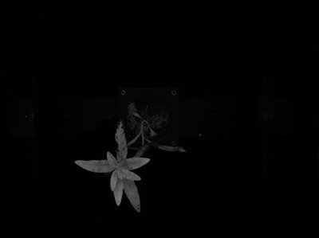
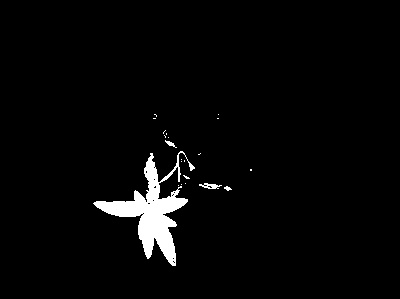
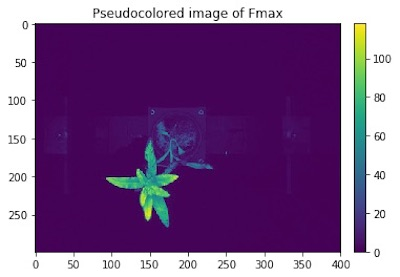
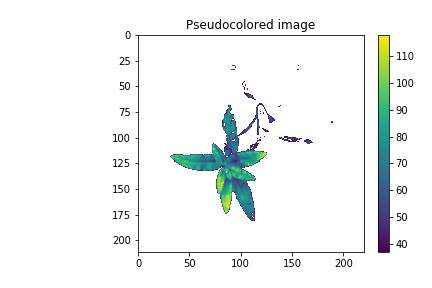

## Pseudocolor any Grayscale Image

This function pseudocolors any grayscale image to custom colormap. An optional mask can leave background out in the
pseudocolored image. Additionally, optional maximum and minimum values can be specified.

**plantcv.pseudocolor**(*gray_img, mask=None, cmap=None, min_value=0, max_value=255, obj=None, dpi=None, axes=True, path="."*)

**returns** pseudocolored image that can be saved with `pcv.print_image`

- **Parameters:**
    - gray_img  - Grayscale image data
    - mask      - Binary mask made from selected contours
    - cmap      - Custom colormap, see [here](https://matplotlib.org/tutorials/colors/colormaps.html) for tips on how to choose a colormap in Matplotlib.
    - min_value - Minimum value (optional) for range of interest.
    - max_value - Maximum value (optional) for range of interest.
    - obj       - Single or grouped contour object (optional), if provided the pseudocolored image gets cropped down to the region of interest.
    - dpi       - Dots per inch for image if printed out (optional, if dpi=None then the default is set to 100 dpi).
    - axes      - If False then x- and y-axis won't be displayed (default axes=True).
    - path      - Path giving location the image will get saved.
- **Context:**
    - Used to pseudocolor any grayscale image to custom colormap
- **Example use:**
    - [Interactive Documentation](https://mybinder.org/v2/gh/danforthcenter/plantcv-binder.git/master?filepath=notebooks%2FpsII_tutorial.ipynb)

**Original grayscale image**



**Mask**




```python

from plantcv import plantcv as pcv

pcv.params.debug='plot'

# Pseudocolor an image with 'viridis' colormad
pseudo_img = pcv.pseudocolor(gray_img=img, mask=None, cmap='viridis', min_value=0, max_value=255, path='.')

# Pseudocolor the same image but include the mask and limit the range of values
pseudo_img_masked = pcv.pseudocolor(gray_img=img, mask=mask, cmap='viridis', min_value=30, max_value=200, path='.')

# Save the masked and pseudocolored image
pcv.print_image(pseudo_img_masked, 'nir_tv_z300_L1_pseudocolored.png')

# Print out a pseudocolored image with cropping enabled, axes disabled, and higher dpi value.
pcv.params.debug='print'
pseudo_crop_no_axes = pcv.pseudocolor(gray_img=img, mask=mask, obj=obj, cmap='viridis', dpi=200, axes=False)

# If a black background is preferred over white
cmap = matplotlib.cm.viridis # or whatever you want
cmap.set_bad("black") # or "white" of course
pseudo_img_black_bkgd = pcv.pseudocolor(gray_img=img, mask=mask, cmap=cmap)
```


**Pseudocolored Image**




**Pseudocolored and Masked Image**


**Pseudocolored, Cropped, Disabled Axes Image**



**Pseudocolored and Masked with Black Background**


