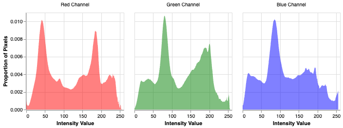
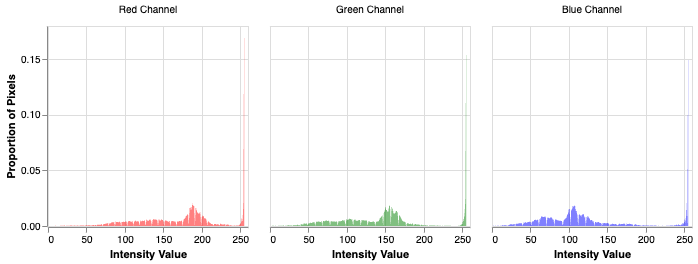

## Quality control for over- and under-exposed images

This function is useful for identifying problems in image quality due to under- and over-exposure of the image. This function works for an RGB image. 
Red (R), Green (G), and Blue (B) values for a pixel range from 0 to 255. In under- and over-exposed images, a pixel may be beyond the range of 0 or 255 due to over- or under-exposure, but the value will only be recorded at 0 or 255, respectively. This results in lost color data that is incorrectly recorded at the limit due to the value being beyond the range of detection. 
To determine if there are quality problems in the image due to exposure, run this function and inspect the color histograms, which should not have peaks at 0 or 255 - if this is the case, a warning message will appear. This function is best run on the region of the image you are analyzing, and thus perform after cropping if that is a step in the workflow. 
If there are quality problems in the image, change the camera settings to reduce or increase the exposure, brightness, or aperture until there is no longer a warning message. 
This function is meant to be run in a jupyter notebook during workflow development. 


**plantcv.qc.exposure**(*rgb_img, warning_threshold=0.05*)

**returns** Altair chart

- **Parameters**
    - rgb_img (numpy.ndarray) - An image in BGR format as a 3D numpy array.
    - warning_threshold (float) - The percentage threshold for triggering a warning
                    for over- or underexposure (default is 0.05 for 5%).
            
        
    
- **Context:**
    - Used to check the image quality for under- or over-exposure. 

```python

from plantcv import plantcv as pcv

chart = pcv.exposure(rgb_img=image, warning_threshold=0.05)

```
**Acceptable quality for exposure**



**Problematic quality for exposure**

Warning: The image is over- or underexposed because more than 5.0% of pixels are equal to 0 or 255 intensity. Color cannot be analyzed responsibly, as color values are lost above the minimum (0) and maximum (255). Change camera settings to capture appropriate images.



**Source Code:** [Here](https://github.com/danforthcenter/plantcv/blob/main/plantcv/plantcv/qc/exposure.py)
