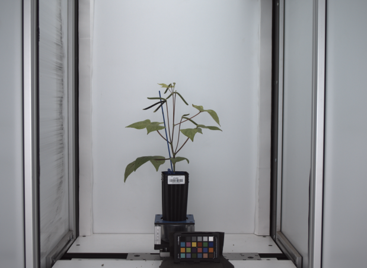
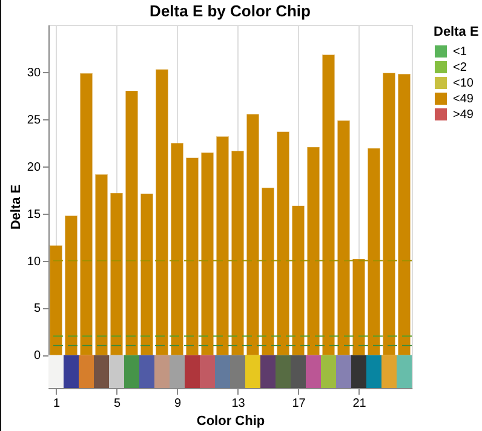
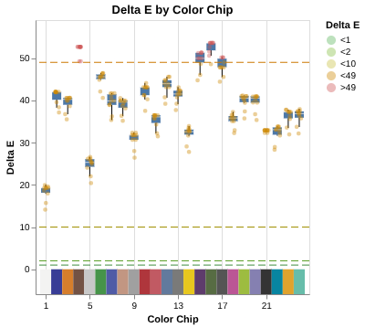

## Plot Delta E

This function creates an interactive chart visualizing per-chip Delta E (color difference) values from a color checker card. Each bar or point is colored by a standard interpretation category: green (<1) indicates imperceptible differences, progressing through yellow (<2, <10) to orange and red (<49, >49) for increasingly noticeable differences. Reference lines at the category boundaries are drawn for quick visual assessment. Standard chip color swatches from the target color matrix are displayed below the x-axis to aid chip identification.

When passed a single `numpy.ndarray` of Delta E values, a bar chart is produced for that image. When passed a directory path or list of image paths, the function reads each image, computes Delta E, and returns a layered boxplot with jittered points so per-image variation is visible alongside the distribution.

**plantcv.qc.plot_deltaE**(*source, n=20, ext="png", \*\*kwargs*)

**returns** chart, an altair.vegalite.v5.api.LayerChart object

- **Parameters:**
    - source - one of:
        - `numpy.ndarray` of per-chip Delta E values shaped to match the color card layout (e.g., (6, 4) for a 24-chip Macbeth card or (3, 5) for a 15-chip AstroBotany card), as returned from [`pcv.transform.deltaE`](https://github.com/danforthcenter/plantcv/blob/main/plantcv/plantcv/transform/detect_color_card.py). A bar chart is produced.
        - `str` path to a directory of images (walked recursively). A boxplot is produced.
        - `list` of file path strings to individual images. A boxplot is produced.
    - n - (default: 20) maximum number of images to read when `source` is a directory path
    - ext - (default: `"png"`) file extension filter when `source` is a directory path
    - \*\*kwargs - additional arguments forwarded to [`pcv.transform.deltaE`](https://github.com/danforthcenter/plantcv/blob/main/plantcv/plantcv/transform/detect_color_card.py): `color_chip_size`, `roi`, `adaptive_method`, `block_size`, `radius`, `min_size`, `aspect_ratio`, `solidity`

- **Context:**
    - Used to evaluate the quality of color calibration by visualizing how closely observed chip colors match their expected values. Lower Delta E values indicate better color fidelity. The single-image bar chart is best used during workflow development to inspect calibration results interactively. The multi-image boxplot is useful for assessing calibration consistency across an experiment or imaging session.

- **Example use:**
    - Below

**Dataset image:**



```python
from plantcv import plantcv as pcv

# Single image — bar chart
de_matrix = pcv.transform.deltaE(rgb_img=img, color_chip_size="classic")
chart = pcv.qc.plot_deltaE(source=de_matrix)
# Calculate Delta E values for each chip relative to the standard color matrix
de_matrix = pcv.transform.deltaE(rgb_img=img, color_chip_size="classic")
# Plot the Delta E values
chart = pcv.qc.plot_deltaE(source=de_matrix)

```

**Delta E bar chart:**



```python
# Directory of images — boxplot with jittered points
chart = pcv.qc.plot_deltaE(source="/path/to/images", n=50, ext="png")

# List of image paths — boxplot with jittered points
image_paths = ["/path/to/img1.png", "/path/to/img2.png"]
chart = pcv.qc.plot_deltaE(source=image_paths)
```

**Delta E boxplot:**



**Source Code:** [Here](https://github.com/danforthcenter/plantcv/blob/main/plantcv/plantcv/qc/plot_delta_e.py)
