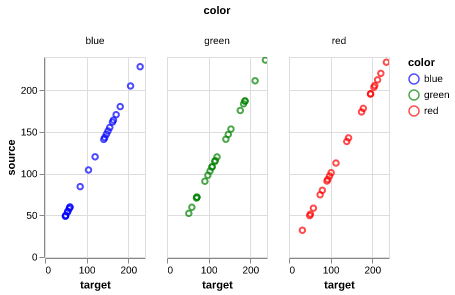
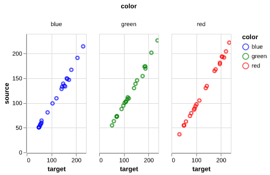

## Checking a Color Card

We have added a function to help identify problems with color chips. One frequent issue that can happen is a color chip that is fully saturated, and would
be better off excluded from analysis . A quick way to examine this is by plotting the source matrix value against the target matrix value for all color chips
masked in the color card.


**plantcv.qc.quick_color_check**(*source_matrix, target_matrix=None, num_chips=None*)

**returns** Altair chart

- **Parameters**
    - source_matrix - an Nx4 matrix containing the average red value, average green value, and. See output of `plantcv.plantcv.transform.detect_color_card`.
                             average blue value for each color chip of the source image
    - target_matrix - an Nx4 matrix containing the average red value, average green value, and average blue value for each color chip of the target image. If `None`, the default, this will use output of `plantcv.plantcv.transform.std_color_matrix(pos=3)` or `plantcv.plantcv.transform.astro_color_matrix()` depending on the number of chips in the source matrix.
    - num_chips     - the number of color card chips included in the matrices. Defaults to `None` which will use all rows of the target matrix.
    
- **Context:**
    - Use the [`get_color_matrix`](get_color_matrix.md)

```python

from plantcv import plantcv as pcv

chart = pcv.qc.quick_color_check(source_matrix=s_matrix,
                                 target_matrix=t_matrix)

```
**Perfect Color Correlation**



**Problematic**



**Source Code:** [Here](https://github.com/danforthcenter/plantcv/blob/main/plantcv/plantcv/qc/quick_color_check.py)
