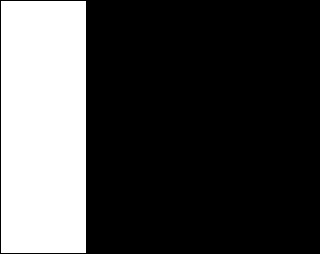

## Mask-Rectangle

Takes an input image and returns a binary image masked by a rectangular area denoted by p1 and p2. 
Note that p1 = (0,0) is the top left hand corner bottom right hand corner is p2 = (max-value(x), max-value(y)).

**plantcv.rectangle_mask**(*img, point1, point2, color="black"*)

**returns** masked, binary img, contours, hierarchy 

- **Parameters:**
    - img - RGB or grayscale image data
    - p1 - Point at the top left corner of rectangle, (0,0) is top left corner (tuple)
    - p2 - Point at the bottom right corner of rectangle (max-value(x),max-value(y)) is bottom right corner (tuple)
    - color - "black", "gray","white", default is "black". This acts to select (mask) area from object capture (need to invert to remove).
- **Context:**
    - Used to mask rectangular regions of an image
- **Example use:**
    - [Use In NIR Tutorial](nir_tutorial.md)
    
**Grayscale image**




```python
from plantcv import plantcv as pcv

# Set global debug behavior to None (default), "print" (to file), or "plot" (Jupyter Notebooks or X11)
pcv.params.debug = "print"

# Makes a rectangle area that will be treated as a mask
masked, binary, contours, hierarchy = pcv.rectangle_mask(img, (0,0), (75,252), color="black")
```

**Region of interest**




**Masked image**



