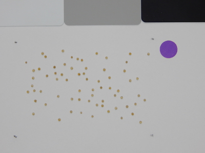
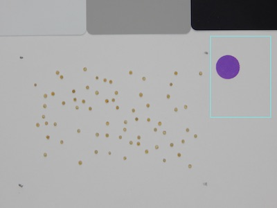
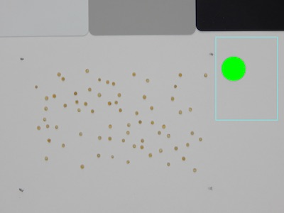

## Report Size Marker

Get and record the size of a size marker or set an area as a size marker.

**plantcv.report_size_marker_area**(*img, roi_contour, roi_hierarchy, marker='define', objcolor='dark', thresh_channel=None,
                            thresh=None, filename=False*)

**returns** marker_header, marker_data, analysis_images

- **Parameters:**
    - img             = An RGB or grayscale image to plot the marker object on
    - roi_contour     = A region of interest contour (e.g. output from [pcv.roi.rectangle](roi_rectangle.md) or other methods)
    - roi_hierarchy   = A region of interest contour hierarchy (e.g. output from pcv.roi.rectangle or other methods)
    - marker          = 'define' (default) or 'detect'. If 'define' it means you set an area, if 'detect' it means you want to
                         detect within an area
    - objcolor        = Object color is 'dark' (default) or 'light' (is the marker darker or lighter than the background)
    - thresh_channel  = 'h', 's', or 'v' for hue, saturation or value, default set to None
    - thresh          = Binary threshold value (integer), default set to None.
    - filename        = False (default) or the name of an output image file
    
- **Context:**
    - Allows user to add size marker data, so that shape data can be normalized between images/cameras

- **Output Data Units:**
    - Marker-Area - area of marker, pixels (units)
    - Marker Bounding Ellipse Major Axis - length of major axis of bounding ellipse, pixels (units)
    - Marker Bounding Ellipse Minor Axis - length of minor axis of bounding ellipse, pixels (units)
    - Marker Bounding Ellipse Eccentricity - ratio, 'roundness' of object (a perfect circle is 0, ellipse is greater than 0 but less than 1)  

**Object (green) that is identified as partially inside ROI**




```python

from plantcv import plantcv as pcv

# Set global debug behavior to None (default), "print" (to file), or "plot" (Jupyter Notebooks or X11)
pcv.params.debug = "print"

# Define an ROI for the marker
roi_contour, roi_hierarchy = pcv.roi.rectangle(3550, 850, 500, 500, img1)

# Detect and Measure Size Marker
marker_header, marker_data, images = pcv.report_size_marker_area(img1, roi_contour, roi_hierarchy, marker='detect', objcolor='light', thresh_channel='s', thresh=120, filename=False)
```

**Area selected to detect size markers**



**Object (green) that is identified as size marker**

