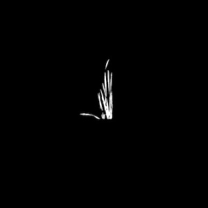

## Resize

Resizes images, used to resize masks over other images.

**plantcv.resize**(*img, resize_x, resize_y*)

**returns** image after resizing

- **Parameters:**
    - img - RGB or grayscale image to resize
    - resize_x - resize number in the x dimension (does not need to be an integer)
    - resize_y - resize number in the y dimension (does not need to be an integer)
   
- **Context:**
    - Resizes images.
- **Example use:**
    - [Use In NIR/VIS Tutorial](vis_nir_tutorial.md)
    
**Input image**


```python

from plantcv import plantcv as pcv

# Set global debug behavior to None (default), "print" (to file), or "plot" (Jupyter Notebooks or X11)
pcv.params.debug = "print"

# Resize image
resize_img = pcv.resize(img, 0.1154905775, 0.1154905775)
```

**Image after resizing**


