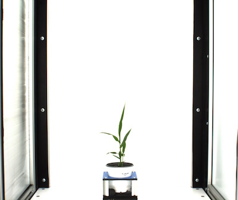
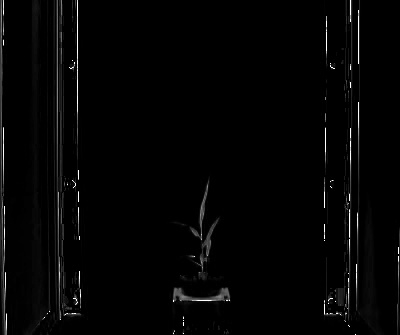
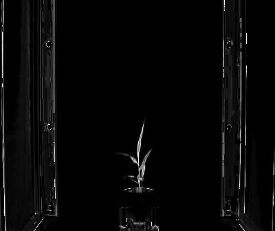
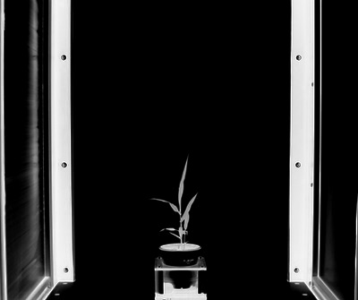

## RGB to CMYK

Convert image from RGB color space to CMYK color space and split the channels.

**plantcv.rgb2gray_cmyk**(*rgb_img, channel*)

**returns** split image (c, m, y or k channel)

- **Parameters:**
    - rgb_img - RGB image data
    - channel - Split 'c' (cyan), 'm' (magenta), 'y' (yellow) or 'k' (black) channel
   
- **Context:**
    - Used to help differentiate plant and background


**Original RGB image**



```python

from plantcv import plantcv as pcv

# Set global debug behavior to None (default), "print" (to file), 
# or "plot" (Jupyter Notebooks or X11)
pcv.params.debug = "print"

# image converted from RGB to LAB, channels are then split. 
# Lightness ('l') channel is output
l_channel = pcv.rgb2gray_cmyk(rgb_img=rgb_img, channel='Y')

```

**Cyan channel image**



```python

# Green-Magenta ('a') channel is output
a_channel = pcv.rgb2gray_cmyk(rgb_img=rgb_img, channel='C')

```

**Magenta channel image**


```python

# Green-Magenta ('a') channel is output
a_channel = pcv.rgb2gray_cmyk(rgb_img=rgb_img, channel='M')

```

**Yellow channel image**



```python

# Green-Magenta ('a') channel is output
a_channel = pcv.rgb2gray_cmyk(rgb_img=rgb_img, channel='Y')

```

**Black channel image**



```python

# Green-Magenta ('a') channel is output
a_channel = pcv.rgb2gray_cmyk(rgb_img=rgb_img, channel='K')

```
