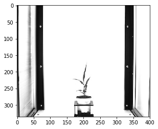

## RGB to Gray

Convert image from RGB color space to gray-scale.

**plantcv.rgb2gray**(*rgb_img*)

**returns** grayscale image 

- **Parameters:**
    - rgb_img - RGB image data
   
- **Context:**
    - Used to help differentiate plant and background

**Original RGB image**


```python

from plantcv import plantcv as pcv

# Set global debug behavior to None (default), "print" (to file), or "plot" (Jupyter Notebooks or X11)
pcv.params.debug = "print"

# image converted from RGB to gray.
gray = pcv.rgb2gray(rgb_img=img)
```

**Gray-scale Image**


